# CIAM-Passwordless-Protect-Account-Recovery-Subflow

 

## Settings
An exhaustive list of settings including defaults.
| Setting                          | Value                                                                                                                                                                                   |
|----------------------------------|-----------------------------------------------------------------------------------------------------------------------------------------------------------------------------------------|
| CSP Value                        | worker-src &#39;self&#39; blob:; script-src &#39;self&#39; https://cdn.jsdelivr.net https://code.jquery.com https://devsdk.singularkey.com http://cdnjs.cloudflare.com &#39;unsafe-inline&#39; &#39;unsafe-eval&#39;; | 
 | CSS Links                        | https://assets.pingone.com/ux/end-user-nano/0.1.0-alpha.1/end-user-nano.css,https://assets.pingone.com/ux/astro-nano/0.1.0-alpha.7/icons.css|

## Input Schemas
| Property Name | Description | Expanded | Preferred Control Type | Preferred Data Type | Required |
|----------------------------------|-----------------|-----------------|-----------------|-----------------|-----------------|
| ciam_companyLogo |  | true | textField | string | false | 
 

## Variables
| Variable | Value | Context | Display Name | Field Type | Min | Max | Mutable | Type |                                                                                                                                                                
|----------------------------------|-----------------|-----------------|-----------------|-----------------|-----------------|-----------------|-----------------|-----------------|
| ciam_recoveryValidationAttempts##SK##flowInstance |  | flowInstance |  | number | 0 | 2000 | true | property | 
 | ciam_recoveryLimit##SK##company | 5 | company |  | number | 0 | 2000 | true | property | 
 | ciam_errorMessage##SK##flowInstance |  | flowInstance |  | string | 0 | 2000 | true | property | 
 | ciam_protectriskPolicyId##SK##flowInstance |  | flowInstance | This PingOne Protect Risk Policy ID will be passed by default. | string | 0 | 2000 | true | property | 
 | ciam_protectRiskLevel##SK##flowInstance |  | flowInstance | Used by CIAM Passwordless and PingOne protect flows | string | 0 | 2000 | true | property | 
 | ciam_protectRiskID##SK##flowInstance |  | flowInstance | This variable is used by CIAM Passwordless with pingone protect flows. | string | 0 | 2000 | true | property | 
 | ciam_protectPredictor##SK##flowInstance |  | flowInstance | Used by CIAM Passwordless and PingOne Protect flows. | string | 0 | 2000 | true | property | 
 | ciam_protectDeviceStatus##SK##flowInstance |  | flowInstance | Used by CIAM Passwordless and PingOne protect flow | string | 0 | 2000 | true | property | 
 

## Subflows
| Label | Capatability Name | Node ID | Node Title | Version ID |                                                                                                                                                             
|----------------------------------|-----------------|-----------------|-----------------|-----------------|
| [CIAM-Passwordless-Protect-Threat-Detection-Subflow](../CIAMPasswordlessProtectThreatDetectionSubflow/index.md) | startSubFlow | [m71wjatj9v](./nodes/m71wjatj9v.md) | Invoke PingOne Protect subflow | -1 | 
 

## Node List
| Node ID | Title | Description |
|----------------------------------|-----------------|-----------------|
| [0jvt7xvej2](./nodes/0jvt7xvej2.md) | Lookup User |  | 
 | [0ldti6gtpg](./nodes/0ldti6gtpg.md) | Annotation |  | 
 | [0wx52cpso1](./nodes/0wx52cpso1.md) | Node |  | 
 | [16hlhgpr5h](./nodes/16hlhgpr5h.md) | Verify Passwords Match | Verify new passwords match before setting | 
 | [2nlcjypoi6](./nodes/2nlcjypoi6.md) | Annotation |  | 
 | [3b5q91z8tx](./nodes/3b5q91z8tx.md) | Return to calling node |  | 
 | [3pbs4ekm6u](./nodes/3pbs4ekm6u.md) | Is Validation Limit Reached? |  | 
 | [5mvyk1j6oz](./nodes/5mvyk1j6oz.md) | Get Values from PingOne Protect analysis | Get Values from PingOne Protect analysis | 
 | [5pgnxcibnw](./nodes/5pgnxcibnw.md) | PingOne Notifications | Configure email notification | 
 | [5vhs0j1lcd](./nodes/5vhs0j1lcd.md) | Update error message |  | 
 | [7050iwhzic](./nodes/7050iwhzic.md) | Check if Risk ID is empty |  | 
 | [7dwvsl8sa8](./nodes/7dwvsl8sa8.md) | Update Risk Evaluation - FAILURE |  | 
 | [8eguhqxqpn](./nodes/8eguhqxqpn.md) | Node |  | 
 | [9ey04i9zs1](./nodes/9ey04i9zs1.md) | Annotation |  | 
 | [akl8h5d22x](./nodes/akl8h5d22x.md) | Get Values from PingOne Protect analysis | Get Values from PingOne Protect analysis. | 
 | [ao6h6cnxrq](./nodes/ao6h6cnxrq.md) | Node |  | 
 | [br93gz6bmz](./nodes/br93gz6bmz.md) | Return Error Response |  | 
 | [c3lspnaskh](./nodes/c3lspnaskh.md) | Annotation |  | 
 | [c6b0hkxcmj](./nodes/c6b0hkxcmj.md) | Annotation |  | 
 | [cbibltgmpq](./nodes/cbibltgmpq.md) | Annotation |  | 
 | [ccqivhr3uh](./nodes/ccqivhr3uh.md) | Set error message |  | 
 | [cluj62drki](./nodes/cluj62drki.md) | Annotation |  | 
 | [dvr3wi8hib](./nodes/dvr3wi8hib.md) | Split By User&#39;s Selection | Branch based on the button selected on the forgot password form | 
 | [ecnva4yzrd](./nodes/ecnva4yzrd.md) | Annotation |  | 
 | [fqioowykrw](./nodes/fqioowykrw.md) | Annotation |  | 
 | [fzf96tttyw](./nodes/fzf96tttyw.md) | User Cancelled |  | 
 | [g3ie4cp1z5](./nodes/g3ie4cp1z5.md) | Find user details |  | 
 | [gm535zgls3](./nodes/gm535zgls3.md) | Passwords Do Not Match Error |  | 
 | [h4u1as8yg4](./nodes/h4u1as8yg4.md) | Recovery Code Form | A form to enter the password recovery code and a new password | 
 | [hhileu4ydz](./nodes/hhileu4ydz.md) | Update Risk Evaluation - SUCCESS |  | 
 | [hu2l38mo64](./nodes/hu2l38mo64.md) | User Cancelled |  | 
 | [ixpij6bdtq](./nodes/ixpij6bdtq.md) | No User Found Error | No existing user with this email. | 
 | [j3hvs9dks4](./nodes/j3hvs9dks4.md) | Success | Successfully recovered user&#39;s account | 
 | [j688bm13wo](./nodes/j688bm13wo.md) | Annotation |  | 
 | [jb2xut5506](./nodes/jb2xut5506.md) | Display Success Message | Display success message | 
 | [jq6tb99elr](./nodes/jq6tb99elr.md) | Annotation |  | 
 | [jx18l5yjj0](./nodes/jx18l5yjj0.md) | Invalid password | An error occurred during account recovery | 
 | [klrsk927mu](./nodes/klrsk927mu.md) | Forgot Password Form | A form for the user to submit the email of the account they forgot the password to | 
 | [km7ojt5kyt](./nodes/km7ojt5kyt.md) | Return Success Response |  | 
 | [levripcbrt](./nodes/levripcbrt.md) | Annotation |  | 
 | [llvrblwi3q](./nodes/llvrblwi3q.md) | Return to calling node |  | 
 | [m1lp5172g7](./nodes/m1lp5172g7.md) | PingOne Protect Analysis | This branch will perform a threat analysis using PingOne Protect feature. | 
 | [m71wjatj9v](./nodes/m71wjatj9v.md) | Invoke PingOne Protect subflow | Invoke PingOne Protect Sub flow for threat detection analysis using PingOne protect feature. | 
 | [mxiurb5xux](./nodes/mxiurb5xux.md) | Send email for threat detected | Email notification that user is blocked and disabled. | 
 | [nc1ozqg2dy](./nodes/nc1ozqg2dy.md) | Disable User |  | 
 | [o4xxassgqz](./nodes/o4xxassgqz.md) | Risk Score from PingOne Protect | Branching based on risk score from PingOne Protect | 
 | [o88xkrpbve](./nodes/o88xkrpbve.md) | Forgot Password Form |  | 
 | [o8lq26j99n](./nodes/o8lq26j99n.md) | Error |  | 
 | [p7gnqv4r4t](./nodes/p7gnqv4r4t.md) | Set New Password | Sets a new password if the user exists and the submitted recovery code is valid | 
 | [pklbwceder](./nodes/pklbwceder.md) | Annotation |  | 
 | [po11uu9rq](./nodes/po11uu9rq.md) | Annotation |  | 
 | [pq238wtn37](./nodes/pq238wtn37.md) | Annotation |  | 
 | [rfwgqmb87x](./nodes/rfwgqmb87x.md) | Resend recovery code | Sends a password recovery OTP to user to verify they own this account | 
 | [rsu5s043qp](./nodes/rsu5s043qp.md) | Node |  | 
 | [rtv1hwltfy](./nodes/rtv1hwltfy.md) | Split By User&#39;s Selection | Branch based on the button selected on the forgot password form | 
 | [savlv3olxb](./nodes/savlv3olxb.md) | Annotation |  | 
 | [sili5r3wur](./nodes/sili5r3wur.md) | Go to Sign On Success |  | 
 | [tfdqp94azq](./nodes/tfdqp94azq.md) | OTP Resent Message |  | 
 | [u8083hrxny](./nodes/u8083hrxny.md) | Annotation |  | 
 | [ujwd58v2j5](./nodes/ujwd58v2j5.md) | Send Recovery Code | Sends a password recovery OTP to user to verify they own this account | 
 | [ux2xzdhk0a](./nodes/ux2xzdhk0a.md) | Does User Have Existing Password |  | 
 | [v4rlsooi5t](./nodes/v4rlsooi5t.md) | Increment Validation Attempt |  | 
 | [vp9pfw2l9i](./nodes/vp9pfw2l9i.md) | User Cancelled |  | 
 | [xd56mfv9sc](./nodes/xd56mfv9sc.md) | NOP UI Page | Initiate SK Risk SDK with appropriate details to initiate PingOne Protect feature. | 
 | [xebw2nujq5](./nodes/xebw2nujq5.md) | Node |  | 
 | [xj97e6huu4](./nodes/xj97e6huu4.md) | Check for KNOWN DEVICE |  | 
 | [ycc8uizvh4](./nodes/ycc8uizvh4.md) | User Cancelled |  | 
 | [yj3z2ix7ge](./nodes/yj3z2ix7ge.md) | Find user details |  | 
 | [z1uxnr4psu](./nodes/z1uxnr4psu.md) | Set Validation Attempt To Zero |  | 
 | [zmdygh0diw](./nodes/zmdygh0diw.md) | Check if RiskID is empty |  | 
 | [zmgks0hrrb](./nodes/zmgks0hrrb.md) | Annotation |  | 
 