# CIAM-Passwordless-Protect-Account-Registration-Subflow

 

## Settings
An exhaustive list of settings including defaults.
| Setting                          | Value                                                                                                                                                                                   |
|----------------------------------|-----------------------------------------------------------------------------------------------------------------------------------------------------------------------------------------|
| CSP Value                        | worker-src &#39;self&#39; blob:; script-src &#39;self&#39; https://cdn.jsdelivr.net https://code.jquery.com https://devsdk.singularkey.com http://cdnjs.cloudflare.com &#39;unsafe-inline&#39; &#39;unsafe-eval&#39;; | 
 | CSS Links                        | https://assets.pingone.com/ux/astro-nano/0.1.0-alpha.11/icons.css,https://assets.pingone.com/ux/ui-library/5.0.2/images/logo-pingidentity.png|

## Input Schemas
| Property Name | Description | Expanded | Preferred Control Type | Preferred Data Type | Required |
|----------------------------------|-----------------|-----------------|-----------------|-----------------|-----------------|
| ciam_agreementId |  | true | textField | string | false | 
 | ciam_passwordlessRequired |  | true | textField | boolean | false | 
 | allowedDeviceTypes |  | true | textField | string | false | 
 | ciam_agreementEnabled |  | true | textField | boolean | false | 
 | ciam_companyLogo |  | true | textField | string | false | 
 

## Variables
| Variable | Value | Context | Display Name | Field Type | Min | Max | Mutable | Type |                                                                                                                                                                
|----------------------------------|-----------------|-----------------|-----------------|-----------------|-----------------|-----------------|-----------------|-----------------|
| ciam_errorMessage##SK##flowInstance |  | flowInstance |  | string | 0 | 2000 | true | property | 
 | ciam_protectriskPolicyId##SK##flowInstance |  | flowInstance | This PingOne Protect Risk Policy ID will be passed by default. | string | 0 | 2000 | true | property | 
 | ciam_protectRiskLevel##SK##flowInstance |  | flowInstance | Used by CIAM Passwordless and PingOne protect flows | string | 0 | 2000 | true | property | 
 | ciam_protectRiskID##SK##flowInstance |  | flowInstance | This variable is used by CIAM Passwordless with pingone protect flows. | string | 0 | 2000 | true | property | 
 | ciam_protectPredictor##SK##flowInstance |  | flowInstance | Used by CIAM Passwordless and PingOne Protect flows. | string | 0 | 2000 | true | property | 
 | ciam_protectDeviceStatus##SK##flowInstance |  | flowInstance | Used by CIAM Passwordless and PingOne protect flow | string | 0 | 2000 | true | property | 
 

## Subflows
| Label | Capatability Name | Node ID | Node Title | Version ID |                                                                                                                                                             
|----------------------------------|-----------------|-----------------|-----------------|-----------------|
| [CIAM-Passwordless-Protect-Device-Registration-Subflow](../CIAMPasswordlessProtectDeviceRegistrationSubflow/index.md) | startUiSubFlow | [hbtxkrrfyo](./nodes/hbtxkrrfyo.md) | Device Registration | -1 | 
 | [CIAM-Passwordless-Protect-Agreement(ToS)-Subflow](../CIAMPasswordlessProtectAgreementToSSubflow/index.md) | startUiSubFlow | [ce4oo61zup](./nodes/ce4oo61zup.md) | Agreement | -1 | 
 | [CIAM-Passwordless-Protect-Verify-Email-Subflow](../CIAMPasswordlessProtectVerifyEmailSubflow/index.md) | startUiSubFlow | [q2xj7vprwc](./nodes/q2xj7vprwc.md) | Verify Email | -1 | 
 | [CIAM-Passwordless-Protect-Threat-Detection-Subflow](../CIAMPasswordlessProtectThreatDetectionSubflow/index.md) | startSubFlow | [1vqqpdh7jj](./nodes/1vqqpdh7jj.md) | Invoke PingOne Protect subflow | -1 | 
 

## Node List
| Node ID | Title | Description |
|----------------------------------|-----------------|-----------------|
| [1bei1x0975](./nodes/1bei1x0975.md) | Passwords Do Not Match |  | 
 | [1ftyww4qrg](./nodes/1ftyww4qrg.md) | Password Form |  | 
 | [1v0wkik21y](./nodes/1v0wkik21y.md) | Node |  | 
 | [1vqqpdh7jj](./nodes/1vqqpdh7jj.md) | Invoke PingOne Protect subflow | Invoke PingOne Protect Sub flow for threat detection analysis using PingOne protect feature. | 
 | [25d4oxyqsl](./nodes/25d4oxyqsl.md) | Error |  | 
 | [3231zqih41](./nodes/3231zqih41.md) | Success |  | 
 | [3ns5occh3t](./nodes/3ns5occh3t.md) | Set error message |  | 
 | [4kcztxnwnw](./nodes/4kcztxnwnw.md) | Find User By Username |  | 
 | [4ua7g2dlbd](./nodes/4ua7g2dlbd.md) | Annotation |  | 
 | [556oibw7qb](./nodes/556oibw7qb.md) | Node |  | 
 | [6ax7ut4bhe](./nodes/6ax7ut4bhe.md) | Success |  | 
 | [6q3et7ool3](./nodes/6q3et7ool3.md) | Annotation |  | 
 | [6tbnogu9pe](./nodes/6tbnogu9pe.md) | Get Values from PingOne Protect analysis | Get Values from PingOne Protect analysis. | 
 | [6trtikxvu3](./nodes/6trtikxvu3.md) | Device Registration |  | 
 | [7reb9aouh1](./nodes/7reb9aouh1.md) | Node |  | 
 | [8ymuhluq2b](./nodes/8ymuhluq2b.md) | Node |  | 
 | [9731nsl2tw](./nodes/9731nsl2tw.md) | Node |  | 
 | [9lj2zn3s78](./nodes/9lj2zn3s78.md) | Node |  | 
 | [9nmlv1ji8e](./nodes/9nmlv1ji8e.md) | Annotation |  | 
 | [9nx674q8hc](./nodes/9nx674q8hc.md) | PingOne Protect Analysis | This branch will perform a threat analysis using PingOne Protect feature. | 
 | [a6bry36bsh](./nodes/a6bry36bsh.md) | Node |  | 
 | [awcyj6ng8l](./nodes/awcyj6ng8l.md) | Update error message |  | 
 | [c6trci9e40](./nodes/c6trci9e40.md) | Get Values from PingOne Protect analysis | Get Values from PingOne Protect analysis | 
 | [ce1r0zvwxl](./nodes/ce1r0zvwxl.md) | Enter Email |  | 
 | [ce4oo61zup](./nodes/ce4oo61zup.md) | Agreement |  | 
 | [cm74w90uay](./nodes/cm74w90uay.md) | Email Already Exist |  | 
 | [dnl97jd62e](./nodes/dnl97jd62e.md) | Create the PingOne user (Passwordless) | Creates the PingOne account for the user | 
 | [dpyuspmzna](./nodes/dpyuspmzna.md) | Risk Score from PingOne Protect | Branching based on risk score from PingOne Protect | 
 | [e3hk5pdx14](./nodes/e3hk5pdx14.md) | Password Form Selection |  | 
 | [ev6cglh1ng](./nodes/ev6cglh1ng.md) | Annotation |  | 
 | [f61g6i579w](./nodes/f61g6i579w.md) | Enter Name |  | 
 | [f8grwx3pmh](./nodes/f8grwx3pmh.md) | Annotation |  | 
 | [fm8bbibjyv](./nodes/fm8bbibjyv.md) | Annotation |  | 
 | [fvt1eikqlw](./nodes/fvt1eikqlw.md) | Node |  | 
 | [fyiexmemqv](./nodes/fyiexmemqv.md) | Update Risk Evaluation - SUCCESS |  | 
 | [g0ofs7x7ej](./nodes/g0ofs7x7ej.md) | Node |  | 
 | [g7ya3dd76m](./nodes/g7ya3dd76m.md) | Update Risk Evaluation - FAILURE |  | 
 | [gnh7rkcsg6](./nodes/gnh7rkcsg6.md) | Password Form |  | 
 | [gqic30lg29](./nodes/gqic30lg29.md) | Annotation |  | 
 | [gwcgcvqdnk](./nodes/gwcgcvqdnk.md) | Passwords Do Not Match |  | 
 | [h0fakyqawb](./nodes/h0fakyqawb.md) | Password Form Selection |  | 
 | [hbtxkrrfyo](./nodes/hbtxkrrfyo.md) | Device Registration |  | 
 | [hqbldfgp75](./nodes/hqbldfgp75.md) | Return to calling node |  | 
 | [hynm9ilfla](./nodes/hynm9ilfla.md) | Annotation |  | 
 | [i2k2g4dd4k](./nodes/i2k2g4dd4k.md) | Post Account Creation |  | 
 | [i8me302hqi](./nodes/i8me302hqi.md) | Is Passwordless Not Required? |  | 
 | [itzday4ij6](./nodes/itzday4ij6.md) | Set error message |  | 
 | [jhdnf7az60](./nodes/jhdnf7az60.md) | Annotation |  | 
 | [jnsqnfzu9s](./nodes/jnsqnfzu9s.md) | Verify Passwords Match | Verify new passwords match before setting | 
 | [jx2e1mgzth](./nodes/jx2e1mgzth.md) | Adjust Auth Method |  | 
 | [kg5xab6nfq](./nodes/kg5xab6nfq.md) | Verify Passwords Match | Verify new passwords match before setting | 
 | [klup4giais](./nodes/klup4giais.md) | Annotation |  | 
 | [ktfff5wvhf](./nodes/ktfff5wvhf.md) | Node |  | 
 | [lsfo4z2dig](./nodes/lsfo4z2dig.md) | Annotation |  | 
 | [lx6499vpt4](./nodes/lx6499vpt4.md) | First Name/Last Name Form |  | 
 | [o25haz9qjo](./nodes/o25haz9qjo.md) | Node |  | 
 | [o5pe6jfpi5](./nodes/o5pe6jfpi5.md) | Invalid password | An error occurred during account recovery | 
 | [ohp2wj0s2n](./nodes/ohp2wj0s2n.md) | Email Form Selection |  | 
 | [onba8ryx6o](./nodes/onba8ryx6o.md) | Node |  | 
 | [ounerl6t9](./nodes/ounerl6t9.md) | Device Registration Result |  | 
 | [prajl7in65](./nodes/prajl7in65.md) | Error |  | 
 | [q2xj7vprwc](./nodes/q2xj7vprwc.md) | Verify Email |  | 
 | [qgncxw4dil](./nodes/qgncxw4dil.md) | Node |  | 
 | [qn27aswoes](./nodes/qn27aswoes.md) | Annotation |  | 
 | [qnljz2ats7](./nodes/qnljz2ats7.md) | Set Password | Post account creation | 
 | [rffad6f7jp](./nodes/rffad6f7jp.md) | Return to calling node |  | 
 | [rgghrjdny1](./nodes/rgghrjdny1.md) | User Chose Passwordless Registration? |  | 
 | [rtdrfhdzo2](./nodes/rtdrfhdzo2.md) | Set Account Password |  | 
 | [ruvagcgo2v](./nodes/ruvagcgo2v.md) | Annotation |  | 
 | [rx35m4y6sp](./nodes/rx35m4y6sp.md) | Create the PingOne user | Creates the PingOne account for the user | 
 | [skrz1mk3vm](./nodes/skrz1mk3vm.md) | Annotation |  | 
 | [sl1u7aepun](./nodes/sl1u7aepun.md) | Node |  | 
 | [vm34fm8ejo](./nodes/vm34fm8ejo.md) | Node |  | 
 | [vozxqrbygt](./nodes/vozxqrbygt.md) | Annotation |  | 
 | [vwzsll89x6](./nodes/vwzsll89x6.md) | Node |  | 
 | [w8u36wcyjg](./nodes/w8u36wcyjg.md) | NOP UI Page | Initiate SK Risk SDK with appropriate details to initiate PingOne Protect feature. | 
 | [xldkllymko](./nodes/xldkllymko.md) | Check for RIsk ID |  | 
 | [yesd4wr10s](./nodes/yesd4wr10s.md) | Check for RIsk ID |  | 
 | [yktqs7gian](./nodes/yktqs7gian.md) | Name Form Selection |  | 
 | [yp9j3kp2u6](./nodes/yp9j3kp2u6.md) | Node |  | 
 | [z876lbl7xg](./nodes/z876lbl7xg.md) | Email Form |  | 
 | [zwqtnahpyq](./nodes/zwqtnahpyq.md) | Node |  | 
 