# CIAM-Passwordless-Protect-Account-Registration-Subflow

### Flow Diagram

```mermaid
flowchart LR
    v7rng0sn5c(("EVAL")) --> hqbldfgp75[["Return to calling node"]]
    dpyuspmzna[["Risk Score from PingOne Protect"]] --> d4x3gb8izo(("EVAL"))
    yesd4wr10s[["Check for RIsk ID"]] --> kh21zbp6ux(("Evaluator"))
    xldkllymko[["Check for RIsk ID"]] --> f7deeungd4(("Evaluator"))
    6tbnogu9pe[["Get Values from PingOne Protect analysis"]] --> 3lg1avddlj(("EVAL"))
    f7deeungd4(("Evaluator")) --> fyiexmemqv[["Update Risk Evaluation - SUCCESS"]]
    vs1a4w3l05(("EVAL")) --> xldkllymko[["Check for RIsk ID"]]
    3lg1avddlj(("EVAL")) --> onba8ryx6o[["Node"]]
    kh21zbp6ux(("Evaluator")) --> g7ya3dd76m[["Update Risk Evaluation - FAILURE"]]
    d4x3gb8izo(("EVAL")) --> 1v0wkik21y[["Node"]]
    ovgv5ycn3o(("EVAL")) --> yesd4wr10s[["Check for RIsk ID"]]
    9nx674q8hc[["PingOne Protect Analysis"]] --> x97hzoypsc(("EVAL"))
    x97hzoypsc(("EVAL")) --> 1vqqpdh7jj[["Invoke PingOne Protect subflow"]]
    ounerl6t9[["Device Registration Result"]] --> oi73z7ak2s(("EVAL"))
    ohp2wj0s2n[["Email Form Selection"]] --> 3v5v4xjvbl(("EVAL"))
    x3sr98yxnv(("EVAL")) --> i8me302hqi[["Is Passwordless Not Required?"]]
    7z7q9efrmf(("EVAL")) --> 8ymuhluq2b[["Node"]]
    dnl97jd62e[["Create the PingOne user (Passwordless)"]] --> 3759wy9sgr(("EVAL"))
    e6v7ewqrvc(("EVAL")) --> g0ofs7x7ej[["Node"]]
    ounerl6t9[["Device Registration Result"]] --> e6v7ewqrvc(("EVAL"))
    rgghrjdny1[["User Chose Passwordless Registration?"]] --> r6sues2bxt(("EVAL"))
    k0x7ywsse6(("EVAL")) --> rtdrfhdzo2[["Set Account Password"]]
    hbtxkrrfyo[["Device Registration"]] --> 8euk2r8qqp(("Evaluator"))
    a2zg9lz4ta(("EVAL")) --> dnl97jd62e[["Create the PingOne user (Passwordless)"]]
    r6sues2bxt(("EVAL")) --> hbtxkrrfyo[["Device Registration"]]
    ovgv5ycn3o(("EVAL")) --> 25d4oxyqsl[["Error"]]
    k0x7ywsse6(("EVAL")) --> 1bei1x0975[["Passwords Do Not Match"]]
    kerq5fyp8w(("EVAL")) --> jnsqnfzu9s[["Verify Passwords Match"]]
    daxhwjbxh3(("EVAL")) --> kg5xab6nfq[["Verify Passwords Match"]]
    gnh7rkcsg6[["Password Form"]] --> 3os5ylwizz(("EVAL"))
    h0fakyqawb[["Password Form Selection"]] --> 46fi95z8qq(("EVAL"))
    fw7x3rsvg1(("EVAL")) --> zwqtnahpyq[["Node"]]
    5rnhpdt5er(("Evaluator")) --> qgncxw4dil[["Node"]]
    updxs8x4oi(("EVAL")) --> rx35m4y6sp[["Create the PingOne user"]]
    w8u36wcyjg[["NOP UI Page"]] --> 9ajkfnvew2(("EVAL"))
    1ftyww4qrg[["Password Form"]] --> uf3wbe7ccq(("EVAL"))
    e3hk5pdx14[["Password Form Selection"]] --> za37tpd5ja(("EVAL"))
    e3hk5pdx14[["Password Form Selection"]] --> daxhwjbxh3(("EVAL"))
    5rnhpdt5er(("Evaluator")) --> yp9j3kp2u6[["Node"]]
    h0fakyqawb[["Password Form Selection"]] --> kerq5fyp8w(("EVAL"))
    3759wy9sgr(("EVAL")) --> 556oibw7qb[["Node"]]
    ounerl6t9[["Device Registration Result"]] --> j5sho28srg(("EVAL"))
    j5g7kyj3v5(("EVAL")) --> ktfff5wvhf[["Node"]]
    6trtikxvu3[["Device Registration"]] --> 4nbljmsup0(("EVAL"))
    3ey8zk3woh(("EVAL")) --> o25haz9qjo[["Node"]]
    z876lbl7xg[["Email Form"]] --> tew5x0pd7f(("EVAL"))
    tew5x0pd7f(("EVAL")) --> ohp2wj0s2n[["Email Form Selection"]]
    r6sues2bxt(("EVAL")) --> 7reb9aouh1[["Node"]]
    kg5xab6nfq[["Verify Passwords Match"]] --> updxs8x4oi(("EVAL"))
    za37tpd5ja(("EVAL")) --> dnl97jd62e[["Create the PingOne user (Passwordless)"]]
    jnsqnfzu9s[["Verify Passwords Match"]] --> k0x7ywsse6(("EVAL"))
    6ax7ut4bhe[["Success"]] --> vs1a4w3l05(("EVAL"))
    ocq1m14pys(("EVAL")) --> vm34fm8ejo[["Node"]]
    46fi95z8qq(("EVAL")) --> a6bry36bsh[["Node"]]
    3os5ylwizz(("EVAL")) --> h0fakyqawb[["Password Form Selection"]]
    8euk2r8qqp(("Evaluator")) --> ounerl6t9[["Device Registration Result"]]
    rtdrfhdzo2[["Set Account Password"]] --> 5rnhpdt5er(("Evaluator"))
    q574pstasq(("EVAL")) --> yktqs7gian[["Name Form Selection"]]
    a2zg9lz4ta(("EVAL")) --> 1ftyww4qrg[["Password Form"]]
    i8me302hqi[["Is Passwordless Not Required?"]] --> a2zg9lz4ta(("EVAL"))
    lx6499vpt4[["First Name/Last Name Form"]] --> q574pstasq(("EVAL"))
    ohp2wj0s2n[["Email Form Selection"]] --> j5g7kyj3v5(("EVAL"))
    qnljz2ats7[["Set Password"]] --> tcgo0fso3q(("EVAL"))
    waqap3wtx(("EVAL")) --> ce4oo61zup[["Agreement"]]
    i2k2g4dd4k[["Post Account Creation"]] --> waqap3wtx(("EVAL"))
    8euk2r8qqp(("Evaluator")) --> 9731nsl2tw[["Node"]]
    q2xj7vprwc[["Verify Email"]] --> yauguijv8y(("EVAL"))
    ce4oo61zup[["Agreement"]] --> 3ey8zk3woh(("EVAL"))
    3ey8zk3woh(("EVAL")) --> q2xj7vprwc[["Verify Email"]]
    yktqs7gian[["Name Form Selection"]] --> x3sr98yxnv(("EVAL"))
    jx2e1mgzth[["Adjust Auth Method"]] --> 8tqp4g8v75(("EVAL"))
    3759wy9sgr(("EVAL")) --> 3ns5occh3t[["Set error message"]]
    3ns5occh3t[["Set error message"]] --> 0dju0vxxvx(("EVAL"))
    va3e8v4pwh(("EVAL")) --> lx6499vpt4[["First Name/Last Name Form"]]
    bv1bbofla6(("EVAL")) --> 4kcztxnwnw[["Find User By Username"]]
    4kcztxnwnw[["Find User By Username"]] --> va3e8v4pwh(("EVAL"))
    vs1a4w3l05(("EVAL")) --> jx2e1mgzth[["Adjust Auth Method"]]
    oi73z7ak2s(("EVAL")) --> vwzsll89x6[["Node"]]
    xfe79n7ylz(("EVAL")) --> z876lbl7xg[["Email Form"]]
    ce1r0zvwxl[["Enter Email"]] --> xfe79n7ylz(("EVAL"))
    9ajkfnvew2(("EVAL")) --> z876lbl7xg[["Email Form"]]
    e3hk5pdx14[["Password Form Selection"]] --> fw7x3rsvg1(("EVAL"))
    va3e8v4pwh(("EVAL")) --> cm74w90uay[["Email Already Exist"]]
    9ppy0nt2zs(("EVAL")) --> lx6499vpt4[["First Name/Last Name Form"]]
    f61g6i579w[["Enter Name"]] --> 9ppy0nt2zs(("EVAL"))
    4nbljmsup0(("EVAL")) --> rgghrjdny1[["User Chose Passwordless Registration?"]]
    prajl7in65[["Error"]] --> ovgv5ycn3o(("EVAL"))
    updxs8x4oi(("EVAL")) --> gwcgcvqdnk[["Passwords Do Not Match"]]
    yauguijv8y(("EVAL")) --> sl1u7aepun[["Node"]]
    yktqs7gian[["Name Form Selection"]] --> 7z7q9efrmf(("EVAL"))
    rx35m4y6sp[["Create the PingOne user"]] --> ocq1m14pys(("EVAL"))
    j5sho28srg(("EVAL")) --> fvt1eikqlw[["Node"]]
    yauguijv8y(("EVAL")) --> rgghrjdny1[["User Chose Passwordless Registration?"]]
    tcgo0fso3q(("EVAL")) --> gnh7rkcsg6[["Password Form"]]
    uf3wbe7ccq(("EVAL")) --> e3hk5pdx14[["Password Form Selection"]]
    8tqp4g8v75(("EVAL")) --> 3231zqih41[["Success"]]
    awcyj6ng8l[["Update error message"]] --> nzgpez13rz(("EVAL"))
    nzgpez13rz(("EVAL")) --> o5pe6jfpi5[["Invalid password"]]
    itzday4ij6[["Set error message"]] --> hb32pzk5ax(("EVAL"))
    hb32pzk5ax(("EVAL")) --> awcyj6ng8l[["Update error message"]]
    ocq1m14pys(("EVAL")) --> itzday4ij6[["Set error message"]]
    0dju0vxxvx(("EVAL")) --> awcyj6ng8l[["Update error message"]]
    3v5v4xjvbl(("EVAL")) --> 9lj2zn3s78[["Node"]]
    9lj2zn3s78[["Node"]] --> bv1bbofla6(("EVAL"))
    1vqqpdh7jj[["Invoke PingOne Protect subflow"]] --> ydy90pbw5k(("Evaluator"))
    ydy90pbw5k(("Evaluator")) --> c6trci9e40[["Get Values from PingOne Protect analysis"]]
    ydy90pbw5k(("Evaluator")) --> 6tbnogu9pe[["Get Values from PingOne Protect analysis"]]
    c6trci9e40[["Get Values from PingOne Protect analysis"]] --> vkiofgjsix(("EVAL"))
    vkiofgjsix(("EVAL")) --> dpyuspmzna[["Risk Score from PingOne Protect"]]
    dpyuspmzna[["Risk Score from PingOne Protect"]] --> obdb16fbj2(("EVAL"))
    obdb16fbj2(("EVAL")) --> rffad6f7jp[["Return to calling node"]]
    dpyuspmzna[["Risk Score from PingOne Protect"]] --> v7rng0sn5c(("EVAL"))


```

## Settings
An exhaustive list of settings including defaults.
| Setting                          | Value                                                                                                                                                                                   |
|----------------------------------|-----------------------------------------------------------------------------------------------------------------------------------------------------------------------------------------|
| CSP Value                        | worker-src &#39;self&#39; blob:; script-src &#39;self&#39; https://cdn.jsdelivr.net https://code.jquery.com https://devsdk.singularkey.com http://cdnjs.cloudflare.com &#39;unsafe-inline&#39; &#39;unsafe-eval&#39;; | 
 | CSS Links                        | https://assets.pingone.com/ux/astro-nano/0.1.0-alpha.11/icons.css,https://assets.pingone.com/ux/ui-library/5.0.2/images/logo-pingidentity.png|

## Input Schemas
| Property Name | Description | Expanded | Preferred Control Type | Preferred Data Type | Required |
|----------------------------------|-----------------|-----------------|-----------------|-----------------|-----------------|
| ciam_agreementId |  | true | textField | string | false | 
 | ciam_passwordlessRequired |  | true | textField | boolean | false | 
 | allowedDeviceTypes |  | true | textField | string | false | 
 | ciam_agreementEnabled |  | true | textField | boolean | false | 
 | ciam_companyLogo |  | true | textField | string | false | 
 

## Variables
| Variable | Value | Context | Display Name | Field Type | Min | Max | Mutable | Type |                                                                                                                                                                
|----------------------------------|-----------------|-----------------|-----------------|-----------------|-----------------|-----------------|-----------------|-----------------|
| ciam_errorMessage##SK##flowInstance |  | flowInstance |  | string | 0 | 2000 | true | property | 
 | ciam_protectriskPolicyId##SK##flowInstance |  | flowInstance | This PingOne Protect Risk Policy ID will be passed by default. | string | 0 | 2000 | true | property | 
 | ciam_protectRiskLevel##SK##flowInstance |  | flowInstance | Used by CIAM Passwordless and PingOne protect flows | string | 0 | 2000 | true | property | 
 | ciam_protectRiskID##SK##flowInstance |  | flowInstance | This variable is used by CIAM Passwordless with pingone protect flows. | string | 0 | 2000 | true | property | 
 | ciam_protectPredictor##SK##flowInstance |  | flowInstance | Used by CIAM Passwordless and PingOne Protect flows. | string | 0 | 2000 | true | property | 
 | ciam_protectDeviceStatus##SK##flowInstance |  | flowInstance | Used by CIAM Passwordless and PingOne protect flow | string | 0 | 2000 | true | property | 
 

## Subflows
| Label | Capatability Name | Node ID | Node Title | Version ID |                                                                                                                                                             
|----------------------------------|-----------------|-----------------|-----------------|-----------------|
| [CIAM-Passwordless-Protect-Device-Registration-Subflow](../CIAMPasswordlessProtectDeviceRegistrationSubflow/index.md) | startUiSubFlow | [hbtxkrrfyo](./nodes/hbtxkrrfyo.md) | Device Registration | -1 | 
 | [CIAM-Passwordless-Protect-Agreement(ToS)-Subflow](../CIAMPasswordlessProtectAgreementToSSubflow/index.md) | startUiSubFlow | [ce4oo61zup](./nodes/ce4oo61zup.md) | Agreement | -1 | 
 | [CIAM-Passwordless-Protect-Verify-Email-Subflow](../CIAMPasswordlessProtectVerifyEmailSubflow/index.md) | startUiSubFlow | [q2xj7vprwc](./nodes/q2xj7vprwc.md) | Verify Email | -1 | 
 | [CIAM-Passwordless-Protect-Threat-Detection-Subflow](../CIAMPasswordlessProtectThreatDetectionSubflow/index.md) | startSubFlow | [1vqqpdh7jj](./nodes/1vqqpdh7jj.md) | Invoke PingOne Protect subflow | -1 | 
 