# CIAM-Passwordless-Protect-Agreement(ToS)-Subflow

 

## Settings
An exhaustive list of settings including defaults.
| Setting                          | Value                                                                                                                                                                                   |
|----------------------------------|-----------------------------------------------------------------------------------------------------------------------------------------------------------------------------------------|
| CSP Value                        | worker-src &#39;self&#39; blob:; script-src &#39;self&#39; https://cdn.jsdelivr.net https://code.jquery.com https://devsdk.singularkey.com http://cdnjs.cloudflare.com &#39;unsafe-inline&#39; &#39;unsafe-eval&#39;; | 
 |

## Input Schemas
| Property Name | Description | Expanded | Preferred Control Type | Preferred Data Type | Required |
|----------------------------------|-----------------|-----------------|-----------------|-----------------|-----------------|
| checkRequired | To check if user has consent before directing user to agreement | true | textField | boolean | true | 
 | pingOneUserId |  | true | textField | string | true | 
 | ciam_agreementId |  | true | textField | string | false | 
 | ciam_agreementEnabled |  | true | textField | boolean | false | 
 | ciam_companyLogo |  | true | textField | string | false | 
 

## Node List
| Node ID | Title | Description |
|----------------------------------|-----------------|-----------------|
| [0h8so1sxqq](./nodes/0h8so1sxqq.md) | Agreement Form | Display agreement form to user | 
 | [1rvj1fvgpu](./nodes/1rvj1fvgpu.md) | Check If Consent Status Is Accepted |  | 
 | [2wjsd5pwds](./nodes/2wjsd5pwds.md) | Annotation | Display agreement form | 
 | [3koaafiiox](./nodes/3koaafiiox.md) | Node | Go To: Success | 
 | [4cijn9bmjx](./nodes/4cijn9bmjx.md) | Annotation | Check if agreement form needs to be displayed | 
 | [4qv73tz0ug](./nodes/4qv73tz0ug.md) | Accept Agreement |  | 
 | [64hrke1krq](./nodes/64hrke1krq.md) | NOP UI Page |  | 
 | [6pm1x665h0](./nodes/6pm1x665h0.md) | Node | Go To: Success | 
 | [6x74clj9zm](./nodes/6x74clj9zm.md) | Check For User Consent? | If there is the need to check if user has consent before directing user to agreement | 
 | [8jemlov0oc](./nodes/8jemlov0oc.md) | Check User Consent Status |  | 
 | [8x2gjjcvxj](./nodes/8x2gjjcvxj.md) | Check User Action |  | 
 | [8ytvupm9en](./nodes/8ytvupm9en.md) | Get Agreement |  | 
 | [8zvqjrwsj8](./nodes/8zvqjrwsj8.md) | Node | Go To: Ask for agreement | 
 | [canivkxqjq](./nodes/canivkxqjq.md) | Node | Go To: Success | 
 | [gmy48vvv3f](./nodes/gmy48vvv3f.md) | Annotation | Return error | 
 | [hb77by4606](./nodes/hb77by4606.md) | Node | Go To: Error | 
 | [khh1sp7gzc](./nodes/khh1sp7gzc.md) | Annotation | CIAM-Passwordless-Protect-Agreement(ToS)-Subflow | 
 | [o5cgjow8id](./nodes/o5cgjow8id.md) | Return Success Response |  | 
 | [ph62v3m7kl](./nodes/ph62v3m7kl.md) | Decline Agreement |  | 
 | [pt563yeug9](./nodes/pt563yeug9.md) | Success |  | 
 | [qhcqow5g8y](./nodes/qhcqow5g8y.md) | Ask for agreement |  | 
 | [sx6hfk6dig](./nodes/sx6hfk6dig.md) | Annotation | Return success | 
 | [v68793bc1v](./nodes/v68793bc1v.md) | Is Agreement Enabled? |  | 
 | [wp1x2soyg3](./nodes/wp1x2soyg3.md) | Annotation | User Action | 
 | [ybxmywd5i6](./nodes/ybxmywd5i6.md) | Annotation | Input Schema: CheckRequired, UserID, AgreementID*, AgreementEnabled*, *Optional | 
 | [yqx4phhtcl](./nodes/yqx4phhtcl.md) | Node | Go To: Error | 
 | [zgq483nez5](./nodes/zgq483nez5.md) | Return Error Response |  | 
 | [zv66jvh5ja](./nodes/zv66jvh5ja.md) | Error |  | 
 