# CIAM-Passwordless-Protect-Change-Password-Subflow

### Flow Diagram

```mermaid
flowchart LR
    v738ey1b5y(("EVAL")) --> xo4l1ngx8q[["NOP UI Page"]]
    md8472gv2e[["Show Success"]] --> v738ey1b5y(("EVAL"))
    ixq0pq1td7(("EVAL")) --> 5vfn623mx7[["Display password reset form"]]
    mjqbph9elz(("Evaluator")) --> ur66q695u0[["Node"]]
    d3ziqry02i(("EVAL")) --> yo6nv4gud2[["Node"]]
    d3ziqry02i(("EVAL")) --> jn53bcmsnv[["Boolean Check"]]
    w0jz1dtx27[["Verify Passwords Match"]] --> 6oeo7c9bch(("Evaluator"))
    6oeo7c9bch(("Evaluator")) --> 7eaxdz9nwk[["Update password"]]
    h330sqhk7o[["Empty Check"]] --> d3ziqry02i(("EVAL"))
    mjqbph9elz(("Evaluator")) --> ut2v2s6fqq[["Node"]]
    75iq81515r[["Password reset submit?"]] --> o5jvuf0bwl(("EVAL"))
    79lag5unyk[["NOP UI Page"]] --> a3oth8yspq(("EVAL"))
    a3oth8yspq(("EVAL")) --> 5vfn623mx7[["Display password reset form"]]
    ateb0l10nl(("Evaluator")) --> h330sqhk7o[["Empty Check"]]
    jn53bcmsnv[["Boolean Check"]] --> mjqbph9elz(("Evaluator"))
    o5jvuf0bwl(("EVAL")) --> dcq4ib3mce[["Node"]]
    6oeo7c9bch(("Evaluator")) --> 2m4whqb1dr[["Passwords dont match"]]
    wv79oxt1fo(("EVAL")) --> 9pswmi4mi1[["Node"]]
    brpmsv8uag[["Success Error"]] --> b900rty9pd(("EVAL"))
    30owhg6lfp(("EVAL")) --> 75iq81515r[["Password reset submit?"]]
    2inl0soj3i(("EVAL")) --> w0jz1dtx27[["Verify Passwords Match"]]
    7eaxdz9nwk[["Update password"]] --> ateb0l10nl(("Evaluator"))
    8qr5bc3clq[["Success"]] --> jf9akdpa1q(("EVAL"))
    5vfn623mx7[["Display password reset form"]] --> 30owhg6lfp(("EVAL"))
    75iq81515r[["Password reset submit?"]] --> 2inl0soj3i(("EVAL"))
    4tnam70cjm[["Send Success Response"]] --> 2znw6pakac(("Evaluator"))
    75iq81515r[["Password reset submit?"]] --> wv79oxt1fo(("EVAL"))
    b900rty9pd(("EVAL")) --> hxmqf7sb52[["Send Error Response"]]
    xo4l1ngx8q[["NOP UI Page"]] --> ixq0pq1td7(("EVAL"))
    jf9akdpa1q(("EVAL")) --> 4tnam70cjm[["Send Success Response"]]
    2znw6pakac(("Evaluator")) --> uj42vvvgjt[["Node"]]
    ym31re8b7g(("EVAL")) --> okw0g6i84d[["Update error message"]]
    um3lcpaulo(("EVAL")) --> abmzqz1u6f[["Invalid password"]]
    okw0g6i84d[["Update error message"]] --> um3lcpaulo(("EVAL"))
    rysh2x3iz2[["Set error message"]] --> ym31re8b7g(("EVAL"))
    ateb0l10nl(("Evaluator")) --> rysh2x3iz2[["Set error message"]]


```

## Settings
An exhaustive list of settings including defaults.
| Setting                          | Value                                                                                                                                                                                   |
|----------------------------------|-----------------------------------------------------------------------------------------------------------------------------------------------------------------------------------------|
| CSP Value                        | worker-src &#39;self&#39; blob:; script-src &#39;self&#39; https://cdn.jsdelivr.net https://code.jquery.com https://devsdk.singularkey.com http://cdnjs.cloudflare.com &#39;unsafe-inline&#39; &#39;unsafe-eval&#39;; | 
 | CSS Links                        | https://assets.pingone.com/ux/end-user-nano/0.1.0-alpha.0/end-user-nano.css,https://assets.pingone.com/ux/astro-nano/0.1.0-alpha.6/icons.css|

## Input Schemas
| Property Name | Description | Expanded | Preferred Control Type | Preferred Data Type | Required |
|----------------------------------|-----------------|-----------------|-----------------|-----------------|-----------------|
| userID |  | true | textField | string | true | 
 | showSuccessMessage |  | true | textField | boolean | false | 
 | ciam_companyLogo |  | true | textField | string | false | 
 

## Variables
| Variable | Value | Context | Display Name | Field Type | Min | Max | Mutable | Type |                                                                                                                                                                
|----------------------------------|-----------------|-----------------|-----------------|-----------------|-----------------|-----------------|-----------------|-----------------|
| ciam_errorMessage##SK##flowInstance |  | flowInstance |  | string | 0 | 2000 | true | property | 
 

