# CIAM-Passwordless-Protect-Change-Password-Subflow

 

## Settings
An exhaustive list of settings including defaults.
| Setting                          | Value                                                                                                                                                                                   |
|----------------------------------|-----------------------------------------------------------------------------------------------------------------------------------------------------------------------------------------|
| CSP Value                        | worker-src &#39;self&#39; blob:; script-src &#39;self&#39; https://cdn.jsdelivr.net https://code.jquery.com https://devsdk.singularkey.com http://cdnjs.cloudflare.com &#39;unsafe-inline&#39; &#39;unsafe-eval&#39;; | 
 | CSS Links                        | https://assets.pingone.com/ux/end-user-nano/0.1.0-alpha.0/end-user-nano.css,https://assets.pingone.com/ux/astro-nano/0.1.0-alpha.6/icons.css|

## Input Schemas
| Property Name | Description | Expanded | Preferred Control Type | Preferred Data Type | Required |
|----------------------------------|-----------------|-----------------|-----------------|-----------------|-----------------|
| userID |  | true | textField | string | true | 
 | showSuccessMessage |  | true | textField | boolean | false | 
 | ciam_companyLogo |  | true | textField | string | false | 
 

## Variables
| Variable | Value | Context | Display Name | Field Type | Min | Max | Mutable | Type |                                                                                                                                                                
|----------------------------------|-----------------|-----------------|-----------------|-----------------|-----------------|-----------------|-----------------|-----------------|
| ciam_errorMessage##SK##flowInstance |  | flowInstance |  | string | 0 | 2000 | true | property | 
 

## Node List
| Node ID | Title | Description |
|----------------------------------|-----------------|-----------------|
| [2m4whqb1dr](./nodes/2m4whqb1dr.md) | Passwords don&#39;t match |  | 
 | [4tnam70cjm](./nodes/4tnam70cjm.md) | Send Success Response |  | 
 | [5vfn623mx7](./nodes/5vfn623mx7.md) | Display password reset form |  | 
 | [75iq81515r](./nodes/75iq81515r.md) | Password reset submit? |  | 
 | [79lag5unyk](./nodes/79lag5unyk.md) | NOP UI Page |  | 
 | [7eaxdz9nwk](./nodes/7eaxdz9nwk.md) | Update password |  | 
 | [8qr5bc3clq](./nodes/8qr5bc3clq.md) | Success |  | 
 | [909gcxuamo](./nodes/909gcxuamo.md) | Annotation |  | 
 | [9pswmi4mi1](./nodes/9pswmi4mi1.md) | Node |  | 
 | [abmzqz1u6f](./nodes/abmzqz1u6f.md) | Invalid password | An error occurred while changing the password | 
 | [brpmsv8uag](./nodes/brpmsv8uag.md) | Success Error |  | 
 | [dcq4ib3mce](./nodes/dcq4ib3mce.md) | Node |  | 
 | [eo3jbik9pd](./nodes/eo3jbik9pd.md) | Annotation |  | 
 | [fkjvk1b7bk](./nodes/fkjvk1b7bk.md) | Annotation |  | 
 | [h330sqhk7o](./nodes/h330sqhk7o.md) | Empty Check | Check if showSuccessMessage is empty | 
 | [hxmqf7sb52](./nodes/hxmqf7sb52.md) | Send Error Response |  | 
 | [jn53bcmsnv](./nodes/jn53bcmsnv.md) | Boolean Check | Check if successShowMessage is set to true or false | 
 | [md8472gv2e](./nodes/md8472gv2e.md) | Show Success |  | 
 | [okw0g6i84d](./nodes/okw0g6i84d.md) | Update error message |  | 
 | [p674a26vil](./nodes/p674a26vil.md) | Annotation |  | 
 | [rysh2x3iz2](./nodes/rysh2x3iz2.md) | Set error message |  | 
 | [si6drlaz76](./nodes/si6drlaz76.md) | Annotation |  | 
 | [t0vllny9q](./nodes/t0vllny9q.md) | Http |  | 
 | [uj42vvvgjt](./nodes/uj42vvvgjt.md) | Node |  | 
 | [ur66q695u0](./nodes/ur66q695u0.md) | Node |  | 
 | [ut2v2s6fqq](./nodes/ut2v2s6fqq.md) | Node |  | 
 | [w0jz1dtx27](./nodes/w0jz1dtx27.md) | Verify Passwords Match |  | 
 | [xo4l1ngx8q](./nodes/xo4l1ngx8q.md) | NOP UI Page |  | 
 | [yfyux987w8](./nodes/yfyux987w8.md) | Annotation |  | 
 | [yo6nv4gud2](./nodes/yo6nv4gud2.md) | Node |  | 
 