# CIAM-Passwordless-Protect-Device-Authentication-Subflow

 

## Settings
An exhaustive list of settings including defaults.
| Setting                          | Value                                                                                                                                                                                   |
|----------------------------------|-----------------------------------------------------------------------------------------------------------------------------------------------------------------------------------------|
| CSP Value                        | worker-src &#39;self&#39; blob:; script-src &#39;self&#39; https://cdn.jsdelivr.net https://code.jquery.com https://devsdk.singularkey.com http://cdnjs.cloudflare.com &#39;unsafe-inline&#39; &#39;unsafe-eval&#39;; | 
 | CSS Links                        | https://assets.pingone.com/ux/end-user-nano/0.1.0-alpha.1/end-user-nano.css,https://assets.pingone.com/ux/astro-nano/0.1.0-alpha.7/icons.css|

## Input Schemas
| Property Name | Description | Expanded | Preferred Control Type | Preferred Data Type | Required |
|----------------------------------|-----------------|-----------------|-----------------|-----------------|-----------------|
| pingOneUserId | PingOne User ID | true | textField | string | true | 
 | email | PingOne User Email(Username) | true | textField | string | true | 
 | ciam_magicLinkEnabled |  | true | textField | boolean | false | 
 | allowedDeviceTypes |  | true | textField | string | false | 
 | ciam_companyLogo |  | true | textField | string | false | 
 

## Variables
| Variable | Value | Context | Display Name | Field Type | Min | Max | Mutable | Type |                                                                                                                                                                
|----------------------------------|-----------------|-----------------|-----------------|-----------------|-----------------|-----------------|-----------------|-----------------|
| ciam_protectriskPolicyId##SK##flowInstance |  | flowInstance | This PingOne Protect Risk Policy ID will be passed by default. | string | 0 | 2000 | true | property | 
 | ciam_protectRiskLevel##SK##flowInstance |  | flowInstance | Used by CIAM Passwordless and PingOne protect flows | string | 0 | 2000 | true | property | 
 | ciam_protectRiskID##SK##flowInstance |  | flowInstance | This variable is used by CIAM Passwordless with pingone protect flows. | string | 0 | 2000 | true | property | 
 | ciam_protectPredictor##SK##flowInstance |  | flowInstance | Used by CIAM Passwordless and PingOne Protect flows. | string | 0 | 2000 | true | property | 
 | ciam_protectDeviceStatus##SK##flowInstance |  | flowInstance | Used by CIAM Passwordless and PingOne protect flow | string | 0 | 2000 | true | property | 
 

## Subflows
| Label | Capatability Name | Node ID | Node Title | Version ID |                                                                                                                                                             
|----------------------------------|-----------------|-----------------|-----------------|-----------------|
| [CIAM-Passwordless-Protect-Magic-Link-Authentication-Subflow](../CIAMPasswordlessProtectMagicLinkAuthenticationSubflow/index.md) | startUiSubFlow | [gntsn38l9s](./nodes/gntsn38l9s.md) | CIAM - Magic Link Authentication | -1 | 
 | [CIAM-Passwordless-Protect-Magic-Link-Authentication-Subflow](../CIAMPasswordlessProtectMagicLinkAuthenticationSubflow/index.md) | startUiSubFlow | [te0bcdks99](./nodes/te0bcdks99.md) | Magic Link Authentication | -1 | 
 | [CIAM-Passwordless-Protect-Threat-Detection-Subflow](../CIAMPasswordlessProtectThreatDetectionSubflow/index.md) | startSubFlow | [u9ab712lfx](./nodes/u9ab712lfx.md) | Invoke PingOne Protect subflow | -1 | 
 

## Node List
| Node ID | Title | Description |
|----------------------------------|-----------------|-----------------|
| [0tz8rrzz50](./nodes/0tz8rrzz50.md) | Annotation | Check If MFA Enabled And Any Device Active | 
 | [10oaokas61](./nodes/10oaokas61.md) | Start MFA Authentication |  | 
 | [10uwd1ccc4](./nodes/10uwd1ccc4.md) | Filter Unusable Devices |  | 
 | [1lam7h7jbc](./nodes/1lam7h7jbc.md) | Split By Subflow&#39;s Result |  | 
 | [1qtib8s0uu](./nodes/1qtib8s0uu.md) | Select Authentication Device |  | 
 | [2n3az4vori](./nodes/2n3az4vori.md) | User Has Active Devices |  | 
 | [2uhj1oobbe](./nodes/2uhj1oobbe.md) | Node | Go To: Error | 
 | [33kryo3flh](./nodes/33kryo3flh.md) | PingOne Protect Risk ID is Empty/NULL | Provide the Risk ID in "Invoke PingOne Protect Subflow" | 
 | [367mxosvvd](./nodes/367mxosvvd.md) | Annotation | Send email notification to user  if this attempt is coming from an unknown device. | 
 | [3s5kidc2wc](./nodes/3s5kidc2wc.md) | Get Values from PingOne Protect analysis | Get Values from PingOne Protect analysis | 
 | [3u95w0kwal](./nodes/3u95w0kwal.md) | Annotation | Filter And Mask Devices | 
 | [3y03qc0kxe](./nodes/3y03qc0kxe.md) | Find user details |  | 
 | [4psx471uwp](./nodes/4psx471uwp.md) | Authentication Required |  | 
 | [4vf8sqyl70](./nodes/4vf8sqyl70.md) | Node | Go To: Authentication Method Selection | 
 | [5231692i67](./nodes/5231692i67.md) | Return to calling node. |  | 
 | [58z2yaklyc](./nodes/58z2yaklyc.md) | Annotation | Perform PingOne Protect analysis | 
 | [5gs9h0ar04](./nodes/5gs9h0ar04.md) | Node | Go To: Success  | 
 | [5pixttpidw](./nodes/5pixttpidw.md) | Invalid Passcode Error |  | 
 | [5sb0db3vb0](./nodes/5sb0db3vb0.md) | Node | Go To: Success  | 
 | [61c9e2dt59](./nodes/61c9e2dt59.md) | Node | Go To: Device Selection | 
 | [6p4frzqpp1](./nodes/6p4frzqpp1.md) | Get Origin | Get Origin and initialise skrisk | 
 | [737gi6ip3e](./nodes/737gi6ip3e.md) | Node | Go To: PingOne Protect Analysis | 
 | [76reddil11](./nodes/76reddil11.md) | Node | Go To: FIDO2 | 
 | [78i0a08xfl](./nodes/78i0a08xfl.md) | Send email for threat detection | Notify user on disabling the account for threat detection. | 
 | [7bysth891o](./nodes/7bysth891o.md) | Annotation | Gather Browser And Devices Data | 
 | [7hwtzuxjwc](./nodes/7hwtzuxjwc.md) | Disable user |  | 
 | [7jufzmg1rk](./nodes/7jufzmg1rk.md) | Activate MFA Device |  | 
 | [7vpjww2ek2](./nodes/7vpjww2ek2.md) | FIDO2 |  | 
 | [8jrbqcts2g](./nodes/8jrbqcts2g.md) | Create MFA Device |  | 
 | [8olkc90i8k](./nodes/8olkc90i8k.md) | Annotation | Device Selection | 
 | [9f0dokmcu9](./nodes/9f0dokmcu9.md) | Node | Go To: Success  | 
 | [9m5a2f4emp](./nodes/9m5a2f4emp.md) | Get User&#39;s Existing Devices |  | 
 | [9q9zj5ndao](./nodes/9q9zj5ndao.md) | Node | Go To: Error | 
 | [9w2fwmdjtp](./nodes/9w2fwmdjtp.md) | PingOne Protect Risk ID is Empty/NULL | Provide the Risk ID in "Invoke PingOne Protect Subflow" | 
 | [9zctbmveoc](./nodes/9zctbmveoc.md) | Enrich Device Details |  | 
 | [a58tdqlgfb](./nodes/a58tdqlgfb.md) | Node | Go To: Device Selection | 
 | [ahjplbui3q](./nodes/ahjplbui3q.md) | PingOne Notifications | Configure email notification | 
 | [ao8bhoc4wu](./nodes/ao8bhoc4wu.md) | Annotation | Block the user | 
 | [ax5dr97ue0](./nodes/ax5dr97ue0.md) | Annotation | Send email notification to user for new device | 
 | [b01n00fwkm](./nodes/b01n00fwkm.md) | Continue MFA With Only Device |  | 
 | [beakf43h8t](./nodes/beakf43h8t.md) | Node | Go To: Device Selection | 
 | [blfrvtf9c1](./nodes/blfrvtf9c1.md) | Annotation | Default Device Enrichment | 
 | [cbapcifpyy](./nodes/cbapcifpyy.md) | Node | Go To: Error | 
 | [czzrbt1dsb](./nodes/czzrbt1dsb.md) | Magic Link Enabled |  | 
 | [d2uumx5mpk](./nodes/d2uumx5mpk.md) | Return to calling node |  | 
 | [di86a7q7j0](./nodes/di86a7q7j0.md) | Node | Go To: Error | 
 | [dm6bs22m88](./nodes/dm6bs22m88.md) | Annotation | Handle SMS And Email OTP Authentication | 
 | [dp43hy7h76](./nodes/dp43hy7h76.md) | Get authMethod Value |  | 
 | [dwhgyxkavz](./nodes/dwhgyxkavz.md) | Error Error Response |  | 
 | [dxowhkk5n5](./nodes/dxowhkk5n5.md) | Check if Risk Policy ID is empty | Check if Risk Policy ID is empty | 
 | [dxsjn36392](./nodes/dxsjn36392.md) | Node | Go To: Error | 
 | [e717up82dy](./nodes/e717up82dy.md) | Device Selected By The User |  | 
 | [en7y953x31](./nodes/en7y953x31.md) | Get authMethod Value |  | 
 | [exoq5doxx8](./nodes/exoq5doxx8.md) | Annotation | Variables Passed into this subflow is taken from earlier sections. | 
 | [fgc8woctfo](./nodes/fgc8woctfo.md) | Validate Passcode |  | 
 | [fj8w62y4z3](./nodes/fj8w62y4z3.md) | Assert FIDO Device Authentication |  | 
 | [fkkub10ukt](./nodes/fkkub10ukt.md) | Node | Go To: Device Selection | 
 | [fq7l0s8w2s](./nodes/fq7l0s8w2s.md) | Mask Device |  | 
 | [frh74jp1jg](./nodes/frh74jp1jg.md) | Only One Usable Device |  | 
 | [gntsn38l9s](./nodes/gntsn38l9s.md) | CIAM - Magic Link Authentication |  | 
 | [gsmghrxxoy](./nodes/gsmghrxxoy.md) | Check for KNOWN DEVICE |  | 
 | [h4xq5e3fs8](./nodes/h4xq5e3fs8.md) | Annotation | CIAM-Passwordless-Protect-Device-Authentication-Subflow | 
 | [hdc8oa72ci](./nodes/hdc8oa72ci.md) | Is invalidOTP Error |  | 
 | [icy7kw57ll](./nodes/icy7kw57ll.md) | Authentication Prompt |  | 
 | [ilu6o9n2x7](./nodes/ilu6o9n2x7.md) | Update Risk Evaluation - SUCCESS |  | 
 | [iol98dgq2g](./nodes/iol98dgq2g.md) | Annotation | Send email notification to user if device is unknown | 
 | [j55n69o5i7](./nodes/j55n69o5i7.md) | Node | Go To: Authentication Method Selection | 
 | [j6salon8z4](./nodes/j6salon8z4.md) | Get Values from PingOne Protect analysis | Get Values from PingOne Protect analysis. | 
 | [j8lmuiytzs](./nodes/j8lmuiytzs.md) | Is MFA Enabled? |  | 
 | [jd87iaho99](./nodes/jd87iaho99.md) | Error |  | 
 | [k46n95w9eo](./nodes/k46n95w9eo.md) | Success  |  | 
 | [kok73n8hkt](./nodes/kok73n8hkt.md) | to otp | Go To: OTP | 
 | [l7i5qjffz1](./nodes/l7i5qjffz1.md) | Node | Go To: Authentication Method Selection | 
 | [lgn9kliiqj](./nodes/lgn9kliiqj.md) | Node | Go To: Success  | 
 | [li0d8slgjx](./nodes/li0d8slgjx.md) | Send email for new device | Configure email notification to send an email for new device added. | 
 | [m1e0cw0ygl](./nodes/m1e0cw0ygl.md) | Resend OTP |  | 
 | [mmojm56jlj](./nodes/mmojm56jlj.md) | Node | Go To: Error | 
 | [ms19ql02hi](./nodes/ms19ql02hi.md) | Get MFA Status |  | 
 | [muund54c7j](./nodes/muund54c7j.md) | Node | Go To: Error | 
 | [ndm5er34sv](./nodes/ndm5er34sv.md) | Risk Score from PingOne Protect | Branching based on risk score from PingOne Protect | 
 | [nf4hv96sui](./nodes/nf4hv96sui.md) | Check MFA devices size |  | 
 | [nvxwg0vum3](./nodes/nvxwg0vum3.md) | Node | Go To: Error | 
 | [onogvjusk6](./nodes/onogvjusk6.md) | Prompt For OTP |  | 
 | [p3914imkz7](./nodes/p3914imkz7.md) | Update Risk Evaluation - FAILURE |  | 
 | [pmti6ujkhs](./nodes/pmti6ujkhs.md) | Annotation | Call Magic Link Authentication | 
 | [qurffyxc2d](./nodes/qurffyxc2d.md) | Split by user selection  |  | 
 | [qy7s75yr53](./nodes/qy7s75yr53.md) | Annotation | Decide Authentication Path Based On MFA Policy | 
 | [qzuk2c4cdb](./nodes/qzuk2c4cdb.md) | Node | Go To: Error | 
 | [r0hto2xun7](./nodes/r0hto2xun7.md) | Present OTP Form |  | 
 | [r6lnkuy0yh](./nodes/r6lnkuy0yh.md) | Transform Passcode To Lowercase |  | 
 | [re4ioqdown](./nodes/re4ioqdown.md) | Annotation | Return Success | 
 | [rpzoddi1xa](./nodes/rpzoddi1xa.md) | Annotation | Send the AUTHENTICATION risk poliy ID from pingone Protect. | 
 | [s4g5xdwyc0](./nodes/s4g5xdwyc0.md) | Annotation | Return Error | 
 | [sj6aezm25b](./nodes/sj6aezm25b.md) | Node | Go To: Error | 
 | [sqdggkol0g](./nodes/sqdggkol0g.md) | Node | Go To: Error | 
 | [t4cuk82upd](./nodes/t4cuk82upd.md) | Node | Go To: Error | 
 | [t6p5s6t603](./nodes/t6p5s6t603.md) | Get WebAuthn Browser Compatibility |  | 
 | [te0bcdks99](./nodes/te0bcdks99.md) | Magic Link Authentication |  | 
 | [tidk1pmqix](./nodes/tidk1pmqix.md) | Return Success Response |  | 
 | [u9ab712lfx](./nodes/u9ab712lfx.md) | Invoke PingOne Protect subflow | Invoke PingOne Protect Sub flow for threat detection analysis using PingOne protect feature. | 
 | [ulsqznx6ut](./nodes/ulsqznx6ut.md) | Is Constraint Violation Error |  | 
 | [uoyh9kzwil](./nodes/uoyh9kzwil.md) | Device Selection |  | 
 | [uwfrx6s60u](./nodes/uwfrx6s60u.md) | Node | Go To: Error | 
 | [uz6hhdt9gv](./nodes/uz6hhdt9gv.md) | OTP Resent Message |  | 
 | [viydivqb9g](./nodes/viydivqb9g.md) | Annotation | Input Schema: UserId, Email, AllowedDeviceTypes*, MagiclinkEnabled*, *Optional | 
 | [wa07p8s7qm](./nodes/wa07p8s7qm.md) | Not Magic Link? |  | 
 | [wf0h6fo6h8](./nodes/wf0h6fo6h8.md) | Split By User&#39;s Selection |  | 
 | [wi6hu0ai62](./nodes/wi6hu0ai62.md) | Check if Risk Policy ID is empty | Check if Risk Policy ID is empty | 
 | [wpbqyomp7z](./nodes/wpbqyomp7z.md) | Node | Go To: Success  | 
 | [wphj1fy8ri](./nodes/wphj1fy8ri.md) | Node | Go To: Authentication Method Selection | 
 | [wt08b95kxj](./nodes/wt08b95kxj.md) | Annotation | PingOne Protect threat detection analysis | 
 | [wzzac3ucto](./nodes/wzzac3ucto.md) | Create Masked Devices |  | 
 | [x0jx5r2pyd](./nodes/x0jx5r2pyd.md) | Node | Go To: Error | 
 | [x9k0uusly8](./nodes/x9k0uusly8.md) | Node | Go To: Device Selection | 
 | [xsm25p5qf7](./nodes/xsm25p5qf7.md) | Magic Link Enabled |  | 
 | [y7f8x8dkw2](./nodes/y7f8x8dkw2.md) | Node | Go To: Error | 
 | [y8pxpynfle](./nodes/y8pxpynfle.md) | Invalid Device Error |  | 
 | [zbckjar2e2](./nodes/zbckjar2e2.md) | Annotation | Input : Provide the PingOne Protect AUTHENTICATION Risk policy ID in "Invoke PingOne Protect Subflow" | 
 | [zbhvblc83s](./nodes/zbhvblc83s.md) | Authentication Method Selection |  | 
 | [zfpuewwuhl](./nodes/zfpuewwuhl.md) | PingOne Protect Analysis | This branch will perform a threat analysis using PingOne Protect feature. | 
 | [zfsjjfa5h6](./nodes/zfsjjfa5h6.md) | Present FIDO2 Form  |  | 
 | [zlphn8iyc9](./nodes/zlphn8iyc9.md) | Annotation | Handle FIDO2 Authentication | 
 | [zxfluj3oxa](./nodes/zxfluj3oxa.md) | OTP |  | 
 