# CIAM-Passwordless-Protect-Device-Authentication-Subflow

### Flow Diagram

```mermaid
flowchart LR
    mtaqacdw1m(("Evaluator")) --> 8jrbqcts2g[["Create MFA Device"]]
    hk00gx2f95(("EVAL")) --> onogvjusk6[["Prompt For OTP"]]
    qw4n733f3t(("EVAL")) --> li0d8slgjx[["Send email for new device"]]
    7jufzmg1rk[["Activate MFA Device"]] --> qw4n733f3t(("EVAL"))
    8jrbqcts2g[["Create MFA Device"]] --> hk00gx2f95(("EVAL"))
    kho2rpwvb7(("Evaluator")) --> 7jufzmg1rk[["Activate MFA Device"]]
    onogvjusk6[["Prompt For OTP"]] --> kho2rpwvb7(("Evaluator"))
    78i0a08xfl[["Send email for threat detection"]] --> iz5nper189(("EVAL"))
    gsmghrxxoy[["Check for KNOWN DEVICE"]] --> nl0cxyid0x(("EVAL"))
    99q38lg97t(("EVAL")) --> sqdggkol0g[["Node"]]
    iloobtovwh(("EVAL")) --> dxowhkk5n5[["Check if Risk Policy ID is empty"]]
    iz5nper189(("EVAL")) --> 7hwtzuxjwc[["Disable user"]]
    n69ynlsgag(("EVAL")) --> nf4hv96sui[["Check MFA devices size"]]
    cb4rka2li0(("EVAL")) --> 78i0a08xfl[["Send email for threat detection"]]
    x8ainlbr6x(("EVAL")) --> ndm5er34sv[["Risk Score from PingOne Protect"]]
    j6salon8z4[["Get Values from PingOne Protect analysis"]] --> cb4rka2li0(("EVAL"))
    ahjplbui3q[["PingOne Notifications"]] --> x8ainlbr6x(("EVAL"))
    pt24r4nafa(("EVAL")) --> 3y03qc0kxe[["Find user details"]]
    mtaqacdw1m(("Evaluator")) --> 5231692i67[["Return to calling node."]]
    4oyc5l9npk(("EVAL")) --> 737gi6ip3e[["Node"]]
    u22hch23vs(("EVAL")) --> gsmghrxxoy[["Check for KNOWN DEVICE"]]
    zfpuewwuhl[["PingOne Protect Analysis"]] --> pt24r4nafa(("EVAL"))
    3y03qc0kxe[["Find user details"]] --> qxdd8mlll5(("EVAL"))
    nl0cxyid0x(("EVAL")) --> ahjplbui3q[["PingOne Notifications"]]
    li0d8slgjx[["Send email for new device"]] --> e3httj56zd(("EVAL"))
    737gi6ip3e[["Node"]] --> 9vk797lpxx(("EVAL"))
    nf4hv96sui[["Check MFA devices size"]] --> mtaqacdw1m(("Evaluator"))
    1cbcpbc5no(("EVAL")) --> 4psx471uwp[["Authentication Required"]]
    h8dtvwld36(("EVAL")) --> 76reddil11[["Node"]]
    r0hto2xun7[["Present OTP Form"]] --> l5z3ngnhjv(("EVAL"))
    1gtc5d0awz(("EVAL")) --> kok73n8hkt[["to otp"]]
    4psx471uwp[["Authentication Required"]] --> 1gtc5d0awz(("EVAL"))
    qurffyxc2d[["Split by user selection "]] --> gsw5wwtm7t(("EVAL"))
    en7y953x31[["Get authMethod Value"]] --> 0w6twuixxq(("EVAL"))
    fzjj3nuh7m(("EVAL")) --> dxsjn36392[["Node"]]
    mt9kvt7hnn(("EVAL")) --> fgc8woctfo[["Validate Passcode"]]
    qurffyxc2d[["Split by user selection "]] --> 00j11fkhbx(("EVAL"))
    fzjj3nuh7m(("EVAL")) --> uz6hhdt9gv[["OTP Resent Message"]]
    zxfluj3oxa[["OTP"]] --> b0csz8cgnl(("EVAL"))
    qurffyxc2d[["Split by user selection "]] --> ig2ndq8bf2(("EVAL"))
    00j11fkhbx(("EVAL")) --> beakf43h8t[["Node"]]
    gsw5wwtm7t(("EVAL")) --> r6lnkuy0yh[["Transform Passcode To Lowercase"]]
    ig2ndq8bf2(("EVAL")) --> m1e0cw0ygl[["Resend OTP"]]
    m1e0cw0ygl[["Resend OTP"]] --> fzjj3nuh7m(("EVAL"))
    r6lnkuy0yh[["Transform Passcode To Lowercase"]] --> mt9kvt7hnn(("EVAL"))
    hdc8oa72ci[["Is invalidOTP Error"]] --> 8h5tjkrug9(("EVAL"))
    v97rmwpban(("EVAL")) --> 5pixttpidw[["Invalid Passcode Error"]]
    gntsn38l9s[["CIAM - Magic Link Authentication"]] --> 51zazld6jz(("EVAL"))
    5uyrxkfgza(("EVAL")) --> tidk1pmqix[["Return Success Response"]]
    8h5tjkrug9(("EVAL")) --> mmojm56jlj[["Node"]]
    uoyh9kzwil[["Device Selection"]] --> bhgtvbjvu1(("EVAL"))
    se271xaurx(("EVAL")) --> uwfrx6s60u[["Node"]]
    vr1msssq3l(("EVAL")) --> wpbqyomp7z[["Node"]]
    wa07p8s7qm[["Not Magic Link?"]] --> vr1msssq3l(("EVAL"))
    vul5k2q2dw(("EVAL")) --> te0bcdks99[["Magic Link Authentication"]]
    wa07p8s7qm[["Not Magic Link?"]] --> vul5k2q2dw(("EVAL"))
    imhudhsy1w(("EVAL")) --> e717up82dy[["Device Selected By The User"]]
    wa07p8s7qm[["Not Magic Link?"]] --> imhudhsy1w(("EVAL"))
    j8lmuiytzs[["Is MFA Enabled?"]] --> bf9jlbogz1(("EVAL"))
    bhgtvbjvu1(("EVAL")) --> 1qtib8s0uu[["Select Authentication Device"]]
    0sua91hqk7(("EVAL")) --> 10oaokas61[["Start MFA Authentication"]]
    845xzgf4bk(("EVAL")) --> ulsqznx6ut[["Is Constraint Violation Error"]]
    51zazld6jz(("EVAL")) --> 5gs9h0ar04[["Node"]]
    3a77bpgwom(("EVAL")) --> y7f8x8dkw2[["Node"]]
    zfsjjfa5h6[["Present FIDO2 Form "]] --> 9pb86bg0qi(("EVAL"))
    wf0h6fo6h8[["Split By Users Selection"]] --> ay2mm4z4xe(("EVAL"))
    ulsqznx6ut[["Is Constraint Violation Error"]] --> fu06ckn12l(("EVAL"))
    fj8w62y4z3[["Assert FIDO Device Authentication"]] --> 845xzgf4bk(("EVAL"))
    fu06ckn12l(("EVAL")) --> y8pxpynfle[["Invalid Device Error"]]
    7vrrd3uuhm(("EVAL")) --> en7y953x31[["Get authMethod Value"]]
    1lam7h7jbc[["Split By Subflows Result"]] --> 9fzm9oj8fd(("EVAL"))
    qsu3efxcsp(("EVAL")) --> 1lam7h7jbc[["Split By Subflows Result"]]
    6yu5p2iz3r(("EVAL")) --> ms19ql02hi[["Get MFA Status"]]
    en7y953x31[["Get authMethod Value"]] --> 0w6twuixxq(("EVAL"))
    t6p5s6t603[["Get WebAuthn Browser Compatibility"]] --> 4oyc5l9npk(("EVAL"))
    10uwd1ccc4[["Filter Unusable Devices"]] --> se271xaurx(("EVAL"))
    wzzac3ucto[["Create Masked Devices"]] --> 6yu5p2iz3r(("EVAL"))
    fd7o3icva4(("EVAL")) --> j8lmuiytzs[["Is MFA Enabled?"]]
    ms19ql02hi[["Get MFA Status"]] --> fd7o3icva4(("EVAL"))
    3nn0mw8jkt(("EVAL")) --> 61c9e2dt59[["Node"]]
    51zazld6jz(("EVAL")) --> nvxwg0vum3[["Node"]]
    9fzm9oj8fd(("EVAL")) --> lgn9kliiqj[["Node"]]
    b0csz8cgnl(("EVAL")) --> fq7l0s8w2s[["Mask Device"]]
    1lam7h7jbc[["Split By Subflows Result"]] --> lylme68jbw(("EVAL"))
    0w6twuixxq(("EVAL")) --> 5sb0db3vb0[["Node"]]
    7vpjww2ek2[["FIDO2"]] --> t04dles3gs(("EVAL"))
    9vk797lpxx(("EVAL")) --> 10uwd1ccc4[["Filter Unusable Devices"]]
    wf0h6fo6h8[["Split By Users Selection"]] --> 3nn0mw8jkt(("EVAL"))
    k46n95w9eo[["Success "]] --> 5uyrxkfgza(("EVAL"))
    hdc8oa72ci[["Is invalidOTP Error"]] --> v97rmwpban(("EVAL"))
    7vrrd3uuhm(("EVAL")) --> hdc8oa72ci[["Is invalidOTP Error"]]
    fgc8woctfo[["Validate Passcode"]] --> 7vrrd3uuhm(("EVAL"))
    zbhvblc83s[["Authentication Method Selection"]] --> ybwxgols9w(("EVAL"))
    4psx471uwp[["Authentication Required"]] --> h8dtvwld36(("EVAL"))
    ybwxgols9w(("EVAL")) --> 9zctbmveoc[["Enrich Device Details"]]
    iloobtovwh(("EVAL")) --> dwhgyxkavz[["Error Error Response"]]
    qsu3efxcsp(("EVAL")) --> muund54c7j[["Node"]]
    6p4frzqpp1[["Get Origin"]] --> sk7vd2o3r7(("EVAL"))
    845xzgf4bk(("EVAL")) --> dp43hy7h76[["Get authMethod Value"]]
    5v1i2f1az4(("EVAL")) --> cbapcifpyy[["Node"]]
    nydopq0ve3(("EVAL")) --> qzuk2c4cdb[["Node"]]
    nydopq0ve3(("EVAL")) --> t6p5s6t603[["Get WebAuthn Browser Compatibility"]]
    fq7l0s8w2s[["Mask Device"]] --> bdjeulfdki(("EVAL"))
    jd87iaho99[["Error"]] --> iloobtovwh(("EVAL"))
    7vz1yqkdqo(("Evaluator")) --> gntsn38l9s[["CIAM - Magic Link Authentication"]]
    bdjeulfdki(("EVAL")) --> r0hto2xun7[["Present OTP Form"]]
    9m5a2f4emp[["Get Users Existing Devices"]] --> nydopq0ve3(("EVAL"))
    dp43hy7h76[["Get authMethod Value"]] --> zep1ojf98g(("EVAL"))
    czzrbt1dsb[["Magic Link Enabled"]] --> 7vz1yqkdqo(("Evaluator"))
    ulsqznx6ut[["Is Constraint Violation Error"]] --> 3a77bpgwom(("EVAL"))
    ay2mm4z4xe(("EVAL")) --> fj8w62y4z3[["Assert FIDO Device Authentication"]]
    0sua91hqk7(("EVAL")) --> czzrbt1dsb[["Magic Link Enabled"]]
    sk7vd2o3r7(("EVAL")) --> 9m5a2f4emp[["Get Users Existing Devices"]]
    lylme68jbw(("EVAL")) --> fkkub10ukt[["Node"]]
    zep1ojf98g(("EVAL")) --> 9f0dokmcu9[["Node"]]
    10oaokas61[["Start MFA Authentication"]] --> 4l39ap532m(("Evaluator"))
    47qta86y95(("EVAL")) --> x0jx5r2pyd[["Node"]]
    frh74jp1jg[["Only One Usable Device"]] --> ydyrhm9fkz(("EVAL"))
    47qta86y95(("EVAL")) --> wphj1fy8ri[["Node"]]
    b01n00fwkm[["Continue MFA With Only Device"]] --> 47qta86y95(("EVAL"))
    7vz1yqkdqo(("Evaluator")) --> 2uhj1oobbe[["Node"]]
    4l39ap532m(("Evaluator")) --> icy7kw57ll[["Authentication Prompt"]]
    icy7kw57ll[["Authentication Prompt"]] --> v0t14r4lv2(("EVAL"))
    v0t14r4lv2(("EVAL")) --> frh74jp1jg[["Only One Usable Device"]]
    4l39ap532m(("Evaluator")) --> t4cuk82upd[["Node"]]
    icy7kw57ll[["Authentication Prompt"]] --> wj5284rjb8(("EVAL"))
    wj5284rjb8(("EVAL")) --> l7i5qjffz1[["Node"]]
    icy7kw57ll[["Authentication Prompt"]] --> vw8zbuzgod(("EVAL"))
    vw8zbuzgod(("EVAL")) --> j55n69o5i7[["Node"]]
    ydyrhm9fkz(("EVAL")) --> a58tdqlgfb[["Node"]]
    t04dles3gs(("EVAL")) --> zfsjjfa5h6[["Present FIDO2 Form "]]
    5v1i2f1az4(("EVAL")) --> 4vf8sqyl70[["Node"]]
    9pb86bg0qi(("EVAL")) --> wf0h6fo6h8[["Split By Users Selection"]]
    1qtib8s0uu[["Select Authentication Device"]] --> iagfrg0an6(("EVAL"))
    e717up82dy[["Device Selected By The User"]] --> 5v1i2f1az4(("EVAL"))
    bf9jlbogz1(("EVAL")) --> 2n3az4vori[["User Has Active Devices"]]
    iagfrg0an6(("EVAL")) --> wa07p8s7qm[["Not Magic Link?"]]
    bf9jlbogz1(("EVAL")) --> czzrbt1dsb[["Magic Link Enabled"]]
    2n3az4vori[["User Has Active Devices"]] --> 0sua91hqk7(("EVAL"))
    te0bcdks99[["Magic Link Authentication"]] --> qsu3efxcsp(("EVAL"))
    ydyrhm9fkz(("EVAL")) --> xsm25p5qf7[["Magic Link Enabled"]]
    xsm25p5qf7[["Magic Link Enabled"]] --> ayodtok1lb(("EVAL"))
    ayodtok1lb(("EVAL")) --> x9k0uusly8[["Node"]]
    ayodtok1lb(("EVAL")) --> b01n00fwkm[["Continue MFA With Only Device"]]
    9zctbmveoc[["Enrich Device Details"]] --> 1cbcpbc5no(("EVAL"))
    l5z3ngnhjv(("EVAL")) --> qurffyxc2d[["Split by user selection "]]
    se271xaurx(("EVAL")) --> wzzac3ucto[["Create Masked Devices"]]
    sk3dza5671(("EVAL")) --> di86a7q7j0[["Node"]]
    e3httj56zd(("EVAL")) --> 5231692i67[["Return to calling node."]]
    qxdd8mlll5(("EVAL")) --> u9ab712lfx[["Invoke PingOne Protect subflow"]]
    u9ab712lfx[["Invoke PingOne Protect subflow"]] --> vexxoicu6a(("Evaluator"))
    vexxoicu6a(("Evaluator")) --> 3s5kidc2wc[["Get Values from PingOne Protect analysis"]]
    vexxoicu6a(("Evaluator")) --> j6salon8z4[["Get Values from PingOne Protect analysis"]]
    3s5kidc2wc[["Get Values from PingOne Protect analysis"]] --> u22hch23vs(("EVAL"))
    nl0cxyid0x(("EVAL")) --> ndm5er34sv[["Risk Score from PingOne Protect"]]
    ndm5er34sv[["Risk Score from PingOne Protect"]] --> 4n12f0orqv(("EVAL"))
    4n12f0orqv(("EVAL")) --> d2uumx5mpk[["Return to calling node"]]
    ndm5er34sv[["Risk Score from PingOne Protect"]] --> n69ynlsgag(("EVAL"))
    7hwtzuxjwc[["Disable user"]] --> 99q38lg97t(("EVAL"))
    ndm5er34sv[["Risk Score from PingOne Protect"]] --> sk3dza5671(("EVAL"))
    kgxiu8h9i5(("EVAL")) --> 9w2fwmdjtp[["PingOne Protect Risk ID is Empty/NULL"]]
    qw4n733f3t(("EVAL")) --> sj6aezm25b[["Node"]]
    dxowhkk5n5[["Check if Risk Policy ID is empty"]] --> kgxiu8h9i5(("EVAL"))
    kgxiu8h9i5(("EVAL")) --> p3914imkz7[["Update Risk Evaluation - FAILURE"]]
    5uyrxkfgza(("EVAL")) --> wi6hu0ai62[["Check if Risk Policy ID is empty"]]
    wi6hu0ai62[["Check if Risk Policy ID is empty"]] --> 33jpsgsdxv(("EVAL"))
    33jpsgsdxv(("EVAL")) --> ilu6o9n2x7[["Update Risk Evaluation - SUCCESS"]]
    33jpsgsdxv(("EVAL")) --> 33kryo3flh[["PingOne Protect Risk ID is Empty/NULL"]]
    fd7o3icva4(("EVAL")) --> 9q9zj5ndao[["Node"]]


```

## Settings
An exhaustive list of settings including defaults.
| Setting                          | Value                                                                                                                                                                                   |
|----------------------------------|-----------------------------------------------------------------------------------------------------------------------------------------------------------------------------------------|
| CSP Value                        | worker-src &#39;self&#39; blob:; script-src &#39;self&#39; https://cdn.jsdelivr.net https://code.jquery.com https://devsdk.singularkey.com http://cdnjs.cloudflare.com &#39;unsafe-inline&#39; &#39;unsafe-eval&#39;; | 
 | CSS Links                        | https://assets.pingone.com/ux/end-user-nano/0.1.0-alpha.1/end-user-nano.css,https://assets.pingone.com/ux/astro-nano/0.1.0-alpha.7/icons.css|

## Input Schemas
| Property Name | Description | Expanded | Preferred Control Type | Preferred Data Type | Required |
|----------------------------------|-----------------|-----------------|-----------------|-----------------|-----------------|
| pingOneUserId | PingOne User ID | true | textField | string | true | 
 | email | PingOne User Email(Username) | true | textField | string | true | 
 | ciam_magicLinkEnabled |  | true | textField | boolean | false | 
 | allowedDeviceTypes |  | true | textField | string | false | 
 | ciam_companyLogo |  | true | textField | string | false | 
 

## Variables
| Variable | Value | Context | Display Name | Field Type | Min | Max | Mutable | Type |                                                                                                                                                                
|----------------------------------|-----------------|-----------------|-----------------|-----------------|-----------------|-----------------|-----------------|-----------------|
| ciam_protectriskPolicyId##SK##flowInstance |  | flowInstance | This PingOne Protect Risk Policy ID will be passed by default. | string | 0 | 2000 | true | property | 
 | ciam_protectRiskLevel##SK##flowInstance |  | flowInstance | Used by CIAM Passwordless and PingOne protect flows | string | 0 | 2000 | true | property | 
 | ciam_protectRiskID##SK##flowInstance |  | flowInstance | This variable is used by CIAM Passwordless with pingone protect flows. | string | 0 | 2000 | true | property | 
 | ciam_protectPredictor##SK##flowInstance |  | flowInstance | Used by CIAM Passwordless and PingOne Protect flows. | string | 0 | 2000 | true | property | 
 | ciam_protectDeviceStatus##SK##flowInstance |  | flowInstance | Used by CIAM Passwordless and PingOne protect flow | string | 0 | 2000 | true | property | 
 

## Subflows
| Label | Capatability Name | Node ID | Node Title | Version ID |                                                                                                                                                             
|----------------------------------|-----------------|-----------------|-----------------|-----------------|
| [CIAM-Passwordless-Protect-Magic-Link-Authentication-Subflow](../CIAMPasswordlessProtectMagicLinkAuthenticationSubflow/index.md) | startUiSubFlow | [gntsn38l9s](./nodes/gntsn38l9s.md) | CIAM - Magic Link Authentication | -1 | 
 | [CIAM-Passwordless-Protect-Magic-Link-Authentication-Subflow](../CIAMPasswordlessProtectMagicLinkAuthenticationSubflow/index.md) | startUiSubFlow | [te0bcdks99](./nodes/te0bcdks99.md) | Magic Link Authentication | -1 | 
 | [CIAM-Passwordless-Protect-Threat-Detection-Subflow](../CIAMPasswordlessProtectThreatDetectionSubflow/index.md) | startSubFlow | [u9ab712lfx](./nodes/u9ab712lfx.md) | Invoke PingOne Protect subflow | -1 | 
 