# CIAM-Passwordless-Protect-Device-Registration-Subflow

 

## Settings
An exhaustive list of settings including defaults.
| Setting                          | Value                                                                                                                                                                                   |
|----------------------------------|-----------------------------------------------------------------------------------------------------------------------------------------------------------------------------------------|
| CSP Value                        | worker-src &#39;self&#39; blob:; script-src &#39;self&#39; https://cdn.jsdelivr.net https://code.jquery.com https://devsdk.singularkey.com http://cdnjs.cloudflare.com &#39;unsafe-inline&#39; &#39;unsafe-eval&#39;; | 
 | CSS Links                        | https://assets.pingone.com/ux/end-user-nano/0.1.0-alpha.1/end-user-nano.css,https://assets.pingone.com/ux/astro-nano/0.1.0-alpha.7/icons.css|

## Input Schemas
| Property Name | Description | Expanded | Preferred Control Type | Preferred Data Type | Required |
|----------------------------------|-----------------|-----------------|-----------------|-----------------|-----------------|
| pingOneUserId |  | true | textField | string | true | 
 | email | Email used to register email OTP with | true | textField | string | false | 
 | ciam_autoEnrollEmail | Auto enrolling the email passed as MFA device, considering it has been verified. | true | textField | boolean | false | 
 | allowCancel |  | true | textField | boolean | true | 
 | passwordlessRequired |  | true | textField | boolean | false | 
 | allowedDeviceTypes |  | true | textField | string | false | 
 | ciam_companyLogo |  | true | textField | string | false | 
 

## Variables
| Variable | Value | Context | Display Name | Field Type | Min | Max | Mutable | Type |                                                                                                                                                                
|----------------------------------|-----------------|-----------------|-----------------|-----------------|-----------------|-----------------|-----------------|-----------------|
| ciam_deviceId##SK##flowInstance |  | flowInstance |  | string | 0 | 2000 | true | property | 
 

## Node List
| Node ID | Title | Description |
|----------------------------------|-----------------|-----------------|
| [0mnenav9by](./nodes/0mnenav9by.md) | Annotation |  | 
 | [2glrp3yq6j](./nodes/2glrp3yq6j.md) | Annotation |  | 
 | [2kjjqzwb93](./nodes/2kjjqzwb93.md) | Node |  | 
 | [2tv7r1hqp9](./nodes/2tv7r1hqp9.md) | Can User Register Another Device? |  | 
 | [2whff30xov](./nodes/2whff30xov.md) | Mask Email Address |  | 
 | [2yjiwd8na2](./nodes/2yjiwd8na2.md) | Register User&#39;s Email As MFA Device |  | 
 | [3zzt3vrb0k](./nodes/3zzt3vrb0k.md) | Error Type |  | 
 | [4cgf9zgns7](./nodes/4cgf9zgns7.md) | Get Origin |  | 
 | [4he5hctlgw](./nodes/4he5hctlgw.md) | Node |  | 
 | [4m767nsx46](./nodes/4m767nsx46.md) | Success |  | 
 | [57gtx3hjxk](./nodes/57gtx3hjxk.md) | Annotation |  | 
 | [5rlurs22n4](./nodes/5rlurs22n4.md) | Node |  | 
 | [5y2z6x314y](./nodes/5y2z6x314y.md) | Create FIDO2 Device |  | 
 | [6de8yoq3eb](./nodes/6de8yoq3eb.md) | Wrong Relying Party ID |  | 
 | [6jkz2hx974](./nodes/6jkz2hx974.md) | Pair FIDO2 Device |  | 
 | [6kd2knl0eb](./nodes/6kd2knl0eb.md) | Node |  | 
 | [74gf8z86uw](./nodes/74gf8z86uw.md) | Annotation |  | 
 | [75dabb2t7b](./nodes/75dabb2t7b.md) | Annotation |  | 
 | [7mu81oaiqx](./nodes/7mu81oaiqx.md) | Check If User Needs To Enter Email |  | 
 | [7nzxn0tx9f](./nodes/7nzxn0tx9f.md) | Node |  | 
 | [7qi7idcwvv](./nodes/7qi7idcwvv.md) | Activate OTP Device |  | 
 | [866hws1wwv](./nodes/866hws1wwv.md) | Node |  | 
 | [8h2rnuqdua](./nodes/8h2rnuqdua.md) | Node |  | 
 | [8oqliw5zps](./nodes/8oqliw5zps.md) | Set Device ID |  | 
 | [8tluota6xx](./nodes/8tluota6xx.md) | Return Error Response |  | 
 | [8tr8nq23dr](./nodes/8tr8nq23dr.md) | Error |  | 
 | [92ojigwmkh](./nodes/92ojigwmkh.md) | Device Already Paired |  | 
 | [9niomoeu0e](./nodes/9niomoeu0e.md) | Annotation |  | 
 | [bboqqsujae](./nodes/bboqqsujae.md) | Node |  | 
 | [bdbxj0ct3v](./nodes/bdbxj0ct3v.md) | Node |  | 
 | [bp8zqi2ee3](./nodes/bp8zqi2ee3.md) | Node |  | 
 | [bvogh6r954](./nodes/bvogh6r954.md) | Email Form | User enters email | 
 | [cidzpskzeu](./nodes/cidzpskzeu.md) | Node |  | 
 | [cxjw4q2ocj](./nodes/cxjw4q2ocj.md) | Check Method Selected |  | 
 | [dc2mhwx86e](./nodes/dc2mhwx86e.md) | Create OTP Device |  | 
 | [decvvhflks](./nodes/decvvhflks.md) | Display Device Types | Display available methods | 
 | [eh45uuo9ep](./nodes/eh45uuo9ep.md) | SMS/EMAIL OTP |  | 
 | [ehs2szm22u](./nodes/ehs2szm22u.md) | Node |  | 
 | [elvm9hs51q](./nodes/elvm9hs51q.md) | Node |  | 
 | [eq7gbyti2l](./nodes/eq7gbyti2l.md) | Node |  | 
 | [ew8wmbtjs7](./nodes/ew8wmbtjs7.md) | Node |  | 
 | [f93pbyvrj2](./nodes/f93pbyvrj2.md) | Update Error Message |  | 
 | [fc155lnlgf](./nodes/fc155lnlgf.md) | Node |  | 
 | [fcajmc2304](./nodes/fcajmc2304.md) | Enable MFA |  | 
 | [fej3sjbngi](./nodes/fej3sjbngi.md) | Annotation |  | 
 | [fly72kbjyx](./nodes/fly72kbjyx.md) | Node |  | 
 | [gnhn62hei1](./nodes/gnhn62hei1.md) | Node |  | 
 | [gnmbshsowi](./nodes/gnmbshsowi.md) | Is Error Invalid Phone Number/Email Address? |  | 
 | [hili7n1bzj](./nodes/hili7n1bzj.md) | Get Auth Method |  | 
 | [hmvyn1idpv](./nodes/hmvyn1idpv.md) | Enable MFA For User |  | 
 | [i00dggjydf](./nodes/i00dggjydf.md) | Node |  | 
 | [ibotgp2jn2](./nodes/ibotgp2jn2.md) | Annotation |  | 
 | [igsfh12mz5](./nodes/igsfh12mz5.md) | Node |  | 
 | [iru6qhsncf](./nodes/iru6qhsncf.md) | Activate FIDO2 Device |  | 
 | [jikxwfc68i](./nodes/jikxwfc68i.md) | Annotation |  | 
 | [k1n6kg45vx](./nodes/k1n6kg45vx.md) | Annotation |  | 
 | [kfqbhjjaqb](./nodes/kfqbhjjaqb.md) | Filter Unusable Device Types |  | 
 | [kmciqzq5l1](./nodes/kmciqzq5l1.md) | Annotation |  | 
 | [kmq13sjqim](./nodes/kmq13sjqim.md) | Node |  | 
 | [koamwnv0yf](./nodes/koamwnv0yf.md) | Node |  | 
 | [l9xjrjligx](./nodes/l9xjrjligx.md) | Annotation |  | 
 | [na4hef71sq](./nodes/na4hef71sq.md) | Gather Browser Information |  | 
 | [o3p0lu1ww2](./nodes/o3p0lu1ww2.md) | Mask Phone Number/Email Address |  | 
 | [orf96wndkv](./nodes/orf96wndkv.md) | Check If There Are Usable Device Types? |  | 
 | [pjzv5pikab](./nodes/pjzv5pikab.md) | Create OTP Device |  | 
 | [qdsmqnczwr](./nodes/qdsmqnczwr.md) | Prompt For OTP |  | 
 | [qvja9ysrwp](./nodes/qvja9ysrwp.md) | Node |  | 
 | [qwggt9vgg6](./nodes/qwggt9vgg6.md) | Node |  | 
 | [qz04gq3vc8](./nodes/qz04gq3vc8.md) | Node |  | 
 | [qz2aml0p13](./nodes/qz2aml0p13.md) | Show Error From PingOne |  | 
 | [qzsm15mtm7](./nodes/qzsm15mtm7.md) | Node |  | 
 | [r0z9swupt6](./nodes/r0z9swupt6.md) | Phone Number Form | User enters phone number | 
 | [rblpwgsav2](./nodes/rblpwgsav2.md) | Display OTP Resent Message |  | 
 | [rgvtyn8116](./nodes/rgvtyn8116.md) | Annotation |  | 
 | [rhbe2mkmk2](./nodes/rhbe2mkmk2.md) | Annotation |  | 
 | [rqw3x0w2p1](./nodes/rqw3x0w2p1.md) | Annotation |  | 
 | [s0wuh3cmeu](./nodes/s0wuh3cmeu.md) | Node |  | 
 | [s900lnmvn5](./nodes/s900lnmvn5.md) | Annotation |  | 
 | [sdvxpx62lw](./nodes/sdvxpx62lw.md) | Check If User Can Auto Enroll? | User&#39;s email will be auto enrolled, assuming the email is already verified in the calling flow | 
 | [slu740f2kg](./nodes/slu740f2kg.md) | Delete Previous Device | Delete the non activated device to create a new one instead | 
 | [smnjhqmjr2](./nodes/smnjhqmjr2.md) | Node |  | 
 | [t9jyjrzivl](./nodes/t9jyjrzivl.md) | User action  |  | 
 | [te6t0zwohr](./nodes/te6t0zwohr.md) | Read All Devices |  | 
 | [u5kub3qvkq](./nodes/u5kub3qvkq.md) | Annotation |  | 
 | [uh95uv8tkc](./nodes/uh95uv8tkc.md) | User action  |  | 
 | [uoppd09l5f](./nodes/uoppd09l5f.md) | Activate OTP Device |  | 
 | [v92cr3znpj](./nodes/v92cr3znpj.md) | Enable MFA for user |  | 
 | [vc8o1wnpis](./nodes/vc8o1wnpis.md) | FIDO2 |  | 
 | [vi56defl6q](./nodes/vi56defl6q.md) | Return Success Response |  | 
 | [vilx80kut0](./nodes/vilx80kut0.md) | Annotation |  | 
 | [w4i8a0zmx4](./nodes/w4i8a0zmx4.md) | Invalid OTP  |  | 
 | [wc0jfkkr3z](./nodes/wc0jfkkr3z.md) | Authentication method selection |  | 
 | [wgvcj4rbmh](./nodes/wgvcj4rbmh.md) | Node |  | 
 | [wms6o050jb](./nodes/wms6o050jb.md) | Check Status |  | 
 | [wurft65sg6](./nodes/wurft65sg6.md) | Update Device ID |  | 
 | [xidlsgr1u8](./nodes/xidlsgr1u8.md) | Annotation |  | 
 | [xlmzidbgc9](./nodes/xlmzidbgc9.md) | Annotation |  | 
 | [ybbdsq2fzf](./nodes/ybbdsq2fzf.md) | Create device |  | 
 | [z7l0uzlcxw](./nodes/z7l0uzlcxw.md) | Node |  | 
 | [zkdofvrmxu](./nodes/zkdofvrmxu.md) | Node |  | 
 | [zqb2rroahz](./nodes/zqb2rroahz.md) | Check User Selection  |  | 
 | [zva38sw55w](./nodes/zva38sw55w.md) | Node |  | 
 | [zzia2art5i](./nodes/zzia2art5i.md) | Annotation |  | 
 