# CIAM-Passwordless-Protect-Device-Registration-Subflow

### Flow Diagram

```mermaid
flowchart LR
    fcajmc2304[["Enable MFA"]] --> niwd9bvvyl(("EVAL"))
    niwd9bvvyl(("EVAL")) --> hmvyn1idpv[["Enable MFA For User"]]
    f93pbyvrj2[["Update Error Message"]] --> hqdb3y3i65(("EVAL"))
    4smjdpxvyk(("EVAL")) --> sdvxpx62lw[["Check If User Can Auto Enroll?"]]
    ltkdlim024(("Evaluator")) --> bboqqsujae[["Node"]]
    sdvxpx62lw[["Check If User Can Auto Enroll?"]] --> zdzabypfcv(("EVAL"))
    ltkdlim024(("Evaluator")) --> qzsm15mtm7[["Node"]]
    2yjiwd8na2[["Register Users Email As MFA Device"]] --> ltkdlim024(("Evaluator"))
    7mu81oaiqx[["Check If User Needs To Enter Email"]] --> 4smjdpxvyk(("EVAL"))
    4smjdpxvyk(("EVAL")) --> bvogh6r954[["Email Form"]]
    rkuiz7q78p(("EVAL")) --> t9jyjrzivl[["User action "]]
    2my7xaouma(("EVAL")) --> z7l0uzlcxw[["Node"]]
    zdzabypfcv(("EVAL")) --> 2yjiwd8na2[["Register Users Email As MFA Device"]]
    zdzabypfcv(("EVAL")) --> 866hws1wwv[["Node"]]
    thtxgh5tye(("EVAL")) --> gnmbshsowi[["Is Error Invalid Phone Number/Email Address?"]]
    h7w9k7knl9(("EVAL")) --> 2kjjqzwb93[["Node"]]
    gnmbshsowi[["Is Error Invalid Phone Number/Email Address?"]] --> 2my7xaouma(("EVAL"))
    cxjw4q2ocj[["Check Method Selected"]] --> eczw2t8dc(("EVAL"))
    wurft65sg6[["Update Device ID"]] --> 3mzgwd5xbx(("EVAL"))
    eczw2t8dc(("EVAL")) --> eq7gbyti2l[["Node"]]
    wms6o050jb[["Check Status"]] --> s1axmvsfoq(("EVAL"))
    k90u9roz6q(("EVAL")) --> 7mu81oaiqx[["Check If User Needs To Enter Email"]]
    s1axmvsfoq(("EVAL")) --> wgvcj4rbmh[["Node"]]
    t9jyjrzivl[["User action "]] --> qwx56pgrc8(("EVAL"))
    hqdb3y3i65(("EVAL")) --> qz2aml0p13[["Show Error From PingOne"]]
    k44ne8uadp(("EVAL")) --> cxjw4q2ocj[["Check Method Selected"]]
    wms6o050jb[["Check Status"]] --> wpljz4km80(("EVAL"))
    cxjw4q2ocj[["Check Method Selected"]] --> ocsgnkoz0e(("EVAL"))
    0s68cax470(("EVAL")) --> uh95uv8tkc[["User action "]]
    t9jyjrzivl[["User action "]] --> jm2mglfpb1(("EVAL"))
    jm2mglfpb1(("EVAL")) --> gnhn62hei1[["Node"]]
    wdmeq58d57(("EVAL")) --> 4he5hctlgw[["Node"]]
    wpljz4km80(("EVAL")) --> iru6qhsncf[["Activate FIDO2 Device"]]
    3mzgwd5xbx(("EVAL")) --> rblpwgsav2[["Display OTP Resent Message"]]
    aduo0dhos1(("EVAL")) --> te6t0zwohr[["Read All Devices"]]
    wms6o050jb[["Check Status"]] --> 7z5i8o5gts(("EVAL"))
    p0xbtjpw30(("EVAL")) --> koamwnv0yf[["Node"]]
    o3p0lu1ww2[["Mask Phone Number/Email Address"]] --> xceoebu0xh(("EVAL"))
    rx5c39j4cx(("EVAL")) --> hili7n1bzj[["Get Auth Method"]]
    0ugqstlmcb(("EVAL")) --> vi56defl6q[["Return Success Response"]]
    hili7n1bzj[["Get Auth Method"]] --> e9kw26s8me(("EVAL"))
    qj9x404zi1(("EVAL")) --> bp8zqi2ee3[["Node"]]
    3zzt3vrb0k[["Error Type"]] --> ux1izu65m4(("EVAL"))
    eh45uuo9ep[["SMS/EMAIL OTP"]] --> 522ujtnujz(("EVAL"))
    qj9x404zi1(("EVAL")) --> qz04gq3vc8[["Node"]]
    v92cr3znpj[["Enable MFA for user"]] --> qj9x404zi1(("EVAL"))
    h7w9k7knl9(("EVAL")) --> v92cr3znpj[["Enable MFA for user"]]
    iru6qhsncf[["Activate FIDO2 Device"]] --> h7w9k7knl9(("EVAL"))
    kbzya62ydz(("EVAL")) --> wms6o050jb[["Check Status"]]
    cxjw4q2ocj[["Check Method Selected"]] --> j0zgu89bdj(("EVAL"))
    j0zgu89bdj(("EVAL")) --> elvm9hs51q[["Node"]]
    jozso5l9gu(("EVAL")) --> wurft65sg6[["Update Device ID"]]
    zqb2rroahz[["Check User Selection "]] --> eqr4ril6n5(("EVAL"))
    vc8o1wnpis[["FIDO2"]] --> t0my8smuad(("EVAL"))
    wms6o050jb[["Check Status"]] --> nxc2amxsdh(("EVAL"))
    ug7cydwdhw(("EVAL")) --> 3zzt3vrb0k[["Error Type"]]
    ux1izu65m4(("EVAL")) --> smnjhqmjr2[["Node"]]
    zqb2rroahz[["Check User Selection "]] --> car7f7wytu(("EVAL"))
    zqb2rroahz[["Check User Selection "]] --> h00gom93pv(("EVAL"))
    t0my8smuad(("EVAL")) --> 5y2z6x314y[["Create FIDO2 Device"]]
    5y2z6x314y[["Create FIDO2 Device"]] --> 53fy0avvam(("EVAL"))
    jozso5l9gu(("EVAL")) --> i00dggjydf[["Node"]]
    4cgf9zgns7[["Get Origin"]] --> aduo0dhos1(("EVAL"))
    53fy0avvam(("EVAL")) --> 6jkz2hx974[["Pair FIDO2 Device"]]
    car7f7wytu(("EVAL")) --> zva38sw55w[["Node"]]
    6jkz2hx974[["Pair FIDO2 Device"]] --> kbzya62ydz(("EVAL"))
    ug7cydwdhw(("EVAL")) --> hmvyn1idpv[["Enable MFA For User"]]
    8oqliw5zps[["Set Device ID"]] --> jacbwkhwfc(("EVAL"))
    wdmeq58d57(("EVAL")) --> ybbdsq2fzf[["Create device"]]
    nxc2amxsdh(("EVAL")) --> 92ojigwmkh[["Device Already Paired"]]
    eqr4ril6n5(("EVAL")) --> kmq13sjqim[["Node"]]
    dc2mhwx86e[["Create OTP Device"]] --> 9a49qb1y7k(("EVAL"))
    ih33zryjpu(("EVAL")) --> uoppd09l5f[["Activate OTP Device"]]
    wtcsrlx6i1(("EVAL")) --> zqb2rroahz[["Check User Selection "]]
    h00gom93pv(("EVAL")) --> slu740f2kg[["Delete Previous Device"]]
    9a49qb1y7k(("EVAL")) --> pjzv5pikab[["Create OTP Device"]]
    vqogwo2qjm(("EVAL")) --> w4i8a0zmx4[["Invalid OTP "]]
    ybbdsq2fzf[["Create device"]] --> jozso5l9gu(("EVAL"))
    uoppd09l5f[["Activate OTP Device"]] --> ug7cydwdhw(("EVAL"))
    3zzt3vrb0k[["Error Type"]] --> vqogwo2qjm(("EVAL"))
    8tr8nq23dr[["Error"]] --> xa83bdvhbj(("EVAL"))
    hmvyn1idpv[["Enable MFA For User"]] --> rx5c39j4cx(("EVAL"))
    uh95uv8tkc[["User action "]] --> 3mjp355lsy(("EVAL"))
    7qi7idcwvv[["Activate OTP Device"]] --> ih33zryjpu(("EVAL"))
    rx5c39j4cx(("EVAL")) --> ehs2szm22u[["Node"]]
    xceoebu0xh(("EVAL")) --> qdsmqnczwr[["Prompt For OTP"]]
    jacbwkhwfc(("EVAL")) --> fc155lnlgf[["Node"]]
    thtxgh5tye(("EVAL")) --> 8oqliw5zps[["Set Device ID"]]
    e9kw26s8me(("EVAL")) --> ew8wmbtjs7[["Node"]]
    4m767nsx46[["Success"]] --> 0ugqstlmcb(("EVAL"))
    ocsgnkoz0e(("EVAL")) --> r0z9swupt6[["Phone Number Form"]]
    pjzv5pikab[["Create OTP Device"]] --> thtxgh5tye(("EVAL"))
    3mjp355lsy(("EVAL")) --> s0wuh3cmeu[["Node"]]
    uyltkub1v7(("EVAL")) --> igsfh12mz5[["Node"]]
    522ujtnujz(("EVAL")) --> o3p0lu1ww2[["Mask Phone Number/Email Address"]]
    uh95uv8tkc[["User action "]] --> uyltkub1v7(("EVAL"))
    531xfigfe0(("EVAL")) --> qvja9ysrwp[["Node"]]
    cxjw4q2ocj[["Check Method Selected"]] --> 531xfigfe0(("EVAL"))
    r0z9swupt6[["Phone Number Form"]] --> 0s68cax470(("EVAL"))
    slu740f2kg[["Delete Previous Device"]] --> wdmeq58d57(("EVAL"))
    decvvhflks[["Display Device Types"]] --> k44ne8uadp(("EVAL"))
    xa83bdvhbj(("EVAL")) --> 8tluota6xx[["Return Error Response"]]
    qdsmqnczwr[["Prompt For OTP"]] --> wtcsrlx6i1(("EVAL"))
    orf96wndkv[["Check If There Are Usable Device Types?"]] --> jh39me4hnk(("EVAL"))
    53fy0avvam(("EVAL")) --> zkdofvrmxu[["Node"]]
    qj3vhzekmd(("Evaluator")) --> fly72kbjyx[["Node"]]
    jh39me4hnk(("EVAL")) --> cidzpskzeu[["Node"]]
    jh39me4hnk(("EVAL")) --> 2tv7r1hqp9[["Can User Register Another Device?"]]
    qj3vhzekmd(("Evaluator")) --> bdbxj0ct3v[["Node"]]
    2tv7r1hqp9[["Can User Register Another Device?"]] --> qj3vhzekmd(("Evaluator"))
    na4hef71sq[["Gather Browser Information"]] --> tir7r8fvkp(("EVAL"))
    7z5i8o5gts(("EVAL")) --> 6de8yoq3eb[["Wrong Relying Party ID"]]
    wms6o050jb[["Check Status"]] --> p0xbtjpw30(("EVAL"))
    te6t0zwohr[["Read All Devices"]] --> p8n9w6rdgy(("EVAL"))
    p8n9w6rdgy(("EVAL")) --> na4hef71sq[["Gather Browser Information"]]
    tir7r8fvkp(("EVAL")) --> kfqbhjjaqb[["Filter Unusable Device Types"]]
    2ewaah2axe(("EVAL")) --> orf96wndkv[["Check If There Are Usable Device Types?"]]
    2ewaah2axe(("EVAL")) --> 8h2rnuqdua[["Node"]]
    kfqbhjjaqb[["Filter Unusable Device Types"]] --> 2ewaah2axe(("EVAL"))
    qwx56pgrc8(("EVAL")) --> 7nzxn0tx9f[["Node"]]
    bvogh6r954[["Email Form"]] --> rkuiz7q78p(("EVAL"))
    p8n9w6rdgy(("EVAL")) --> 6kd2knl0eb[["Node"]]
    cxjw4q2ocj[["Check Method Selected"]] --> k90u9roz6q(("EVAL"))
    2my7xaouma(("EVAL")) --> f93pbyvrj2[["Update Error Message"]]
    wc0jfkkr3z[["Authentication method selection"]] --> k9rrvndxtf(("EVAL"))
    k9rrvndxtf(("EVAL")) --> 2whff30xov[["Mask Email Address"]]
    2whff30xov[["Mask Email Address"]] --> h2d7rovpq5(("EVAL"))
    h2d7rovpq5(("EVAL")) --> decvvhflks[["Display Device Types"]]
    h2d7rovpq5(("EVAL")) --> qwggt9vgg6[["Node"]]
    xceoebu0xh(("EVAL")) --> 5rlurs22n4[["Node"]]


```

## Settings
An exhaustive list of settings including defaults.
| Setting                          | Value                                                                                                                                                                                   |
|----------------------------------|-----------------------------------------------------------------------------------------------------------------------------------------------------------------------------------------|
| CSP Value                        | worker-src &#39;self&#39; blob:; script-src &#39;self&#39; https://cdn.jsdelivr.net https://code.jquery.com https://devsdk.singularkey.com http://cdnjs.cloudflare.com &#39;unsafe-inline&#39; &#39;unsafe-eval&#39;; | 
 | CSS Links                        | https://assets.pingone.com/ux/end-user-nano/0.1.0-alpha.1/end-user-nano.css,https://assets.pingone.com/ux/astro-nano/0.1.0-alpha.7/icons.css|

## Input Schemas
| Property Name | Description | Expanded | Preferred Control Type | Preferred Data Type | Required |
|----------------------------------|-----------------|-----------------|-----------------|-----------------|-----------------|
| pingOneUserId |  | true | textField | string | true | 
 | email | Email used to register email OTP with | true | textField | string | false | 
 | ciam_autoEnrollEmail | Auto enrolling the email passed as MFA device, considering it has been verified. | true | textField | boolean | false | 
 | allowCancel |  | true | textField | boolean | true | 
 | passwordlessRequired |  | true | textField | boolean | false | 
 | allowedDeviceTypes |  | true | textField | string | false | 
 | ciam_companyLogo |  | true | textField | string | false | 
 

## Variables
| Variable | Value | Context | Display Name | Field Type | Min | Max | Mutable | Type |                                                                                                                                                                
|----------------------------------|-----------------|-----------------|-----------------|-----------------|-----------------|-----------------|-----------------|-----------------|
| ciam_deviceId##SK##flowInstance |  | flowInstance |  | string | 0 | 2000 | true | property | 
 

