# CIAM-Passwordless-Protect-Magic-Link-Authentication-Subflow

 

## Settings
An exhaustive list of settings including defaults.
| Setting                          | Value                                                                                                                                                                                   |
|----------------------------------|-----------------------------------------------------------------------------------------------------------------------------------------------------------------------------------------|
| CSP Value                        | worker-src &#39;self&#39; blob:; script-src &#39;self&#39; https://cdn.jsdelivr.net https://code.jquery.com https://devsdk.singularkey.com http://cdnjs.cloudflare.com &#39;unsafe-inline&#39; &#39;unsafe-eval&#39;; | 
 | CSS Links                        | https://assets.pingone.com/ux/end-user-nano/0.1.0-alpha.1/end-user-nano.css,https://assets.pingone.com/ux/astro-nano/0.1.0-alpha.6/icons.css|

## Input Schemas
| Property Name | Description | Expanded | Preferred Control Type | Preferred Data Type | Required |
|----------------------------------|-----------------|-----------------|-----------------|-----------------|-----------------|
| email | User Email | true | textField | string | true | 
 | canChangeDevice |  | true | textField | boolean | true | 
 | ciam_companyLogo |  | true | textField | string | false | 
 


## Variables
| Variable | Value | Context | Display Name | Field Type | Min | Max | Mutable | Type |                                                                                                                                                                
|----------------------------------|-----------------|-----------------|-----------------|-----------------|-----------------|-----------------|-----------------|-----------------|
| ciam_logoUrl##SK##company | https://assets.pingone.com/ux/ui-library/5.0.2/images/logo-pingidentity.png | company | URL of company logo | string | 0 | 2000 | true | property | 
 | ciam_logoStyle##SK##company | width: 65px; height: 65px; | company | CSS style for company logo | string | 0 | 2000 | true | property | 
 | ciam_companyName##SK##company | Ping Identity | company |  | string | 0 | 2000 | false | property | 
 

### Custom CSS
```css
body, .page {
  background-color: #ededed !important;
}

.buttonLink {
  background: none !important;
  border: none;
  cursor: pointer;
  color: #2996cc;
  font-size: 15px;
}
```


## Node List
| Node ID | Title | Description |
|----------------------------------|-----------------|-----------------|
| [0n0ut437o3](./nodes/0n0ut437o3.md) | Annotation |  | 
 | [0qcssfrh10](./nodes/0qcssfrh10.md) | Annotation |  | 
 | [2nagahrwxs](./nodes/2nagahrwxs.md) | Node |  | 
 | [31jujh5ubp](./nodes/31jujh5ubp.md) | Node |  | 
 | [6pm68xyuuo](./nodes/6pm68xyuuo.md) | Return Success Response |  | 
 | [7e08goj0iq](./nodes/7e08goj0iq.md) | Annotation |  | 
 | [8djc46t1wd](./nodes/8djc46t1wd.md) | Annotation |  | 
 | [br0d2k4br2](./nodes/br0d2k4br2.md) | Annotation |  | 
 | [c9rl5wctez](./nodes/c9rl5wctez.md) | Error |  | 
 | [cb5wbngwml](./nodes/cb5wbngwml.md) | Return Error Response |  | 
 | [ebtd5fr0tn](./nodes/ebtd5fr0tn.md) | Approve Challenge Status |  | 
 | [exmvyabfps](./nodes/exmvyabfps.md) | Check Challenge Status |  | 
 | [fetjewgnk5](./nodes/fetjewgnk5.md) | Send Magic Link Email |  | 
 | [fhoue68esb](./nodes/fhoue68esb.md) | Magic Link Polling | Magic Link polling screen | 
 | [footoj1rr5](./nodes/footoj1rr5.md) | Success Message | Display success message | 
 | [g1rhudk93t](./nodes/g1rhudk93t.md) | Annotation |  | 
 | [gy5df5u07u](./nodes/gy5df5u07u.md) | Node |  | 
 | [hhwhmetaid](./nodes/hhwhmetaid.md) | Continue Out of Band |  | 
 | [i57cwf2jh5](./nodes/i57cwf2jh5.md) | Node |  | 
 | [i8unidj14v](./nodes/i8unidj14v.md) | Node |  | 
 | [jdrbqfg1mz](./nodes/jdrbqfg1mz.md) | Is Challenge Not Expired? |  | 
 | [l7rgmj087d](./nodes/l7rgmj087d.md) | Annotation |  | 
 | [n6qy3v9bsy](./nodes/n6qy3v9bsy.md) | Find User |  | 
 | [pvg1cpn6kh](./nodes/pvg1cpn6kh.md) | Annotation |  | 
 | [qvn5tw6kbc](./nodes/qvn5tw6kbc.md) | Is Challenge Approved? |  | 
 | [rv5btaqk8t](./nodes/rv5btaqk8t.md) | Annotation |  | 
 | [si1p71skgq](./nodes/si1p71skgq.md) | Deny Challenge After Expiration |  | 
 | [u5xirin76g](./nodes/u5xirin76g.md) | Node |  | 
 | [utjcbphp35](./nodes/utjcbphp35.md) | Show Expiration Error |  | 
 | [v9e53rljmv](./nodes/v9e53rljmv.md) | Success  |  | 
 | [w9wzxxn1e0](./nodes/w9wzxxn1e0.md) | Magic Link Form | Request Magic Link | 
 | [x4bzauvkig](./nodes/x4bzauvkig.md) | Annotation |  | 
 | [z80t8d8glj](./nodes/z80t8d8glj.md) | Check Challenge Status |  | 
 | [z86jockb1t](./nodes/z86jockb1t.md) | Split By User&#39;s Selection  |  | 
 | [zsk0ny89ud](./nodes/zsk0ny89ud.md) | Create Magic Link |  | 
 