# CIAM-Passwordless-Protect-Magic-Link-Authentication-Subflow

### Flow Diagram

```mermaid
flowchart LR
    ali9zum89s(("EVAL")) --> gy5df5u07u[["Node"]]
    zsk0ny89ud[["Create Magic Link"]] --> 65s242z206(("EVAL"))
    w9wzxxn1e0[["Magic Link Form"]] --> m2p5qnib8n(("EVAL"))
    ali9zum89s(("EVAL")) --> fhoue68esb[["Magic Link Polling"]]
    65s242z206(("EVAL")) --> fetjewgnk5[["Send Magic Link Email"]]
    g1fs3uznfh(("EVAL")) --> cb5wbngwml[["Return Error Response"]]
    3ma220y2v8(("EVAL")) --> i8unidj14v[["Node"]]
    z86jockb1t[["Split By Users Selection "]] --> zv9k30dslp(("EVAL"))
    hhwhmetaid[["Continue Out of Band"]] --> ln2n5kqqb8(("EVAL"))
    fhoue68esb[["Magic Link Polling"]] --> 2ynekjzhbj(("Evaluator"))
    2ynekjzhbj(("Evaluator")) --> z80t8d8glj[["Check Challenge Status"]]
    fetjewgnk5[["Send Magic Link Email"]] --> ali9zum89s(("EVAL"))
    jdrbqfg1mz[["Is Challenge Not Expired?"]] --> v0rkta2j1x(("EVAL"))
    qvn5tw6kbc[["Is Challenge Approved?"]] --> 3ma220y2v8(("EVAL"))
    si1p71skgq[["Deny Challenge After Expiration"]] --> rbbahd8wkk(("EVAL"))
    z86jockb1t[["Split By Users Selection "]] --> 4ry973ap9g(("EVAL"))
    3ma220y2v8(("EVAL")) --> si1p71skgq[["Deny Challenge After Expiration"]]
    rbbahd8wkk(("EVAL")) --> 2nagahrwxs[["Node"]]
    m2p5qnib8n(("EVAL")) --> z86jockb1t[["Split By Users Selection "]]
    v0rkta2j1x(("EVAL")) --> ebtd5fr0tn[["Approve Challenge Status"]]
    exmvyabfps[["Check Challenge Status"]] --> 9rfeo7c8cp(("EVAL"))
    ln2n5kqqb8(("EVAL")) --> exmvyabfps[["Check Challenge Status"]]
    v0rkta2j1x(("EVAL")) --> utjcbphp35[["Show Expiration Error"]]
    9rfeo7c8cp(("EVAL")) --> jdrbqfg1mz[["Is Challenge Not Expired?"]]
    qcxgcbyy02(("Evaluator")) --> 31jujh5ubp[["Node"]]
    qcxgcbyy02(("Evaluator")) --> qvn5tw6kbc[["Is Challenge Approved?"]]
    4ry973ap9g(("EVAL")) --> i57cwf2jh5[["Node"]]
    v9e53rljmv[["Success "]] --> r20nxc61oc(("EVAL"))
    ebtd5fr0tn[["Approve Challenge Status"]] --> drn0tajuo1(("Evaluator"))
    c9rl5wctez[["Error"]] --> g1fs3uznfh(("EVAL"))
    z80t8d8glj[["Check Challenge Status"]] --> qcxgcbyy02(("Evaluator"))
    drn0tajuo1(("Evaluator")) --> footoj1rr5[["Success Message"]]
    r20nxc61oc(("EVAL")) --> 6pm68xyuuo[["Return Success Response"]]
    p5i7v1wl02(("EVAL")) --> w9wzxxn1e0[["Magic Link Form"]]
    n6qy3v9bsy[["Find User"]] --> p5i7v1wl02(("EVAL"))
    zv9k30dslp(("EVAL")) --> zsk0ny89ud[["Create Magic Link"]]
    zv9k30dslp(("EVAL")) --> hhwhmetaid[["Continue Out of Band"]]
    p5i7v1wl02(("EVAL")) --> u5xirin76g[["Node"]]


```


## Settings
An exhaustive list of settings including defaults.
| Setting                          | Value                                                                                                                                                                                   |
|----------------------------------|-----------------------------------------------------------------------------------------------------------------------------------------------------------------------------------------|
| CSP Value                        | worker-src &#39;self&#39; blob:; script-src &#39;self&#39; https://cdn.jsdelivr.net https://code.jquery.com https://devsdk.singularkey.com http://cdnjs.cloudflare.com &#39;unsafe-inline&#39; &#39;unsafe-eval&#39;; | 
 | CSS Links                        | https://assets.pingone.com/ux/end-user-nano/0.1.0-alpha.1/end-user-nano.css,https://assets.pingone.com/ux/astro-nano/0.1.0-alpha.6/icons.css|

## Input Schemas
| Property Name | Description | Expanded | Preferred Control Type | Preferred Data Type | Required |
|----------------------------------|-----------------|-----------------|-----------------|-----------------|-----------------|
| email | User Email | true | textField | string | true | 
 | canChangeDevice |  | true | textField | boolean | true | 
 | ciam_companyLogo |  | true | textField | string | false | 
 


## Variables
| Variable | Value | Context | Display Name | Field Type | Min | Max | Mutable | Type |                                                                                                                                                                
|----------------------------------|-----------------|-----------------|-----------------|-----------------|-----------------|-----------------|-----------------|-----------------|
| ciam_logoUrl##SK##company | https://assets.pingone.com/ux/ui-library/5.0.2/images/logo-pingidentity.png | company | URL of company logo | string | 0 | 2000 | true | property | 
 | ciam_logoStyle##SK##company | width: 65px; height: 65px; | company | CSS style for company logo | string | 0 | 2000 | true | property | 
 | ciam_companyName##SK##company | Ping Identity | company |  | string | 0 | 2000 | false | property | 
 

### Custom CSS
```css
body, .page {
  background-color: #ededed !important;
}

.buttonLink {
  background: none !important;
  border: none;
  cursor: pointer;
  color: #2996cc;
  font-size: 15px;
}
```

