# CIAM-Passwordless-Protect-Registration-Authentication-Account-Recovery-Main Flow

### Flow Diagram

```mermaid
flowchart LR
    i21ma1l9mn(("EVAL")) --> muyh5iinqk[["Node"]]
    mkz8u9xtjp(("EVAL")) --> dv7x4k323t[["Password Sign On Page"]]
    0cmw42tqse(("EVAL")) --> bcrh9zpo2j[["Read all MFA devices"]]
    hun8tkpynt[["Check if Risk ID is Empty"]] --> 7186msgx2b(("Evaluator"))
    1gv745vu9f(("EVAL")) --> 5tz0a2yt0y[["Check if MFA Size is 0"]]
    7186msgx2b(("Evaluator")) --> fqw47ezfd4[["Update risk evaluation with SUCCESS"]]
    0cdm5xwnl3[["Check if Risk ID is Empty"]] --> oep2ke136(("Evaluator"))
    sdz87dk9h3(("EVAL")) --> hun8tkpynt[["Check if Risk ID is Empty"]]
    2ixdpv74ih(("EVAL")) --> 0cdm5xwnl3[["Check if Risk ID is Empty"]]
    ybma422b3i(("EVAL")) --> 3dpidmgj6g[["Node"]]
    8a3rp16jhq[["Find user and error out if user not found"]] --> ybma422b3i(("EVAL"))
    eq6oq9q1ag[["Find user in PingOne"]] --> 71uz2oxfw9(("Evaluator"))
    5gz6jcxdng(("Evaluator")) --> ptslfr1den[["Check if user can authenticate"]]
    rmx6s73ihv[["Passwordless Sign On Page"]] --> 59qszmzgg5(("EVAL"))
    71uz2oxfw9(("Evaluator")) --> r7ddjgug4y[["Check if user is enabled."]]
    ph08u6bgi1(("Evaluator")) --> hcdhp9ww20[["Proceed with this user"]]
    dv7x4k323t[["Password Sign On Page"]] --> gersdqsi8h(("Evaluator"))
    ptslfr1den[["Check if user can authenticate"]] --> dfcr1art1l(("Evaluator"))
    dfcr1art1l(("Evaluator")) --> j23r4buol6[["Error message for user authentication."]]
    4rjs3llu20[["Set Industry Variables"]] --> 340awenest(("EVAL"))
    sdz87dk9h3(("EVAL")) --> 5770fvct63[["Check Flow Method"]]
    2ixdpv74ih(("EVAL")) --> m8unn93k58[["Error Message Screen"]]
    m8unn93k58[["Error Message Screen"]] --> bkuqv7wdoo(("EVAL"))
    gm6xl62pf3[["Check Flow Method"]] --> yjz1weh9xh(("EVAL"))
    cl9ugbu07r[["Return Error"]] --> 2ixdpv74ih(("EVAL"))
    jv8lvv5w4x(("EVAL")) --> jimu9wsyls[["Find User"]]
    5770fvct63[["Check Flow Method"]] --> eum65le218(("EVAL"))
    asnrb9403q[["Keep authMethods As Is"]] --> njmld8889h(("EVAL"))
    qdea3v0byw(("EVAL")) --> oca826nc0b[["Send Response"]]
    yjz1weh9xh(("EVAL")) --> yr9tytff7[["Redirect With Error Response"]]
    j7vnuet5bk[["Set Flow Constants"]] --> 3lgnmx50te(("EVAL"))
    bkuqv7wdoo(("EVAL")) --> gm6xl62pf3[["Check Flow Method"]]
    cppsibbyhy[["Password Sign On Page Button Pressed"]] --> 8epxzybfo(("EVAL"))
    jimu9wsyls[["Find User"]] --> jio5trsqxr(("EVAL"))
    eum65le218(("EVAL")) --> zlublpnvlp[["Redirect With Success Response"]]
    5770fvct63[["Check Flow Method"]] --> jv8lvv5w4x(("EVAL"))
    jio5trsqxr(("EVAL")) --> 0e7xqfqq2e[["Return With Success Response"]]
    wcask7tfhv(("EVAL")) --> z34hsrcd98[["CIAM - Account Recovery "]]
    m2zwktv18x(("EVAL")) --> drg4lvxpjw[["Node"]]
    ins74ygtvc[["Check Session"]] --> fqkfitsm9p(("EVAL"))
    fqkfitsm9p(("EVAL")) --> w16j6hvh6d[["Check For Valid Session"]]
    zkdpy8oqb5(("EVAL")) --> 5g1u9k5fi3[["Is Remember Me Checked"]]
    cppsibbyhy[["Password Sign On Page Button Pressed"]] --> n5vpbff54(("EVAL"))
    hp2eob8gy8(("Evaluator")) --> rtjwqkq5ng[["Node"]]
    aeek6nl8wj(("EVAL")) --> yt7rz448i7[["Node"]]
    85rxatuk44(("EVAL")) --> qc1wiq047b[["NOP UI Page"]]
    g1w1cltra3[["CIAM - Account Registration "]] --> hzmdf4b1w6(("Evaluator"))
    60dszexpy6(("Evaluator")) --> 6961q0o277[["Split By Subflows Result"]]
    qc1wiq047b[["NOP UI Page"]] --> 83g36u9ohr(("EVAL"))
    83g36u9ohr(("EVAL")) --> sbudfzsp5m[["Change Password"]]
    sbudfzsp5m[["Change Password"]] --> ug3m1588jl(("Evaluator"))
    ug3m1588jl(("Evaluator")) --> y1g5lzp3md[["Did Subflow Return Success"]]
    8b7afymuxh(("EVAL")) --> wdhgxaxnfa[["Node"]]
    ug3m1588jl(("Evaluator")) --> synvhooann[["Node"]]
    8b7afymuxh(("EVAL")) --> se0w7zdrd7[["Reset Password Success Message"]]
    y1g5lzp3md[["Did Subflow Return Success"]] --> 8b7afymuxh(("EVAL"))
    cao68g3gyc(("EVAL")) --> e0fk3mmhht[["Send Verification Code"]]
    zkdpy8oqb5(("EVAL")) --> r60mrklkuw[["Node"]]
    n2c0bh5gsg(("EVAL")) --> c3x77vuo10[["NOP UI Page"]]
    ozb119ee81(("EVAL")) --> m8opeg6ilr[["Verify Email"]]
    hp2eob8gy8(("Evaluator")) --> e01o5o4i77[["Has User Cancelled Auth"]]
    c3x77vuo10[["NOP UI Page"]] --> 76t9hosyif(("EVAL"))
    pmzg2ixr1g(("EVAL")) --> 90yph4ra19[["Node"]]
    flmowbcu44(("EVAL")) --> aeev9gqagj[["Node"]]
    w9egwegsnj(("EVAL")) --> cqktdyqncg[["Split By Subflows Result"]]
    gqbh7qw6qa(("EVAL")) --> 614hjulpdj[["Node"]]
    nb3y5kcx2q(("EVAL")) --> ze4pz75nx[["Node"]]
    b275pagysx[["Is Account Locked?"]] --> scxeegwacj(("EVAL"))
    c9kmm14iq0(("EVAL")) --> b275pagysx[["Is Account Locked?"]]
    yr66uwy0ma(("EVAL")) --> 0fezdflrz4[["Go to Sign On Success"]]
    76t9hosyif(("EVAL")) --> frkr1a0u82[["Check Agreement"]]
    scxeegwacj(("EVAL")) --> 8b6kcm9yz6[["Password Check Failure Error"]]
    hzmdf4b1w6(("Evaluator")) --> wxocgg04qz[["Node"]]
    1qqopmsxn1[["Split By Subflows Result"]] --> tcx0nm2t9o(("EVAL"))
    1qqopmsxn1[["Split By Subflows Result"]] --> so58xwowjn(("EVAL"))
    tcx0nm2t9o(("EVAL")) --> 096blcsiod[["Node"]]
    so58xwowjn(("EVAL")) --> qo3pwj5p12[["Node"]]
    qbf8b4sda4(("EVAL")) --> 7y41qu33vz[["CIAM - Account Registration"]]
    hzmdf4b1w6(("Evaluator")) --> 1qqopmsxn1[["Split By Subflows Result"]]
    n5vpbff54(("EVAL")) --> h0rcajanl2[["Node"]]
    lbhyjujyjv(("Evaluator")) --> vztjuyevpz[["Check If No Existing Session Token"]]
    d5jso3qit5(("EVAL")) --> g1w1cltra3[["CIAM - Account Registration "]]
    cppsibbyhy[["Password Sign On Page Button Pressed"]] --> d5jso3qit5(("EVAL"))
    2nlbum4ywj[["Delete Session"]] --> m2zwktv18x(("EVAL"))
    m2zwktv18x(("EVAL")) --> hk1hymxs4y[["Node"]]
    qn65h94yqq(("EVAL")) --> hk1hymxs4y[["Node"]]
    vztjuyevpz[["Check If No Existing Session Token"]] --> qn65h94yqq(("EVAL"))
    qn65h94yqq(("EVAL")) --> 2nlbum4ywj[["Delete Session"]]
    zlublpnvlp[["Redirect With Success Response"]] --> o74snj74sy(("Evaluator"))
    3lgnmx50te(("EVAL")) --> byomx9u9ci[["Set Flow Variables"]]
    oiauhhhv4k[["Split By Subflows Result"]] --> aw3ce1sq70(("EVAL"))
    21l7s55n2w(("EVAL")) --> oiauhhhv4k[["Split By Subflows Result"]]
    aw3ce1sq70(("EVAL")) --> nhs3ybbdgg[["Node"]]
    60dszexpy6(("Evaluator")) --> xmdntu2a5o[["Node"]]
    3dpidmgj6g[["Node"]] --> 3e86t7q5xg(("EVAL"))
    ri35kah4nr(("EVAL")) --> as1tfleqv7[["Node"]]
    6961q0o277[["Split By Subflows Result"]] --> vwq8svkesj(("EVAL"))
    6x0m1t11oh[["Passwordless Sign On Page Button Pressed"]] --> ri35kah4nr(("EVAL"))
    mkz8u9xtjp(("EVAL")) --> rmx6s73ihv[["Passwordless Sign On Page"]]
    rc315a9uh1(("EVAL")) --> 5b7wgayb4e[["CIAM - Account Recovery "]]
    oiauhhhv4k[["Split By Subflows Result"]] --> o5vjpzh7bq(("EVAL"))
    o5vjpzh7bq(("EVAL")) --> bv4f2hdy6o[["Node"]]
    1nt8111fdv(("EVAL")) --> 2ernrgqxzb[["Lookup User"]]
    6x0m1t11oh[["Passwordless Sign On Page Button Pressed"]] --> qbf8b4sda4(("EVAL"))
    se0w7zdrd7[["Reset Password Success Message"]] --> liu3llworn(("EVAL"))
    59qszmzgg5(("EVAL")) --> 6x0m1t11oh[["Passwordless Sign On Page Button Pressed"]]
    oiy97ee3bv(("EVAL")) --> vlngo6a8gl[["Node"]]
    powvchr4kr[["Reset Password"]] --> 85rxatuk44(("EVAL"))
    r01x04oq1y(("Evaluator")) --> mmqiyn4q46[["Verification Not Required"]]
    liu3llworn(("EVAL")) --> gj8d9gmnwj[["Go to Sign On Success"]]
    e0fk3mmhht[["Send Verification Code"]] --> ozb119ee81(("EVAL"))
    mmqiyn4q46[["Verification Not Required"]] --> cao68g3gyc(("EVAL"))
    6x0m1t11oh[["Passwordless Sign On Page Button Pressed"]] --> 907z7uvt6v(("EVAL"))
    5gz6jcxdng(("Evaluator")) --> bt6lzhdb0v[["Error Message for disabled user."]]
    w9egwegsnj(("EVAL")) --> e1w127ll95[["Node"]]
    njmld8889h(("EVAL")) --> upanxjpo9i[["Node"]]
    infm8ry8j9(("EVAL")) --> upanxjpo9i[["Node"]]
    kpq6uykwvz[["Add rememberMe To authMethods"]] --> infm8ry8j9(("EVAL"))
    5g1u9k5fi3[["Is Remember Me Checked"]] --> rgae4w87f5(("Evaluator"))
    ph08u6bgi1(("Evaluator")) --> ou1gi7wq5d[["Error message for Non Active user"]]
    7y41qu33vz[["CIAM - Account Registration"]] --> 60dszexpy6(("Evaluator"))
    cqktdyqncg[["Split By Subflows Result"]] --> pmzg2ixr1g(("EVAL"))
    4ncwrpsqgn[["Check account status"]] --> ph08u6bgi1(("Evaluator"))
    21l7s55n2w(("EVAL")) --> x5v48y5oma[["Node"]]
    cao68g3gyc(("EVAL")) --> 5g1u9k5fi3[["Is Remember Me Checked"]]
    rstodi2zw1[["Password Authentication"]] --> bilu0ighwr(("EVAL"))
    rqsigpn591(("EVAL")) --> xfg1fliupl[["Node"]]
    fm7p6z4lgt(("EVAL")) --> 4ncwrpsqgn[["Check account status"]]
    eht5fkf5yz[["CIAM - Device Authentication"]] --> hp2eob8gy8(("Evaluator"))
    o74snj74sy(("Evaluator")) --> wuyh51gb1x[["Node"]]
    c9kmm14iq0(("EVAL")) --> cstwt93s8m[["Check Password Status"]]
    y7f4468q9f(("EVAL")) --> zoqe5yn0jc[["No User Found Error"]]
    6x0m1t11oh[["Passwordless Sign On Page Button Pressed"]] --> wcask7tfhv(("EVAL"))
    bcrh9zpo2j[["Read all MFA devices"]] --> 1gv745vu9f(("EVAL"))
    8epxzybfo(("EVAL")) --> rmx6s73ihv[["Passwordless Sign On Page"]]
    6x0m1t11oh[["Passwordless Sign On Page Button Pressed"]] --> gqbh7qw6qa(("EVAL"))
    w16j6hvh6d[["Check For Valid Session"]] --> lbhyjujyjv(("Evaluator"))
    cppsibbyhy[["Password Sign On Page Button Pressed"]] --> rc315a9uh1(("EVAL"))
    m8opeg6ilr[["Verify Email"]] --> zkdpy8oqb5(("EVAL"))
    r01x04oq1y(("Evaluator")) --> shrf93ss72[["Node"]]
    imnmdfh12z(("EVAL")) --> ed4e0aipzr[["Go to Reset Password"]]
    vwq8svkesj(("EVAL")) --> 6p48mt9nzd[["Node"]]
    gersdqsi8h(("Evaluator")) --> cppsibbyhy[["Password Sign On Page Button Pressed"]]
    8fovn3syu3[["Is Passwordless Required?"]] --> mkz8u9xtjp(("EVAL"))
    cstwt93s8m[["Check Password Status"]] --> rqsigpn591(("EVAL"))
    6961q0o277[["Split By Subflows Result"]] --> aeek6nl8wj(("EVAL"))
    f0p9tnng3j(("EVAL")) --> 8fovn3syu3[["Is Passwordless Required?"]]
    us1sbucx0m[["Validate Password"]] --> c9kmm14iq0(("EVAL"))
    scxeegwacj(("EVAL")) --> a5vlldmzi6[["Node"]]
    nbcsfwxqvp(("EVAL")) --> c8p1c19w99[["Go to Reset Password"]]
    cstwt93s8m[["Check Password Status"]] --> imnmdfh12z(("EVAL"))
    y7f4468q9f(("EVAL")) --> us1sbucx0m[["Validate Password"]]
    bilu0ighwr(("EVAL")) --> t09lk8opxa[["User Lookup"]]
    71uz2oxfw9(("Evaluator")) --> fdo3dhvrb8[["Error Message for user not found."]]
    nb3y5kcx2q(("EVAL")) --> whgnox29ew[["Node"]]
    frkr1a0u82[["Check Agreement"]] --> r01x04oq1y(("Evaluator"))
    rgae4w87f5(("Evaluator")) --> kpq6uykwvz[["Add rememberMe To authMethods"]]
    t09lk8opxa[["User Lookup"]] --> y7f4468q9f(("EVAL"))
    cqktdyqncg[["Split By Subflows Result"]] --> flmowbcu44(("EVAL"))
    rgae4w87f5(("Evaluator")) --> asnrb9403q[["Keep authMethods As Is"]]
    gm6xl62pf3[["Check Flow Method"]] --> qdea3v0byw(("EVAL"))
    e01o5o4i77[["Has User Cancelled Auth"]] --> nb3y5kcx2q(("EVAL"))
    el9cmscetd[["First Screen"]] --> f0p9tnng3j(("EVAL"))
    z34hsrcd98[["CIAM - Account Recovery "]] --> 21l7s55n2w(("EVAL"))
    cppsibbyhy[["Password Sign On Page Button Pressed"]] --> ncdawmfdmo(("EVAL"))
    5b7wgayb4e[["CIAM - Account Recovery "]] --> w9egwegsnj(("EVAL"))
    cstwt93s8m[["Check Password Status"]] --> nbcsfwxqvp(("EVAL"))
    59qszmzgg5(("EVAL")) --> h4ssqha2ei[["Node"]]
    1r9qfce4ko[["Authentication Complete"]] --> n2c0bh5gsg(("EVAL"))
    x8uq3h1ccd[["Return Success"]] --> sdz87dk9h3(("EVAL"))
    byomx9u9ci[["Set Flow Variables"]] --> 2t8o7qakxh(("EVAL"))
    2t8o7qakxh(("EVAL")) --> 4rjs3llu20[["Set Industry Variables"]]
    907z7uvt6v(("EVAL")) --> wuhst17m2s[["Node"]]
    71chk8uoyb(("EVAL")) --> eht5fkf5yz[["CIAM - Device Authentication"]]
    r7ddjgug4y[["Check if user is enabled."]] --> 5gz6jcxdng(("Evaluator"))
    wuhst17m2s[["Node"]] --> 1nt8111fdv(("EVAL"))
    nyw41b5mjr[["Check User"]] --> iui85ujva3(("EVAL"))
    iui85ujva3(("EVAL")) --> eq6oq9q1ag[["Find user in PingOne"]]
    2ernrgqxzb[["Lookup User"]] --> 71chk8uoyb(("EVAL"))
    gersdqsi8h(("Evaluator")) --> mcnyjde0zd[["Node"]]
    dfcr1art1l(("Evaluator")) --> v64gvzmcyy[["Check if MFA is enabled to this user."]]
    v64gvzmcyy[["Check if MFA is enabled to this user."]] --> fm7p6z4lgt(("EVAL"))
    fm7p6z4lgt(("EVAL")) --> rs2jbqnsry[["Check if MFA is Enabled."]]
    ncdawmfdmo(("EVAL")) --> 8a3rp16jhq[["Find user and error out if user not found"]]
    3e86t7q5xg(("EVAL")) --> 3kgzmkm8gy[["Check if  user is enabled."]]
    3kgzmkm8gy[["Check if  user is enabled."]] --> vconl69bto(("EVAL"))
    vconl69bto(("EVAL")) --> p6hcn5iy7g[["Node"]]
    vconl69bto(("EVAL")) --> x15qahvbpw[["Error Message for disabled user."]]
    opojvoak73(("Evaluator")) --> fr9xup4p3z[["Create Device"]]
    3e3ddhe5la(("EVAL")) --> 79cmhtu9fy[["Prompt For OTP"]]
    oiy97ee3bv(("EVAL")) --> 79qzr2aabs[["Configure email notification to send an email for new device added."]]
    5863kwjvsw[["Activate Device"]] --> oiy97ee3bv(("EVAL"))
    fr9xup4p3z[["Create Device"]] --> 3e3ddhe5la(("EVAL"))
    wb4u3n0g7a(("Evaluator")) --> 5863kwjvsw[["Activate Device"]]
    79cmhtu9fy[["Prompt For OTP"]] --> wb4u3n0g7a(("Evaluator"))
    d2ltnk9gkn[["Notify user on disabling the account for threat detection."]] --> 1v3t743uow(("EVAL"))
    qmpie4zfny[["Check if Known Device"]] --> gaj3ygo1j4(("EVAL"))
    dt7mj4nem1(("EVAL")) --> kleitqcid7[["Node"]]
    1v3t743uow(("EVAL")) --> yzoki16xti[["Disable user"]]
    oep2ke136(("Evaluator")) --> 1fdy8se6nx[["Update risk evaluation with FAILURE"]]
    qvyge7omps(("EVAL")) --> d2ltnk9gkn[["Notify user on disabling the account for threat detection."]]
    0eroz3r95x(("EVAL")) --> uekzlj66vx[["Risk Score from PingOne Protect"]]
    dr1asu53u6[["Get Values from PingOne Protect analysis"]] --> qvyge7omps(("EVAL"))
    mg0lkb9ayl[["PingOne Notifications"]] --> 0eroz3r95x(("EVAL"))
    y2yl45morr(("EVAL")) --> flt9ewj1a9[["Find user via userID"]]
    opojvoak73(("Evaluator")) --> ml14k5xdb5[["Return"]]
    o0ebgiurvi(("EVAL")) --> qmpie4zfny[["Check if Known Device"]]
    h2wapsopzt[["PingOne Protect Analysis"]] --> y2yl45morr(("EVAL"))
    flt9ewj1a9[["Find user via userID"]] --> k3qn24f8pv(("EVAL"))
    gaj3ygo1j4(("EVAL")) --> mg0lkb9ayl[["PingOne Notifications"]]
    79qzr2aabs[["Configure email notification to send an email for new device added."]] --> 7nmwxj5w0p(("Evaluator"))
    5tz0a2yt0y[["Check if MFA Size is 0"]] --> opojvoak73(("Evaluator"))
    80hktgiwnm(("EVAL")) --> 8bimk6mxz4[["Node"]]
    7nmwxj5w0p(("Evaluator")) --> ml14k5xdb5[["Return"]]
    k3qn24f8pv(("EVAL")) --> mt49dyk6zx[["Invoke PingOne Protect subflow"]]
    mt49dyk6zx[["Invoke PingOne Protect subflow"]] --> w5t7jozp5a(("Evaluator"))
    w5t7jozp5a(("Evaluator")) --> gahfykd5pd[["Get Values from PingOne Protect analysis"]]
    w5t7jozp5a(("Evaluator")) --> dr1asu53u6[["Get Values from PingOne Protect analysis"]]
    gahfykd5pd[["Get Values from PingOne Protect analysis"]] --> o0ebgiurvi(("EVAL"))
    gaj3ygo1j4(("EVAL")) --> uekzlj66vx[["Risk Score from PingOne Protect"]]
    uekzlj66vx[["Risk Score from PingOne Protect"]] --> oc2cqsl41l(("EVAL"))
    oc2cqsl41l(("EVAL")) --> uwl9fwuq4d[["return"]]
    uekzlj66vx[["Risk Score from PingOne Protect"]] --> 0cmw42tqse(("EVAL"))
    yzoki16xti[["Disable user"]] --> dt7mj4nem1(("EVAL"))
    uekzlj66vx[["Risk Score from PingOne Protect"]] --> 80hktgiwnm(("EVAL"))
    340awenest(("EVAL")) --> 3qrmnag6il[["Node"]]
    muyh5iinqk[["Node"]] --> yr66uwy0ma(("EVAL"))
    lbhyjujyjv(("Evaluator")) --> qimhttv2jm[["Initiate Sk-risk"]]
    qimhttv2jm[["Initiate Sk-risk"]] --> i21ma1l9mn(("EVAL"))
    ybma422b3i(("EVAL")) --> yfv4l5oqrn[["User Not Found Error"]]
    71chk8uoyb(("EVAL")) --> n55ilztdeo[["User Not Found Error"]]
    0e7xqfqq2e[["Return With Success Response"]] --> 69tmgilhek(("Evaluator"))
    69tmgilhek(("Evaluator")) --> 3s1kipk6u3[["Node"]]


```


## Settings
An exhaustive list of settings including defaults.
| Setting                          | Value                                                                                                                                                                                   |
|----------------------------------|-----------------------------------------------------------------------------------------------------------------------------------------------------------------------------------------|
| CSP Value                        | worker-src &#39;self&#39; blob:; script-src &#39;self&#39; https://cdn.jsdelivr.net https://code.jquery.com https://devsdk.singularkey.com http://cdnjs.cloudflare.com &#39;unsafe-inline&#39; &#39;unsafe-eval&#39;; | 
 | CSS Links                        | https://assets.pingone.com/ux/end-user-nano/0.1.0-alpha.1/end-user-nano.css,https://assets.pingone.com/ux/astro-nano/0.1.0-alpha.7/icons.css|

## Input Schemas
| Property Name | Description | Expanded | Preferred Control Type | Preferred Data Type | Required |
|----------------------------------|-----------------|-----------------|-----------------|-----------------|-----------------|
| flowParameters |  | true | textField | object | false | 
 


## Variables
| Variable | Value | Context | Display Name | Field Type | Min | Max | Mutable | Type |                                                                                                                                                                
|----------------------------------|-----------------|-----------------|-----------------|-----------------|-----------------|-----------------|-----------------|-----------------|
| agreementId##SK##flowInstance | 29d5d681-93ee-4590-abdc-7d7cd94aa85c | flowInstance |  | string | 0 | 2000 | true | property | 
 | ciam_accountRecoveryEnabled##SK##company | true | company |  | boolean | 0 | 2000 | true | property | 
 | ciam_agreementEnabled##SK##company | false | company |  | boolean | 0 | 2000 | true | property | 
 | ciam_appleEnabled##SK##company | true | company |  | boolean | 0 | 2000 | true | property | 
 | ciam_authMethod##SK##flowInstance |  | flowInstance |  | string | 0 | 2000 | true | property | 
 | ciam_companyName##SK##company | Ping Identity | company |  | string | 0 | 2000 | false | property | 
 | ciam_emailOtpEnabled##SK##company | true | company |  | boolean | 0 | 2000 | true | property | 
 | ciam_facebookEnabled##SK##company | true | company |  | boolean | 0 | 2000 | true | property | 
 | ciam_fidoPasskeyEnabled##SK##company | true | company |  | boolean | 0 | 2000 | true | property | 
 | ciam_googleEnabled##SK##company | true | company |  | boolean | 0 | 2000 | true | property | 
 | ciam_logoStyle##SK##company | width: 65px; height: 65px; | company | CSS style for company logo | string | 0 | 2000 | true | property | 
 | ciam_logoUrl##SK##company | https://assets.pingone.com/ux/ui-library/5.0.2/images/logo-pingidentity.png | company | URL of company logo | string | 0 | 2000 | true | property | 
 | ciam_magicLinkEnabled##SK##company | true | company |  | boolean | 0 | 2000 | true | property | 
 | ciam_passwordlessRequired##SK##company | false | company |  | boolean | 0 | 2000 | false | property | 
 | ciam_protectDeviceStatus##SK##flowInstance |  | flowInstance | Used by CIAM Passwordless and PingOne protect flow | string | 0 | 2000 | true | property | 
 | ciam_protectPredictor##SK##flowInstance |  | flowInstance | Used by CIAM Passwordless and PingOne Protect flows. | string | 0 | 2000 | true | property | 
 | ciam_protectRiskID##SK##flowInstance |  | flowInstance | This variable is used by CIAM Passwordless with pingone protect flows. | string | 0 | 2000 | true | property | 
 | ciam_protectRiskLevel##SK##flowInstance |  | flowInstance | Used by CIAM Passwordless and PingOne protect flows | string | 0 | 2000 | true | property | 
 | ciam_protectriskPolicyId##SK##flowInstance |  | flowInstance | This PingOne Protect Risk Policy ID will be passed by default. | string | 0 | 2000 | true | property | 
 | ciam_sessionLengthInMinute##SK##company | 5 | company |  | number | 0 | 2000 | false | property | 
 | ciam_smsOtpEnabled##SK##company | true | company |  | boolean | 0 | 2000 | true | property | 
 

### Custom CSS
```css
.companyLogo {
    /* Ping Logo  */
    content: url("https://assets.pingone.com/ux/ui-library/5.0.2/images/logo-pingidentity.png");
    width: 65px;
    height: 65px;
}
```


## Subflows
| Label | Capatability Name | Node ID | Node Title | Version ID |                                                                                                                                                             
|----------------------------------|-----------------|-----------------|-----------------|-----------------|
| [CIAM-Passwordless-Protect-Device-Authentication-Subflow](../CIAMPasswordlessProtectDeviceAuthenticationSubflow/index.md) | startUiSubFlow | [eht5fkf5yz](./nodes/eht5fkf5yz.md) | CIAM - Device Authentication | -1 | 
 | [CIAM-Passwordless-Protect-Account-Recovery-Subflow](../CIAMPasswordlessProtectAccountRecoverySubflow/index.md) | startUiSubFlow | [z34hsrcd98](./nodes/z34hsrcd98.md) | CIAM - Account Recovery  | -1 | 
 | [CIAM-Passwordless-Protect-Agreement(ToS)-Subflow](../CIAMPasswordlessProtectAgreementToSSubflow/index.md) | startUiSubFlow | [frkr1a0u82](./nodes/frkr1a0u82.md) | Check Agreement | -1 | 
 | [CIAM-Passwordless-Protect-Account-Recovery-Subflow](../CIAMPasswordlessProtectAccountRecoverySubflow/index.md) | startUiSubFlow | [5b7wgayb4e](./nodes/5b7wgayb4e.md) | CIAM - Account Recovery  | -1 | 
 | [CIAM-Passwordless-Protect-Account-Registration-Subflow](../CIAMPasswordlessProtectAccountRegistrationSubflow/index.md) | startUiSubFlow | [g1w1cltra3](./nodes/g1w1cltra3.md) | CIAM - Account Registration  | -1 | 
 | [CIAM-Passwordless-Protect-Account-Registration-Subflow](../CIAMPasswordlessProtectAccountRegistrationSubflow/index.md) | startUiSubFlow | [7y41qu33vz](./nodes/7y41qu33vz.md) | CIAM - Account Registration | -1 | 
 | [CIAM-Passwordless-Protect-Verify-Email-Subflow](../CIAMPasswordlessProtectVerifyEmailSubflow/index.md) | startUiSubFlow | [m8opeg6ilr](./nodes/m8opeg6ilr.md) | Verify Email | -1 | 
 | [CIAM-Passwordless-Protect-Change-Password-Subflow](../CIAMPasswordlessProtectChangePasswordSubflow/index.md) | startUiSubFlow | [sbudfzsp5m](./nodes/sbudfzsp5m.md) | Change Password | -1 | 
 | [CIAM-Passwordless-Protect-Threat-Detection-Subflow](../CIAMPasswordlessProtectThreatDetectionSubflow/index.md) | startSubFlow | [mt49dyk6zx](./nodes/mt49dyk6zx.md) | Invoke PingOne Protect subflow | -1 | 
 