# CIAM-Passwordless-Protect-Registration-Authentication-Account-Recovery-Main Flow

 

## Settings
An exhaustive list of settings including defaults.
| Setting                          | Value                                                                                                                                                                                   |
|----------------------------------|-----------------------------------------------------------------------------------------------------------------------------------------------------------------------------------------|
| CSP Value                        | worker-src &#39;self&#39; blob:; script-src &#39;self&#39; https://cdn.jsdelivr.net https://code.jquery.com https://devsdk.singularkey.com http://cdnjs.cloudflare.com &#39;unsafe-inline&#39; &#39;unsafe-eval&#39;; | 
 | CSS Links                        | https://assets.pingone.com/ux/end-user-nano/0.1.0-alpha.1/end-user-nano.css,https://assets.pingone.com/ux/astro-nano/0.1.0-alpha.7/icons.css|

## Input Schemas
| Property Name | Description | Expanded | Preferred Control Type | Preferred Data Type | Required |
|----------------------------------|-----------------|-----------------|-----------------|-----------------|-----------------|
| flowParameters |  | true | textField | object | false | 
 


## Variables
| Variable | Value | Context | Display Name | Field Type | Min | Max | Mutable | Type |                                                                                                                                                                
|----------------------------------|-----------------|-----------------|-----------------|-----------------|-----------------|-----------------|-----------------|-----------------|
| agreementId##SK##flowInstance | 29d5d681-93ee-4590-abdc-7d7cd94aa85c | flowInstance |  | string | 0 | 2000 | true | property | 
 | ciam_accountRecoveryEnabled##SK##company | true | company |  | boolean | 0 | 2000 | true | property | 
 | ciam_agreementEnabled##SK##company | false | company |  | boolean | 0 | 2000 | true | property | 
 | ciam_appleEnabled##SK##company | true | company |  | boolean | 0 | 2000 | true | property | 
 | ciam_authMethod##SK##flowInstance |  | flowInstance |  | string | 0 | 2000 | true | property | 
 | ciam_companyName##SK##company | Ping Identity | company |  | string | 0 | 2000 | false | property | 
 | ciam_emailOtpEnabled##SK##company | true | company |  | boolean | 0 | 2000 | true | property | 
 | ciam_facebookEnabled##SK##company | true | company |  | boolean | 0 | 2000 | true | property | 
 | ciam_fidoPasskeyEnabled##SK##company | false | company |  | boolean | 0 | 2000 | true | property | 
 | ciam_googleEnabled##SK##company | true | company |  | boolean | 0 | 2000 | true | property | 
 | ciam_logoStyle##SK##company | width: 65px; height: 65px; | company | CSS style for company logo | string | 0 | 2000 | true | property | 
 | ciam_logoUrl##SK##company | https://assets.pingone.com/ux/ui-library/5.0.2/images/logo-pingidentity.png | company | URL of company logo | string | 0 | 2000 | true | property | 
 | ciam_magicLinkEnabled##SK##company | true | company |  | boolean | 0 | 2000 | true | property | 
 | ciam_passwordlessRequired##SK##company | false | company |  | boolean | 0 | 2000 | false | property | 
 | ciam_protectDeviceStatus##SK##flowInstance |  | flowInstance | Used by CIAM Passwordless and PingOne protect flow | string | 0 | 2000 | true | property | 
 | ciam_protectPredictor##SK##flowInstance |  | flowInstance | Used by CIAM Passwordless and PingOne Protect flows. | string | 0 | 2000 | true | property | 
 | ciam_protectRiskID##SK##flowInstance |  | flowInstance | This variable is used by CIAM Passwordless with pingone protect flows. | string | 0 | 2000 | true | property | 
 | ciam_protectRiskLevel##SK##flowInstance |  | flowInstance | Used by CIAM Passwordless and PingOne protect flows | string | 0 | 2000 | true | property | 
 | ciam_protectriskPolicyId##SK##flowInstance |  | flowInstance | This PingOne Protect Risk Policy ID will be passed by default. | string | 0 | 2000 | true | property | 
 | ciam_sessionLengthInMinute##SK##company | 5 | company |  | number | 0 | 2000 | false | property | 
 | ciam_smsOtpEnabled##SK##company | true | company |  | boolean | 0 | 2000 | true | property | 
 

### Custom CSS
```css
.companyLogo {
    /* Ping Logo  */
    content: url("https://assets.pingone.com/ux/ui-library/5.0.2/images/logo-pingidentity.png");
    width: 65px;
    height: 65px;
}
```


## Subflows
| Label | Capatability Name | Node ID | Node Title | Version ID |                                                                                                                                                             
|----------------------------------|-----------------|-----------------|-----------------|-----------------|
| [CIAM-Passwordless-Protect-Device-Authentication-Subflow](../CIAMPasswordlessProtectDeviceAuthenticationSubflow/index.md) | startUiSubFlow | [eht5fkf5yz](./nodes/eht5fkf5yz.md) | CIAM - Device Authentication | -1 | 
 | [CIAM-Passwordless-Protect-Account-Recovery-Subflow](../CIAMPasswordlessProtectAccountRecoverySubflow/index.md) | startUiSubFlow | [z34hsrcd98](./nodes/z34hsrcd98.md) | CIAM - Account Recovery  | -1 | 
 | [CIAM-Passwordless-Protect-Agreement(ToS)-Subflow](../CIAMPasswordlessProtectAgreementToSSubflow/index.md) | startUiSubFlow | [frkr1a0u82](./nodes/frkr1a0u82.md) | Check Agreement | -1 | 
 | [CIAM-Passwordless-Protect-Account-Recovery-Subflow](../CIAMPasswordlessProtectAccountRecoverySubflow/index.md) | startUiSubFlow | [5b7wgayb4e](./nodes/5b7wgayb4e.md) | CIAM - Account Recovery  | -1 | 
 | [CIAM-Passwordless-Protect-Account-Registration-Subflow](../CIAMPasswordlessProtectAccountRegistrationSubflow/index.md) | startUiSubFlow | [g1w1cltra3](./nodes/g1w1cltra3.md) | CIAM - Account Registration  | -1 | 
 | [CIAM-Passwordless-Protect-Account-Registration-Subflow](../CIAMPasswordlessProtectAccountRegistrationSubflow/index.md) | startUiSubFlow | [7y41qu33vz](./nodes/7y41qu33vz.md) | CIAM - Account Registration | -1 | 
 | [CIAM-Passwordless-Protect-Verify-Email-Subflow](../CIAMPasswordlessProtectVerifyEmailSubflow/index.md) | startUiSubFlow | [m8opeg6ilr](./nodes/m8opeg6ilr.md) | Verify Email | -1 | 
 | [CIAM-Passwordless-Protect-Change-Password-Subflow](../CIAMPasswordlessProtectChangePasswordSubflow/index.md) | startUiSubFlow | [sbudfzsp5m](./nodes/sbudfzsp5m.md) | Change Password | -1 | 
 | [CIAM-Passwordless-Protect-Threat-Detection-Subflow](../CIAMPasswordlessProtectThreatDetectionSubflow/index.md) | startSubFlow | [mt49dyk6zx](./nodes/mt49dyk6zx.md) | Invoke PingOne Protect subflow | -1 | 
 

## Node List
| Node ID | Title | Description |
|----------------------------------|-----------------|-----------------|
| [096blcsiod](./nodes/096blcsiod.md) | Node |  | 
 | [0cdm5xwnl3](./nodes/0cdm5xwnl3.md) | Check if Risk ID is Empty | If risk ID is empty, it can be returning from subflows. | 
 | [0e7xqfqq2e](./nodes/0e7xqfqq2e.md) | Return With Success Response |  | 
 | [0fezdflrz4](./nodes/0fezdflrz4.md) | Go to Sign On Success |  | 
 | [1fdy8se6nx](./nodes/1fdy8se6nx.md) | Update risk evaluation with FAILURE |  | 
 | [1qo6sxe9l4](./nodes/1qo6sxe9l4.md) | Annotation |  | 
 | [1qqopmsxn1](./nodes/1qqopmsxn1.md) | Split By Subflow&#39;s Result |  | 
 | [1r9qfce4ko](./nodes/1r9qfce4ko.md) | Authentication Complete |  | 
 | [2ernrgqxzb](./nodes/2ernrgqxzb.md) | Lookup User | Searches for the user in PingOne&#39;s cloud directory | 
 | [2gbsriqrhi](./nodes/2gbsriqrhi.md) | Annotation |  | 
 | [2nlbum4ywj](./nodes/2nlbum4ywj.md) | Delete Session |  | 
 | [3dpidmgj6g](./nodes/3dpidmgj6g.md) | Node |  | 
 | [3kgzmkm8gy](./nodes/3kgzmkm8gy.md) | Check if  user is enabled. | Check if  user is enabled. | 
 | [3qrmnag6il](./nodes/3qrmnag6il.md) | Node |  | 
 | [3s1kipk6u3](./nodes/3s1kipk6u3.md) | Node |  | 
 | [4ncwrpsqgn](./nodes/4ncwrpsqgn.md) | Check account status | Check if account status is Active | 
 | [4rjs3llu20](./nodes/4rjs3llu20.md) | Set Industry Variables |  | 
 | [56g2vg8cg1](./nodes/56g2vg8cg1.md) | Annotation |  | 
 | [5770fvct63](./nodes/5770fvct63.md) | Check Flow Method |  | 
 | [5863kwjvsw](./nodes/5863kwjvsw.md) | Activate Device | Activate Device | 
 | [5b7wgayb4e](./nodes/5b7wgayb4e.md) | CIAM - Account Recovery  |  | 
 | [5g1u9k5fi3](./nodes/5g1u9k5fi3.md) | Is Remember Me Checked |  | 
 | [5h82fmytrx](./nodes/5h82fmytrx.md) | Annotation |  | 
 | [5tz0a2yt0y](./nodes/5tz0a2yt0y.md) | Check if MFA Size is 0 |  | 
 | [614hjulpdj](./nodes/614hjulpdj.md) | Node |  | 
 | [686tfodyyp](./nodes/686tfodyyp.md) | Annotation |  | 
 | [6961q0o277](./nodes/6961q0o277.md) | Split By Subflow&#39;s Result |  | 
 | [6p48mt9nzd](./nodes/6p48mt9nzd.md) | Node |  | 
 | [6x0m1t11oh](./nodes/6x0m1t11oh.md) | Passwordless Sign On Page Button Pressed |  | 
 | [727bjhcdsj](./nodes/727bjhcdsj.md) | Annotation |  | 
 | [79cmhtu9fy](./nodes/79cmhtu9fy.md) | Prompt For OTP |  | 
 | [79qzr2aabs](./nodes/79qzr2aabs.md) | Configure email notification to send an email for new device added. | Configure email notification to send an email for new device added. | 
 | [7lz5nivh5z](./nodes/7lz5nivh5z.md) | Annotation |  | 
 | [7y2cmqgp9w](./nodes/7y2cmqgp9w.md) | Annotation |  | 
 | [7y41qu33vz](./nodes/7y41qu33vz.md) | CIAM - Account Registration |  | 
 | [8a3rp16jhq](./nodes/8a3rp16jhq.md) | Find user and error out if user not found |  | 
 | [8b6kcm9yz6](./nodes/8b6kcm9yz6.md) | Password Check Failure Error | Failed to validate the submitted password | 
 | [8bimk6mxz4](./nodes/8bimk6mxz4.md) | Node |  | 
 | [8fovn3syu3](./nodes/8fovn3syu3.md) | Is Passwordless Required? |  | 
 | [90yph4ra19](./nodes/90yph4ra19.md) | Node |  | 
 | [91ln80xyjl](./nodes/91ln80xyjl.md) | Annotation |  | 
 | [9lnhqgyu40](./nodes/9lnhqgyu40.md) | Annotation |  | 
 | [a5vlldmzi6](./nodes/a5vlldmzi6.md) | Node |  | 
 | [aeev9gqagj](./nodes/aeev9gqagj.md) | Node |  | 
 | [as1tfleqv7](./nodes/as1tfleqv7.md) | Node |  | 
 | [asnrb9403q](./nodes/asnrb9403q.md) | Keep authMethods As Is |  | 
 | [b243yoy7am](./nodes/b243yoy7am.md) | Annotation |  | 
 | [b275pagysx](./nodes/b275pagysx.md) | Is Account Locked? |  | 
 | [bcrh9zpo2j](./nodes/bcrh9zpo2j.md) | Read all MFA devices | Read all MFA devices | 
 | [bjk9egzdap](./nodes/bjk9egzdap.md) | Annotation |  | 
 | [bou5d6d7iy](./nodes/bou5d6d7iy.md) | Annotation |  | 
 | [bt6lzhdb0v](./nodes/bt6lzhdb0v.md) | Error Message for disabled user. | Error Message for disabled user. | 
 | [bv4f2hdy6o](./nodes/bv4f2hdy6o.md) | Node |  | 
 | [byomx9u9ci](./nodes/byomx9u9ci.md) | Set Flow Variables |  | 
 | [c3x77vuo10](./nodes/c3x77vuo10.md) | NOP UI Page |  | 
 | [c8p1c19w99](./nodes/c8p1c19w99.md) | Go to Reset Password |  | 
 | [cl9ugbu07r](./nodes/cl9ugbu07r.md) | Return Error | Redirect back to requesting resource (error) | 
 | [cppsibbyhy](./nodes/cppsibbyhy.md) | Password Sign On Page Button Pressed |  | 
 | [cqktdyqncg](./nodes/cqktdyqncg.md) | Split By Subflow&#39;s Result |  | 
 | [cstwt93s8m](./nodes/cstwt93s8m.md) | Check Password Status | Branches based on the password status returned by PingOne | 
 | [d2ltnk9gkn](./nodes/d2ltnk9gkn.md) | Notify user on disabling the account for threat detection. | Notify user on disabling the account for threat detection. | 
 | [d6xrc2dgd9](./nodes/d6xrc2dgd9.md) | Annotation |  | 
 | [dr1asu53u6](./nodes/dr1asu53u6.md) | Get Values from PingOne Protect analysis | Get Values from PingOne Protect analysis. | 
 | [drg4lvxpjw](./nodes/drg4lvxpjw.md) | Node |  | 
 | [dv7x4k323t](./nodes/dv7x4k323t.md) | Password Sign On Page |  | 
 | [e01o5o4i77](./nodes/e01o5o4i77.md) | Has User Cancelled Auth |  | 
 | [e0fk3mmhht](./nodes/e0fk3mmhht.md) | Send Verification Code |  | 
 | [e1w127ll95](./nodes/e1w127ll95.md) | Node |  | 
 | [ed4e0aipzr](./nodes/ed4e0aipzr.md) | Go to Reset Password |  | 
 | [eht5fkf5yz](./nodes/eht5fkf5yz.md) | CIAM - Device Authentication |  | 
 | [el9cmscetd](./nodes/el9cmscetd.md) | First Screen |  | 
 | [eq6oq9q1ag](./nodes/eq6oq9q1ag.md) | Find user in PingOne | Find user by Username or email as entered in login page | 
 | [fdo3dhvrb8](./nodes/fdo3dhvrb8.md) | Error Message for user not found. | Error message for user not found. | 
 | [flt9ewj1a9](./nodes/flt9ewj1a9.md) | Find user via userID |  | 
 | [fqw47ezfd4](./nodes/fqw47ezfd4.md) | Update risk evaluation with SUCCESS |  | 
 | [fr9xup4p3z](./nodes/fr9xup4p3z.md) | Create Device | Create Device | 
 | [frkr1a0u82](./nodes/frkr1a0u82.md) | Check Agreement |  | 
 | [g1w1cltra3](./nodes/g1w1cltra3.md) | CIAM - Account Registration  |  | 
 | [gahfykd5pd](./nodes/gahfykd5pd.md) | Get Values from PingOne Protect analysis | Get Values from PingOne Protect analysis | 
 | [gj8d9gmnwj](./nodes/gj8d9gmnwj.md) | Go to Sign On Success |  | 
 | [gm6xl62pf3](./nodes/gm6xl62pf3.md) | Check Flow Method |  | 
 | [gnywmg1hh8](./nodes/gnywmg1hh8.md) | Annotation |  | 
 | [h0rcajanl2](./nodes/h0rcajanl2.md) | Node |  | 
 | [h2wapsopzt](./nodes/h2wapsopzt.md) | PingOne Protect Analysis | This branch will perform a threat analysis using PingOne Protect feature. | 
 | [h4ssqha2ei](./nodes/h4ssqha2ei.md) | Node |  | 
 | [hcdhp9ww20](./nodes/hcdhp9ww20.md) | Proceed with this user | All checks successful | 
 | [hk1hymxs4y](./nodes/hk1hymxs4y.md) | Node |  | 
 | [hun8tkpynt](./nodes/hun8tkpynt.md) | Check if Risk ID is Empty | If risk ID is empty, it can be returning from subflows. | 
 | [ins74ygtvc](./nodes/ins74ygtvc.md) | Check Session |  | 
 | [j23r4buol6](./nodes/j23r4buol6.md) | Error message for user authentication. | Error message for user authentication. | 
 | [j7vnuet5bk](./nodes/j7vnuet5bk.md) | Set Flow Constants |  | 
 | [jimu9wsyls](./nodes/jimu9wsyls.md) | Find User |  | 
 | [kleitqcid7](./nodes/kleitqcid7.md) | Node |  | 
 | [klysbixfhg](./nodes/klysbixfhg.md) | Annotation |  | 
 | [kpq6uykwvz](./nodes/kpq6uykwvz.md) | Add rememberMe To authMethods |  | 
 | [l1ps2d2tel](./nodes/l1ps2d2tel.md) | Annotation |  | 
 | [m8opeg6ilr](./nodes/m8opeg6ilr.md) | Verify Email |  | 
 | [m8unn93k58](./nodes/m8unn93k58.md) | Error Message Screen |  | 
 | [mcnyjde0zd](./nodes/mcnyjde0zd.md) | Node |  | 
 | [mg0lkb9ayl](./nodes/mg0lkb9ayl.md) | PingOne Notifications | Configure email notification | 
 | [ml14k5xdb5](./nodes/ml14k5xdb5.md) | Return | Return | 
 | [mmqiyn4q46](./nodes/mmqiyn4q46.md) | Verification Not Required |  | 
 | [mt49dyk6zx](./nodes/mt49dyk6zx.md) | Invoke PingOne Protect subflow | Invoke PingOne Protect Sub flow for threat detection analysis using PingOne protect feature. | 
 | [muyh5iinqk](./nodes/muyh5iinqk.md) | Node |  | 
 | [n55ilztdeo](./nodes/n55ilztdeo.md) | User Not Found Error |  | 
 | [nbfsa9xtpk](./nodes/nbfsa9xtpk.md) | Annotation |  | 
 | [nfwaqb4cmm](./nodes/nfwaqb4cmm.md) | Annotation |  | 
 | [nhs3ybbdgg](./nodes/nhs3ybbdgg.md) | Node |  | 
 | [nyw41b5mjr](./nodes/nyw41b5mjr.md) | Check User | Check if User is active | 
 | [oca826nc0b](./nodes/oca826nc0b.md) | Send Response |  | 
 | [oiauhhhv4k](./nodes/oiauhhhv4k.md) | Split By Subflow&#39;s Result |  | 
 | [ou1gi7wq5d](./nodes/ou1gi7wq5d.md) | Error message for Non Active user | Error message for non active user. | 
 | [ow7yuubbgh](./nodes/ow7yuubbgh.md) | Annotation |  | 
 | [p6hcn5iy7g](./nodes/p6hcn5iy7g.md) | Node |  | 
 | [powvchr4kr](./nodes/powvchr4kr.md) | Reset Password |  | 
 | [pp7f7e0i4t](./nodes/pp7f7e0i4t.md) | Annotation |  | 
 | [ptslfr1den](./nodes/ptslfr1den.md) | Check if user can authenticate | Check if user can authenticate  | 
 | [qc1wiq047b](./nodes/qc1wiq047b.md) | NOP UI Page |  | 
 | [qimhttv2jm](./nodes/qimhttv2jm.md) | Initiate Sk-risk |  | 
 | [ql9j13swkm](./nodes/ql9j13swkm.md) | Annotation |  | 
 | [qmpie4zfny](./nodes/qmpie4zfny.md) | Check if Known Device |  | 
 | [qo3pwj5p12](./nodes/qo3pwj5p12.md) | Node |  | 
 | [r1hzmpuaai](./nodes/r1hzmpuaai.md) | Annotation |  | 
 | [r60mrklkuw](./nodes/r60mrklkuw.md) | Node |  | 
 | [r7ddjgug4y](./nodes/r7ddjgug4y.md) | Check if user is enabled. | Check if the user is enabled. | 
 | [rmblwildni](./nodes/rmblwildni.md) | Annotation |  | 
 | [rmx6s73ihv](./nodes/rmx6s73ihv.md) | Passwordless Sign On Page |  | 
 | [rs2jbqnsry](./nodes/rs2jbqnsry.md) | Check if MFA is Enabled. | This check is done from Passwordless user and hence MFA has to be enabled | 
 | [rstodi2zw1](./nodes/rstodi2zw1.md) | Password Authentication |  | 
 | [rtjwqkq5ng](./nodes/rtjwqkq5ng.md) | Node |  | 
 | [s1w3p5ncs2](./nodes/s1w3p5ncs2.md) | Annotation |  | 
 | [s3nh9jw7l5](./nodes/s3nh9jw7l5.md) | Annotation |  | 
 | [sa9g55slp2](./nodes/sa9g55slp2.md) | Annotation |  | 
 | [sbudfzsp5m](./nodes/sbudfzsp5m.md) | Change Password |  | 
 | [se0w7zdrd7](./nodes/se0w7zdrd7.md) | Reset Password Success Message | Displays a success page for update password | 
 | [shrf93ss72](./nodes/shrf93ss72.md) | Node |  | 
 | [syb01edyc3](./nodes/syb01edyc3.md) | Annotation |  | 
 | [synvhooann](./nodes/synvhooann.md) | Node |  | 
 | [t09lk8opxa](./nodes/t09lk8opxa.md) | User Lookup | Attempts to find the user in PingOne by the submitted username | 
 | [ud12y286rw](./nodes/ud12y286rw.md) | Annotation |  | 
 | [uekzlj66vx](./nodes/uekzlj66vx.md) | Risk Score from PingOne Protect | Branching based on risk score from PingOne Protect | 
 | [ukdda8barq](./nodes/ukdda8barq.md) | Annotation |  | 
 | [upanxjpo9i](./nodes/upanxjpo9i.md) | Node |  | 
 | [uqeyzhxb2k](./nodes/uqeyzhxb2k.md) | Annotation |  | 
 | [us1sbucx0m](./nodes/us1sbucx0m.md) | Validate Password | Validates that the user submitted the correct password for the account associated with the username | 
 | [uwl9fwuq4d](./nodes/uwl9fwuq4d.md) | return |  | 
 | [v64gvzmcyy](./nodes/v64gvzmcyy.md) | Check if MFA is enabled to this user. | Check if MFA is enabled to this user. | 
 | [v8837qth33](./nodes/v8837qth33.md) | Annotation |  | 
 | [vlngo6a8gl](./nodes/vlngo6a8gl.md) | Node |  | 
 | [vztjuyevpz](./nodes/vztjuyevpz.md) | Check If No Existing Session Token |  | 
 | [w16j6hvh6d](./nodes/w16j6hvh6d.md) | Check For Valid Session | Check if there is an existing session that&#39;s valid in current browser | 
 | [w7dcufm5fj](./nodes/w7dcufm5fj.md) | Annotation |  | 
 | [wdhgxaxnfa](./nodes/wdhgxaxnfa.md) | Node |  | 
 | [whgnox29ew](./nodes/whgnox29ew.md) | Node |  | 
 | [wuhst17m2s](./nodes/wuhst17m2s.md) | Node |  | 
 | [wuyh51gb1x](./nodes/wuyh51gb1x.md) | Node |  | 
 | [wxocgg04qz](./nodes/wxocgg04qz.md) | Node |  | 
 | [x15qahvbpw](./nodes/x15qahvbpw.md) | Error Message for disabled user. | Error Message for disabled user. | 
 | [x5v48y5oma](./nodes/x5v48y5oma.md) | Node |  | 
 | [x8uq3h1ccd](./nodes/x8uq3h1ccd.md) | Return Success | Redirect back to requesting resource (success) | 
 | [xfg1fliupl](./nodes/xfg1fliupl.md) | Node |  | 
 | [xmdntu2a5o](./nodes/xmdntu2a5o.md) | Node |  | 
 | [xmi1y1dot2](./nodes/xmi1y1dot2.md) | Annotation |  | 
 | [y1g5lzp3md](./nodes/y1g5lzp3md.md) | Did Subflow Return Success |  | 
 | [yfv4l5oqrn](./nodes/yfv4l5oqrn.md) | User Not Found Error |  | 
 | [yr9tytff7](./nodes/yr9tytff7.md) | Redirect With Error Response |  | 
 | [yt7rz448i7](./nodes/yt7rz448i7.md) | Node |  | 
 | [yzoki16xti](./nodes/yzoki16xti.md) | Disable user |  | 
 | [z34hsrcd98](./nodes/z34hsrcd98.md) | CIAM - Account Recovery  |  | 
 | [ze4pz75nx](./nodes/ze4pz75nx.md) | Node |  | 
 | [zk34nppic4](./nodes/zk34nppic4.md) | Annotation |  | 
 | [zlublpnvlp](./nodes/zlublpnvlp.md) | Redirect With Success Response |  | 
 | [zoqe5yn0jc](./nodes/zoqe5yn0jc.md) | No User Found Error | No existing user with this email. | 
 