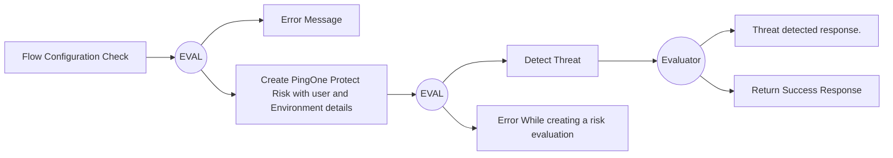

# CIAM-Passwordless-Protect-Threat-Detection-Subflow
Description: Imported on Thu Oct 24 2024 20:38:12 GMT&#43;0000 (Coordinated Universal Time) 


## Settings
An exhaustive list of settings including defaults.
| Setting                          | Value                                                                                                                                                                                   |
|----------------------------------|-----------------------------------------------------------------------------------------------------------------------------------------------------------------------------------------|
| CSP Value                        | worker-src &#39;self&#39; blob:; script-src &#39;self&#39; https://cdn.jsdelivr.net https://code.jquery.com https://devsdk.singularkey.com http://cdnjs.cloudflare.com &#39;unsafe-inline&#39; &#39;unsafe-eval&#39;; | 
 | CSS Links                        | |

## Input Schemas
| Property Name | Description | Expanded | Preferred Control Type | Preferred Data Type | Required |
|----------------------------------|-----------------|-----------------|-----------------|-----------------|-----------------|
| skriskcomponent | PingOne Protect skrisk component | true | textField | string | true | 
 | userName | UserName to be passed to PingOne Protect | true | textField | string | true | 
 | riskPolicyID | Risk Policy ID to be passed to PingOne Protect | true | textField | string | true | 
 | flowType | Flow Type to be passed to PingOne Protect | true | textField | string | true | 
 | ipAddress | user IP Address to be passed to PingOne Protect | true | textField | string | true | 
 | userID | The User ID to be passed to PingOne Protect | true | textField | string | false | 
 | applicationId | ApplicationId to be passed to PingOne Protect | true | textField | string | false | 
 | SessionId | Session Id to be passed to PingOne Protect | true | textField | string | false | 
 | customAttributes | Custom Attributes in PingOne Environment to be passed to PingOne Protect | true | textField | string | false | 
 | userAgent | PingOne Protect User Agent to trigger flow. | true | textField | string | false | 
 | usercookie | PingOne Protect User Cookie to trigger flow. | true | textField | string | false | 
 


## Variables
| Variable | Value | Context | Display Name | Field Type | Min | Max | Mutable | Type |                                                                                                                                                                
|----------------------------------|-----------------|-----------------|-----------------|-----------------|-----------------|-----------------|-----------------|-----------------|
| companyName##SK##flowInstance |  | flowInstance |  | string | 0 | 2000 | true | property | 
 

### Custom CSS
~> Note: Custom CSS is applied to every node in the flow

```css

```


### Flow Diagram

