# CIAM-Passwordless-Protect-Verify-Email-Subflow

### Flow Diagram

```mermaid
flowchart LR
    r8sc175hhf(("EVAL")) --> wweoq86mfw[["Return Success Response"]]
    hpve55zazv(("EVAL")) --> gf3bwis6oi[["Node"]]
    ru45xolut1(("EVAL")) --> 5d5o5ia81u[["Is Validation Limit Reached?"]]
    rjau0njx5i[["Form Button Check"]] --> t92nqcnwux(("EVAL"))
    rjau0njx5i[["Form Button Check"]] --> n5icn97kyh(("EVAL"))
    8l8a54vefk(("Evaluator")) --> ab91zkjrgx[["Node"]]
    hpve55zazv(("EVAL")) --> 1vyzcyazgf[["Validate verification code"]]
    sju60xf677(("EVAL")) --> rjau0njx5i[["Form Button Check"]]
    8l8a54vefk(("Evaluator")) --> 527m4tr2s2[["Verification Code Resent"]]
    n5icn97kyh(("EVAL")) --> 9lrqw38492[["Resend Verification Code"]]
    xsb00g2t92[["Set Validation Attempt To Zero"]] --> qskpbqg2yf(("EVAL"))
    qskpbqg2yf(("EVAL")) --> s5yykzv8zd[["Prompt For Verification Code"]]
    5d5o5ia81u[["Is Validation Limit Reached?"]] --> hpve55zazv(("EVAL"))
    r8sc175hhf(("EVAL")) --> 8gqiq4sagn[["Could not validate the verification code"]]
    t92nqcnwux(("EVAL")) --> wfe8dz7k7v[["Increment Validation Attempt"]]
    1vyzcyazgf[["Validate verification code"]] --> r8sc175hhf(("EVAL"))
    wfe8dz7k7v[["Increment Validation Attempt"]] --> ru45xolut1(("EVAL"))
    9lrqw38492[["Resend Verification Code"]] --> 8l8a54vefk(("Evaluator"))
    s5yykzv8zd[["Prompt For Verification Code"]] --> sju60xf677(("EVAL"))
    xbvfnq8o31[["Error"]] --> 90g8cf6l2u(("EVAL"))
    90g8cf6l2u(("EVAL")) --> rfo66ayuok[["Return Error Response"]]


```

## Settings
An exhaustive list of settings including defaults.
| Setting                          | Value                                                                                                                                                                                   |
|----------------------------------|-----------------------------------------------------------------------------------------------------------------------------------------------------------------------------------------|
| CSP Value                        | worker-src &#39;self&#39; blob:; script-src &#39;self&#39; https://cdn.jsdelivr.net https://code.jquery.com https://devsdk.singularkey.com http://cdnjs.cloudflare.com &#39;unsafe-inline&#39; &#39;unsafe-eval&#39;; | 
 |

## Input Schemas
| Property Name | Description | Expanded | Preferred Control Type | Preferred Data Type | Required |
|----------------------------------|-----------------|-----------------|-----------------|-----------------|-----------------|
| pingOneUserId |  | true | textField | string | true | 
 | ciam_companyLogo |  | true | textField | string | false | 
 

## Variables
| Variable | Value | Context | Display Name | Field Type | Min | Max | Mutable | Type |                                                                                                                                                                
|----------------------------------|-----------------|-----------------|-----------------|-----------------|-----------------|-----------------|-----------------|-----------------|
| ciam_verificationValidationAttempts##SK##flowInstance |  | flowInstance |  | number | 0 | 2000 | true | property | 
 | ciam_verificationLimit##SK##company | 5 | company |  | number | 0 | 2000 | false | property | 
 

