# CIAM-Passwordless-Protect-Verify-Email-Subflow

 

## Settings
An exhaustive list of settings including defaults.
| Setting                          | Value                                                                                                                                                                                   |
|----------------------------------|-----------------------------------------------------------------------------------------------------------------------------------------------------------------------------------------|
| CSP Value                        | worker-src &#39;self&#39; blob:; script-src &#39;self&#39; https://cdn.jsdelivr.net https://code.jquery.com https://devsdk.singularkey.com http://cdnjs.cloudflare.com &#39;unsafe-inline&#39; &#39;unsafe-eval&#39;; | 
 |

## Input Schemas
| Property Name | Description | Expanded | Preferred Control Type | Preferred Data Type | Required |
|----------------------------------|-----------------|-----------------|-----------------|-----------------|-----------------|
| pingOneUserId |  | true | textField | string | true | 
 | ciam_companyLogo |  | true | textField | string | false | 
 

## Variables
| Variable | Value | Context | Display Name | Field Type | Min | Max | Mutable | Type |                                                                                                                                                                
|----------------------------------|-----------------|-----------------|-----------------|-----------------|-----------------|-----------------|-----------------|-----------------|
| ciam_verificationValidationAttempts##SK##flowInstance |  | flowInstance |  | number | 0 | 2000 | true | property | 
 | ciam_verificationLimit##SK##company | 5 | company |  | number | 0 | 2000 | false | property | 
 

## Node List
| Node ID | Title | Description |
|----------------------------------|-----------------|-----------------|
| [1vyzcyazgf](./nodes/1vyzcyazgf.md) | Validate verification code | Sends the verification code to PingOne to validate | 
 | [2zs6bq3sxd](./nodes/2zs6bq3sxd.md) | Annotation | Verify verification code | 
 | [527m4tr2s2](./nodes/527m4tr2s2.md) | Verification Code Resent |  | 
 | [5d5o5ia81u](./nodes/5d5o5ia81u.md) | Is Validation Limit Reached? |  | 
 | [8gqiq4sagn](./nodes/8gqiq4sagn.md) | Could not validate the verification code |  | 
 | [8w4uz2atae](./nodes/8w4uz2atae.md) | Annotation | CIAM-Passwordless-Protect-Verify-Email-Subflow | 
 | [9lrqw38492](./nodes/9lrqw38492.md) | Resend Verification Code |  | 
 | [ab91zkjrgx](./nodes/ab91zkjrgx.md) | Node | Go To: Error | 
 | [gf3bwis6oi](./nodes/gf3bwis6oi.md) | Node | Go To: Error | 
 | [lxzd28ucwq](./nodes/lxzd28ucwq.md) | Annotation | Return error | 
 | [qmzu2jdn7v](./nodes/qmzu2jdn7v.md) | Annotation | Ask for email verification code | 
 | [rfo66ayuok](./nodes/rfo66ayuok.md) | Return Error Response |  | 
 | [rjau0njx5i](./nodes/rjau0njx5i.md) | Form Button Check |  | 
 | [s5yykzv8zd](./nodes/s5yykzv8zd.md) | Prompt For Verification Code | Displays a form for the user to enter the verification code | 
 | [wfe8dz7k7v](./nodes/wfe8dz7k7v.md) | Increment Validation Attempt |  | 
 | [wweoq86mfw](./nodes/wweoq86mfw.md) | Return Success Response |  | 
 | [xbvfnq8o31](./nodes/xbvfnq8o31.md) | Error |  | 
 | [xmqyiubcod](./nodes/xmqyiubcod.md) | Annotation | Input Schema: UserId | 
 | [xsb00g2t92](./nodes/xsb00g2t92.md) | Set Validation Attempt To Zero |  | 
 | [y2ry3nape9](./nodes/y2ry3nape9.md) | Annotation | Resend verification code | 
 