# OOTB - Basic Profile Management

### Flow Diagram

```mermaid
flowchart LR
    0rgxvbc224[["Set Flow Parameters"]] --> 904wdus9vu(("EVAL"))
    fxft0ouru8(("EVAL")) --> psu8mrv4k9[["Functions"]]
    904wdus9vu(("EVAL")) --> phud6qg15h[["PingOne"]]
    xn91t92nxe(("EVAL")) --> 9zuo4wddgf[["Success"]]
    phud6qg15h[["PingOne"]] --> cuajzc3j8n(("EVAL"))
    cuajzc3j8n(("EVAL")) --> 98l736kzfn[["Profile Update"]]
    b028sqws7r[["PingOne"]] --> xn91t92nxe(("EVAL"))
    98l736kzfn[["Profile Update"]] --> fxft0ouru8(("EVAL"))
    psu8mrv4k9[["Functions"]] --> 9v2yv8gf4y(("EVAL"))
    9v2yv8gf4y(("EVAL")) --> b028sqws7r[["PingOne"]]
    9zuo4wddgf[["Success"]] --> vqai8lmub1(("EVAL"))
    vqai8lmub1(("EVAL")) --> 15v6mldd6g[["Http"]]
    jjweor94k9[["Extract Flow Parameters"]] --> bn2hi300ca(("EVAL"))
    bn2hi300ca(("EVAL")) --> 0rgxvbc224[["Set Flow Parameters"]]
    4j666388n9[["Update error message"]] --> f9n7rpymif(("EVAL"))
    f9n7rpymif(("EVAL")) --> zpk0eome97[["Error Customize"]]
    xn91t92nxe(("EVAL")) --> 4j666388n9[["Update error message"]]


```

## Input Schemas
| Property Name | Description | Expanded | Preferred Control Type | Preferred Data Type | Required |
|----------------------------------|-----------------|-----------------|-----------------|-----------------|-----------------|
| flowParameters |  | true | textField | object | false | 
 

## Variables
| Variable | Value | Context | Display Name | Field Type | Min | Max | Mutable | Type |                                                                                                                                                                
|----------------------------------|-----------------|-----------------|-----------------|-----------------|-----------------|-----------------|-----------------|-----------------|
| username##SK##flowInstance |  | flowInstance |  | string | 0 | 2000 | true | property | 
 

