# CIAM-Passwordless-Protect-Agreement(ToS)-Subflow

### Flow Diagram

```mermaid
flowchart LR
    gjg587c8af(("Evaluator")) --> yqx4phhtcl["Node"]
    ldx8d6ahwt(("EVAL")) --> 4qv73tz0ug["Accept Agreement"]
    6xfm9lpclg(("EVAL")) --> canivkxqjq["Node"]
    4h6hi1onkj(("Evaluator")) --> 6pm1x665h0["Node"]
    h22w6agh1(("Evaluator")) --> 1rvj1fvgpu["Check If Consent Status Is Accepted"]
    prjjhhmndv(("Evaluator")) --> 8jemlov0oc["Check User Consent Status"]
    6x74clj9zm["Check For User Consent?"] --> prjjhhmndv(("Evaluator"))
    1rvj1fvgpu["Check If Consent Status Is Accepted"] --> 4h6hi1onkj(("Evaluator"))
    2vij7q7i5j(("EVAL")) --> v68793bc1v["Is Agreement Enabled?"]
    v68793bc1v["Is Agreement Enabled?"] --> 6xfm9lpclg(("EVAL"))
    6xfm9lpclg(("EVAL")) --> 6x74clj9zm["Check For User Consent?"]
    prjjhhmndv(("Evaluator")) --> 8zvqjrwsj8["Node"]
    jcpocm4del(("EVAL")) --> ph62v3m7kl["Decline Agreement"]
    4qv73tz0ug["Accept Agreement"] --> npztwu892l(("EVAL"))
    it43isf5sm(("EVAL")) --> 8x2gjjcvxj["Check User Action"]
    4h6hi1onkj(("Evaluator")) --> 8zvqjrwsj8["Node"]
    je23nstva5(("EVAL")) --> 8ytvupm9en["Get Agreement"]
    8ytvupm9en["Get Agreement"] --> gjg587c8af(("Evaluator"))
    npztwu892l(("EVAL")) --> 3koaafiiox["Node"]
    8x2gjjcvxj["Check User Action"] --> jcpocm4del(("EVAL"))
    qhcqow5g8y["Ask for agreement"] --> je23nstva5(("EVAL"))
    h22w6agh1(("Evaluator")) --> 8zvqjrwsj8["Node"]
    8jemlov0oc["Check User Consent Status"] --> h22w6agh1(("Evaluator"))
    pt563yeug9["Success"] --> vomegm9y96(("EVAL"))
    vomegm9y96(("EVAL")) --> o5cgjow8id["Return Success Response"]
    8x2gjjcvxj["Check User Action"] --> ldx8d6ahwt(("EVAL"))
    gjg587c8af(("Evaluator")) --> 0h8so1sxqq["Agreement Form"]
    0h8so1sxqq["Agreement Form"] --> it43isf5sm(("EVAL"))
    64hrke1krq["NOP UI Page"] --> 2vij7q7i5j(("EVAL"))
    zv66jvh5ja["Error"] --> 0m7rxlhf9o(("EVAL"))
    0m7rxlhf9o(("EVAL")) --> zgq483nez5["Return Error Response"]
    npztwu892l(("EVAL")) --> hb77by4606["Node"]

    click gjg587c8af "vscode://file/./nodes/gjg587c8af.md" _parent
    click yqx4phhtcl "vscode://file/./nodes/yqx4phhtcl.md" _parent
    click ldx8d6ahwt "vscode://file/./nodes/ldx8d6ahwt.md" _parent
    click 4qv73tz0ug "vscode://file/./nodes/4qv73tz0ug.md" _parent
    click 6xfm9lpclg "vscode://file/./nodes/6xfm9lpclg.md" _parent
    click canivkxqjq "vscode://file/./nodes/canivkxqjq.md" _parent
    click 4h6hi1onkj "vscode://file/./nodes/4h6hi1onkj.md" _parent
    click 6pm1x665h0 "vscode://file/./nodes/6pm1x665h0.md" _parent
    click h22w6agh1 "vscode://file/./nodes/h22w6agh1.md" _parent
    click 1rvj1fvgpu "vscode://file/./nodes/1rvj1fvgpu.md" _parent
    click prjjhhmndv "vscode://file/./nodes/prjjhhmndv.md" _parent
    click 8jemlov0oc "vscode://file/./nodes/8jemlov0oc.md" _parent
    click 6x74clj9zm "vscode://file/./nodes/6x74clj9zm.md" _parent
    click prjjhhmndv "vscode://file/./nodes/prjjhhmndv.md" _parent
    click 1rvj1fvgpu "vscode://file/./nodes/1rvj1fvgpu.md" _parent
    click 4h6hi1onkj "vscode://file/./nodes/4h6hi1onkj.md" _parent
    click 2vij7q7i5j "vscode://file/./nodes/2vij7q7i5j.md" _parent
    click v68793bc1v "vscode://file/./nodes/v68793bc1v.md" _parent
    click v68793bc1v "vscode://file/./nodes/v68793bc1v.md" _parent
    click 6xfm9lpclg "vscode://file/./nodes/6xfm9lpclg.md" _parent
    click 6xfm9lpclg "vscode://file/./nodes/6xfm9lpclg.md" _parent
    click 6x74clj9zm "vscode://file/./nodes/6x74clj9zm.md" _parent
    click prjjhhmndv "vscode://file/./nodes/prjjhhmndv.md" _parent
    click 8zvqjrwsj8 "vscode://file/./nodes/8zvqjrwsj8.md" _parent
    click jcpocm4del "vscode://file/./nodes/jcpocm4del.md" _parent
    click ph62v3m7kl "vscode://file/./nodes/ph62v3m7kl.md" _parent
    click 4qv73tz0ug "vscode://file/./nodes/4qv73tz0ug.md" _parent
    click npztwu892l "vscode://file/./nodes/npztwu892l.md" _parent
    click it43isf5sm "vscode://file/./nodes/it43isf5sm.md" _parent
    click 8x2gjjcvxj "vscode://file/./nodes/8x2gjjcvxj.md" _parent
    click 4h6hi1onkj "vscode://file/./nodes/4h6hi1onkj.md" _parent
    click 8zvqjrwsj8 "vscode://file/./nodes/8zvqjrwsj8.md" _parent
    click je23nstva5 "vscode://file/./nodes/je23nstva5.md" _parent
    click 8ytvupm9en "vscode://file/./nodes/8ytvupm9en.md" _parent
    click 8ytvupm9en "vscode://file/./nodes/8ytvupm9en.md" _parent
    click gjg587c8af "vscode://file/./nodes/gjg587c8af.md" _parent
    click npztwu892l "vscode://file/./nodes/npztwu892l.md" _parent
    click 3koaafiiox "vscode://file/./nodes/3koaafiiox.md" _parent
    click 8x2gjjcvxj "vscode://file/./nodes/8x2gjjcvxj.md" _parent
    click jcpocm4del "vscode://file/./nodes/jcpocm4del.md" _parent
    click qhcqow5g8y "vscode://file/./nodes/qhcqow5g8y.md" _parent
    click je23nstva5 "vscode://file/./nodes/je23nstva5.md" _parent
    click h22w6agh1 "vscode://file/./nodes/h22w6agh1.md" _parent
    click 8zvqjrwsj8 "vscode://file/./nodes/8zvqjrwsj8.md" _parent
    click 8jemlov0oc "vscode://file/./nodes/8jemlov0oc.md" _parent
    click h22w6agh1 "vscode://file/./nodes/h22w6agh1.md" _parent
    click pt563yeug9 "vscode://file/./nodes/pt563yeug9.md" _parent
    click vomegm9y96 "vscode://file/./nodes/vomegm9y96.md" _parent
    click vomegm9y96 "vscode://file/./nodes/vomegm9y96.md" _parent
    click o5cgjow8id "vscode://file/./nodes/o5cgjow8id.md" _parent
    click 8x2gjjcvxj "vscode://file/./nodes/8x2gjjcvxj.md" _parent
    click ldx8d6ahwt "vscode://file/./nodes/ldx8d6ahwt.md" _parent
    click gjg587c8af "vscode://file/./nodes/gjg587c8af.md" _parent
    click 0h8so1sxqq "vscode://file/./nodes/0h8so1sxqq.md" _parent
    click 0h8so1sxqq "vscode://file/./nodes/0h8so1sxqq.md" _parent
    click it43isf5sm "vscode://file/./nodes/it43isf5sm.md" _parent
    click 64hrke1krq "vscode://file/./nodes/64hrke1krq.md" _parent
    click 2vij7q7i5j "vscode://file/./nodes/2vij7q7i5j.md" _parent
    click zv66jvh5ja "vscode://file/./nodes/zv66jvh5ja.md" _parent
    click 0m7rxlhf9o "vscode://file/./nodes/0m7rxlhf9o.md" _parent
    click 0m7rxlhf9o "vscode://file/./nodes/0m7rxlhf9o.md" _parent
    click zgq483nez5 "vscode://file/./nodes/zgq483nez5.md" _parent
    click npztwu892l "vscode://file/./nodes/npztwu892l.md" _parent
    click hb77by4606 "vscode://file/./nodes/hb77by4606.md" _parent
```



## Settings
An exhaustive list of settings including defaults.
| Setting                          | Value                                                                                                                                                                                   |
|----------------------------------|-----------------------------------------------------------------------------------------------------------------------------------------------------------------------------------------|
| CSP Value                        | worker-src &#39;self&#39; blob:; script-src &#39;self&#39; https://cdn.jsdelivr.net https://code.jquery.com https://devsdk.singularkey.com http://cdnjs.cloudflare.com &#39;unsafe-inline&#39; &#39;unsafe-eval&#39;; | 
 | CSS Links                        | |

## Input Schemas
| Property Name | Description | Expanded | Preferred Control Type | Preferred Data Type | Required |
|----------------------------------|-----------------|-----------------|-----------------|-----------------|-----------------|
| checkRequired | To check if user has consent before directing user to agreement | true | textField | boolean | true | 
 | pingOneUserId |  | true | textField | string | true | 
 | ciam_agreementId |  | true | textField | string | false | 
 | ciam_agreementEnabled |  | true | textField | boolean | false | 
 | ciam_companyLogo |  | true | textField | string | false | 
 


### Custom CSS
~> Note: Custom CSS is applied to every node in the flow

```css

```
